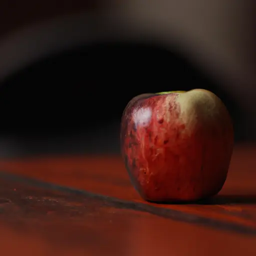

When creating images with Artificial Intelligences, one of the most difficult things to understand is how to use the various words within the prompt. I suspect there are similarities with writing code. But while, for example, JavaScript follows known laws, the rules of AI are a little harder to understand. Someone will eventually write a complete treatise, but for now I have to make do with trial and error.

Obviously, I am not the only one experimenting with AI. For example, [The Jasper Whisperer](https://www.thejasperwhisperer.com/jasperartcheatsheet) has published several guides on the subject. And then there are the posts by [Salvatore Raieli](https://salvatore-raieli.medium.com/), which are very interesting and full of food for thought. And, of course, many others.

That said, today I am testing Jasper Art. I want to see how the images change if I change the basic settings. In this post I will keep track of the generated images. Starting with the first, which will be the base for my tests: an apple.

```
An Apple in a table
```



The generated image is beautiful. It represents, and it represents a good starting point. Starting from this image, I try to add some features. First of all, I try modifying the medium on which the image appears. The basic options of Jasper Art are those common to all AI:

- acrylic paint
- chalk
- collage
- graffiti
- ink
- mixed media
- oil paint
- photography
- tempera paint
- watercolor

I then proceed to modify the prompt by adding one of these mediums at a time. For example, to try the 'acrylic paint' medium, I add to the prompt:

```
An Apple in a table, acrylic paint
```

### Acrylic Paint


Well, now I'll try with the other options.

### Chalk

```
An Apple in a table, chalk
```


### Collage

```
An Apple in a table, collage
```


### Graffiti

```
An Apple in a table, graffiti
```


### Ink

```
An Apple in a table, ink
```


### Mixed Media

```
An Apple in a table, mixed media
```


### Oil Paint

```
An Apple in a table, oil paint
```


### Photography

```
An Apple in a table, photography
```


### Tempera Paint

```
An Apple in a table, tempera paint
```


### Watercolor

```
An Apple in a table, watercolor
```


Well, these 10 are the basic mediums, but we can use others. By searching the internet, you can find [other suggestions](https://promptomania.com/generic-prompt-builder/). For example:

- canvas
- charcoal
- crayon
- glass
- mosaic
- felt
- origami
- papercutting
- ice-carving
- wall decal
- stencil
- indian art
- negative space
- classic oil painting
- modern oil painting
- pastel
- pencil sketch
- spray paint
- wood panels
- paint-by-numbers
- impasto
- silkscreen printing
- finger painting
- lithograph
- engraving
- découpage
- linocut
- risograph
- couache
- cave painting
- tapestry
- text
- typeface
- frame
- banner
- aquatint
- fretwork
- overglaze
- azulejo
- glaze
- inglaze
- paleolithic pottery
- neolitic pottery
- light art
- light painting
- resin
- enamel pin
- latte art
- coffee stain
- smoke art
- tattoo
- sticker bomb
- toy
- scrapbooking
- sparkly
- soviet art

### Canvas

```
An Apple in a table, canvas
```


### Charcoal

```
An Apple in a table, charcoal
```


### Crayon

```
An Apple in a table, crayon
```


### Glass

```
An Apple in a table, glass
```


### Mosaic

```
An Apple in a table, mosaic
```


### Felt

```
An Apple in a table, felt
```


### Origami

```
An Apple in a table, origami
```


### Papercutting

```
An Apple in a table, papercutting
```


### Ice-carving

```
An Apple in a table, ice-carving
```


### Wall Decal

```
An Apple in a table, wall decal
```


