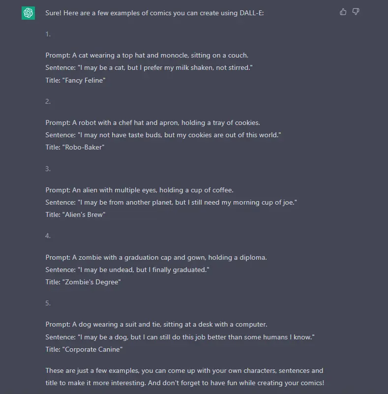
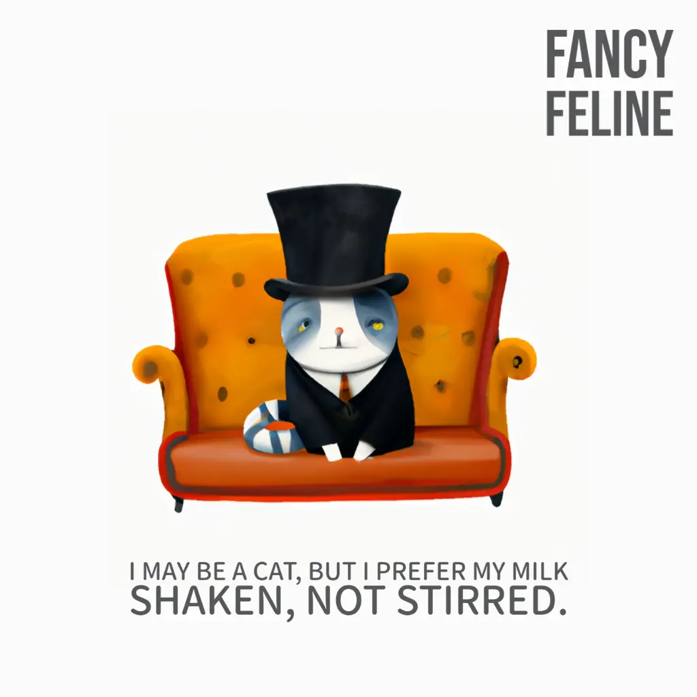
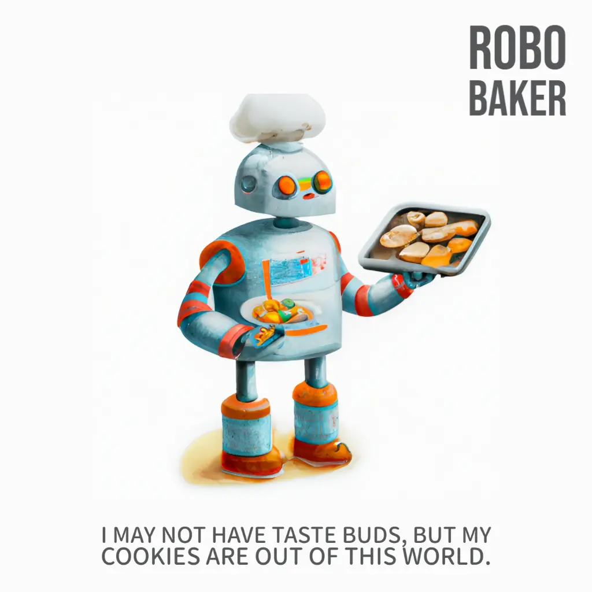
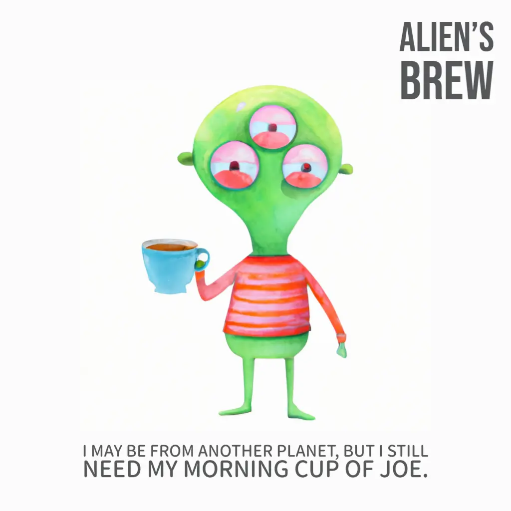
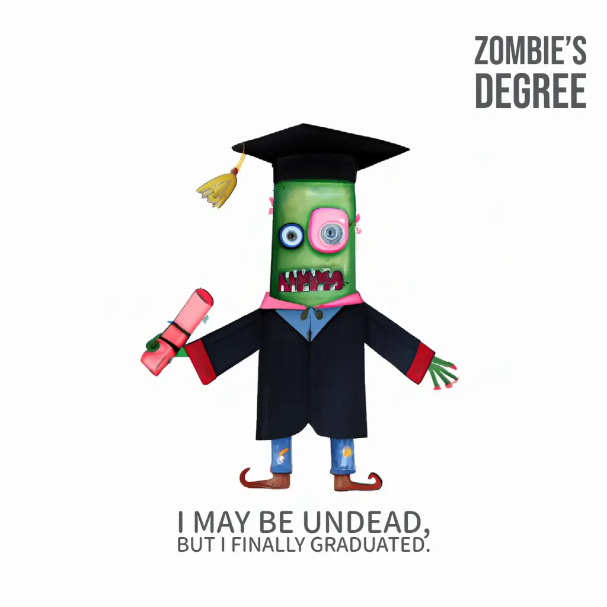
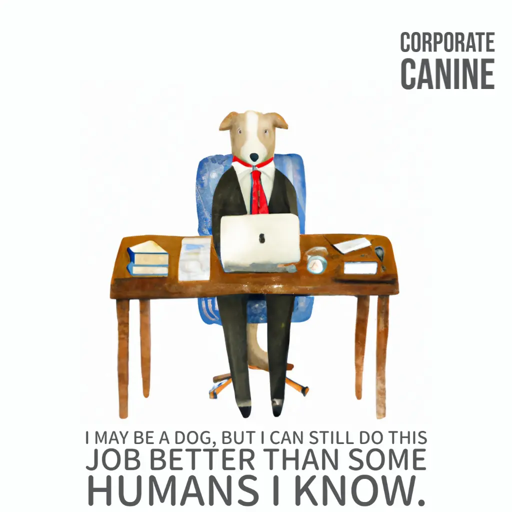

One of my passions is reading comics. They allow me to immerse myself in wonderful worlds and live fantastic adventures. Or to explore delicate little dreams born from artists. Real artists, not like me who can barely hold a brush in my hand. Over time I've also tried to create something of my own, and maybe somewhere on the internet there are still traces of my experiments. But that's not what I want to talk about today. Today I want to try an experiment: create a comic using only tools related to Artificial Intelligence.

To begin, I must establish some rules. What I want to achieve are single panels. Each panel has only one character. And each character says only one line.

I won't be writing the script. I'm asking ChatGPT to give me some ideas. And this is the result of the request.

For the drawings I intend to use Jasper Art. Let's see what comes out of this experiment.

### Fancy Feline

A cat wearing a top hat and monocle, sitting on a couch.

### Robo-Baker

A robot with a chef hat and apron, holding a tray of cookies.

### Alien's Brew

An alien with multiple eyes, holding a cup of coffee.

### Zombie's Degree

A zombie with a graduation cap and gown, holding a diploma.

### Corporate Canine

A dog wearing a suit and tie, sitting at a desk with a computer.

### Conclusion

What can I say? Well, the results are interesting. The drawing style is similar to what I was interested in creating. The jokes, however, are not very funny. But we can work on that, maybe with some training. Or, even better, by integrating my narrative ideas into the drawings.
