I don't know if it's just my habit, or others too. But I often find myself reusing similar prompts to create images with AI. They aren't necessarily long prompts, although I rarely get anything good using short descriptions. Here, today I want to try the opposite: what happens if I use one-word prompts? And what happens if I add "portrait" to that word? Here are some of the images that Artificial Intelligence has generated.

### Cyberpunk

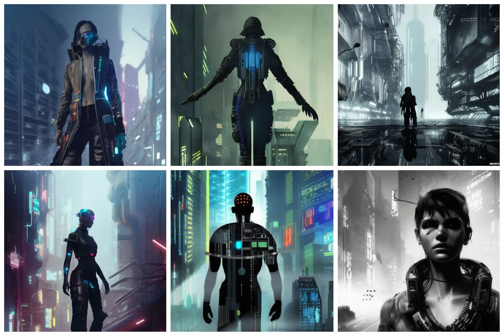

### Cyberpunk Portrait

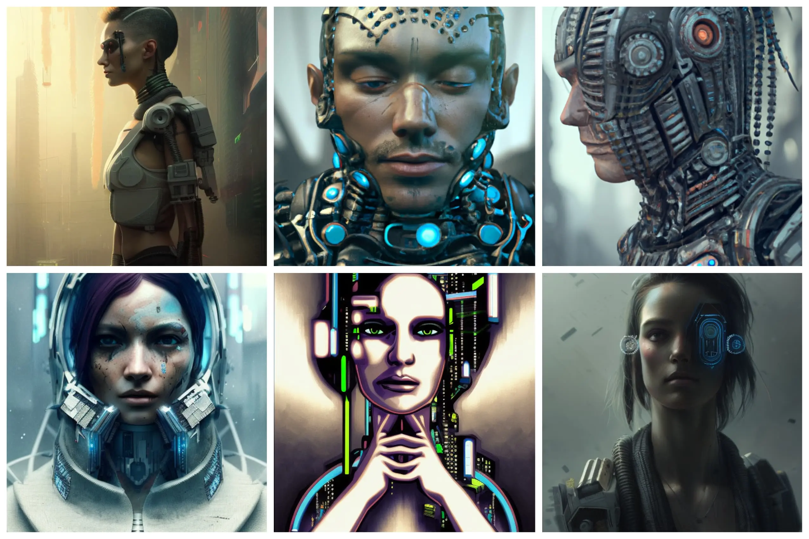

### Steampunk

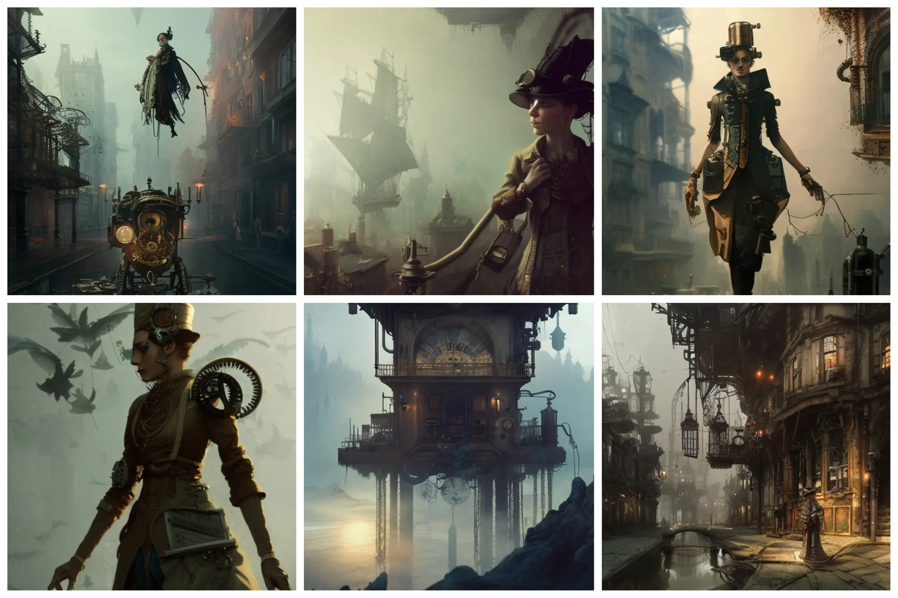
### Steampunk Portrait

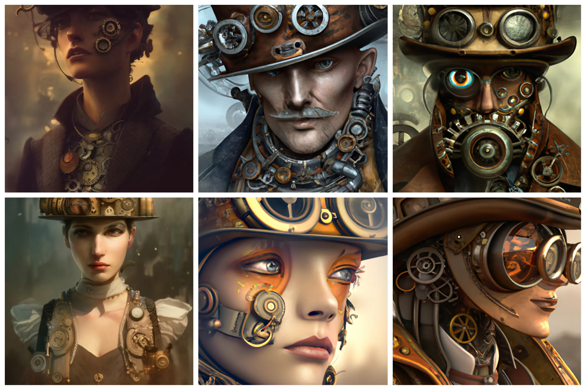
### Weird West

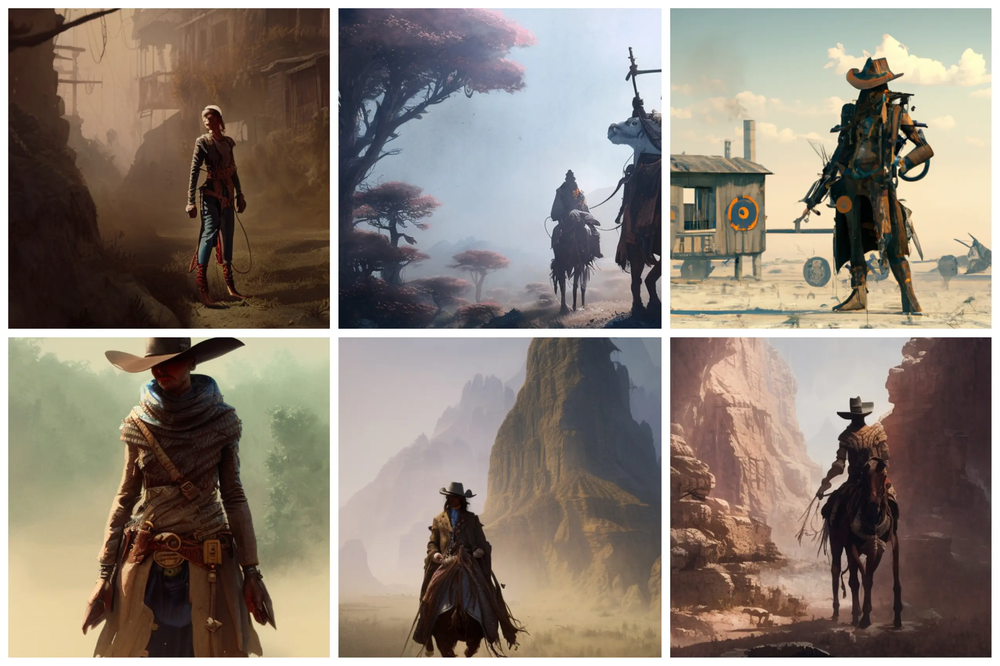

### Weird West Portrait

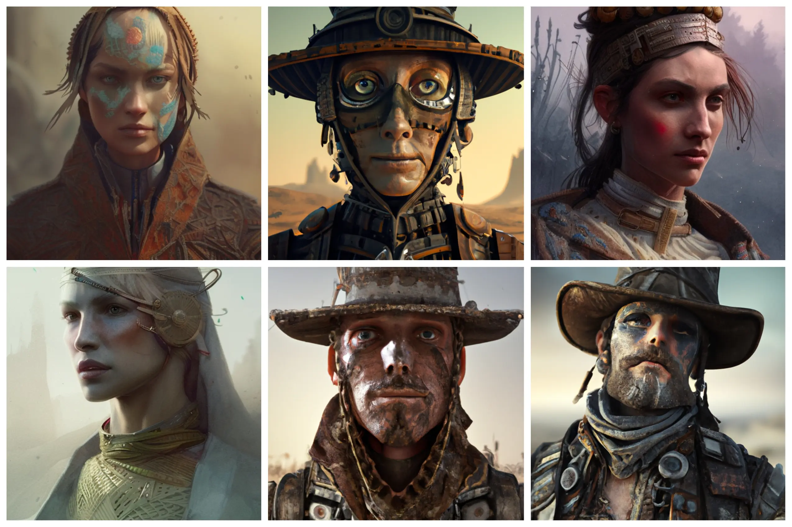

### Retrofuturism

### Retrofuturism Portrait

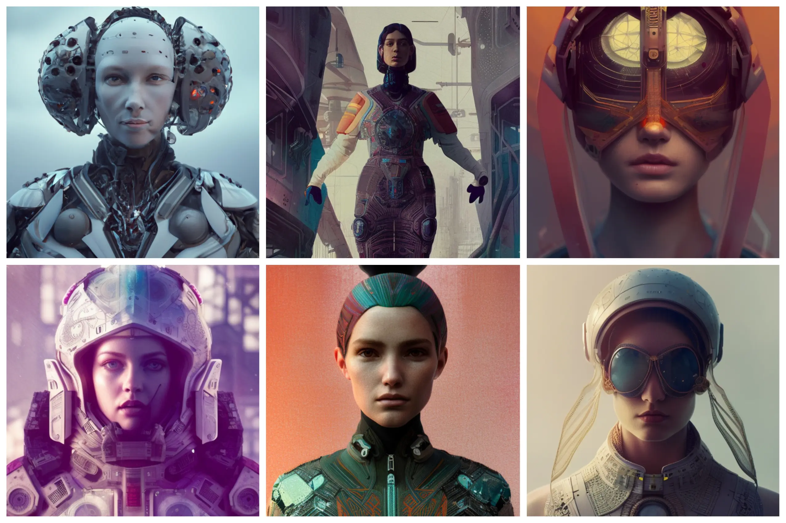

### Space

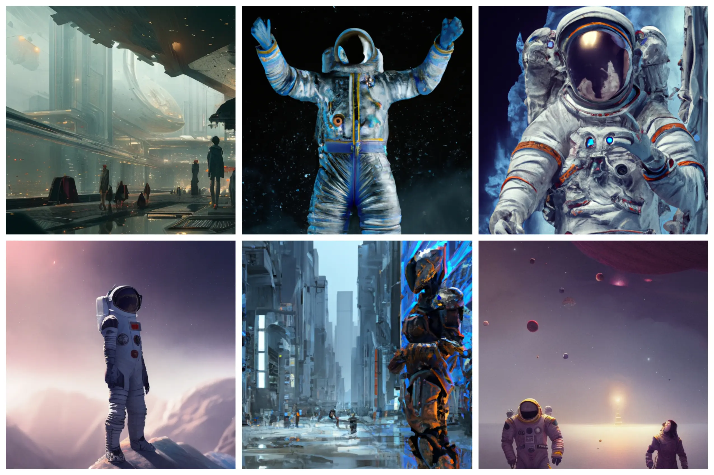

### Space Portrait

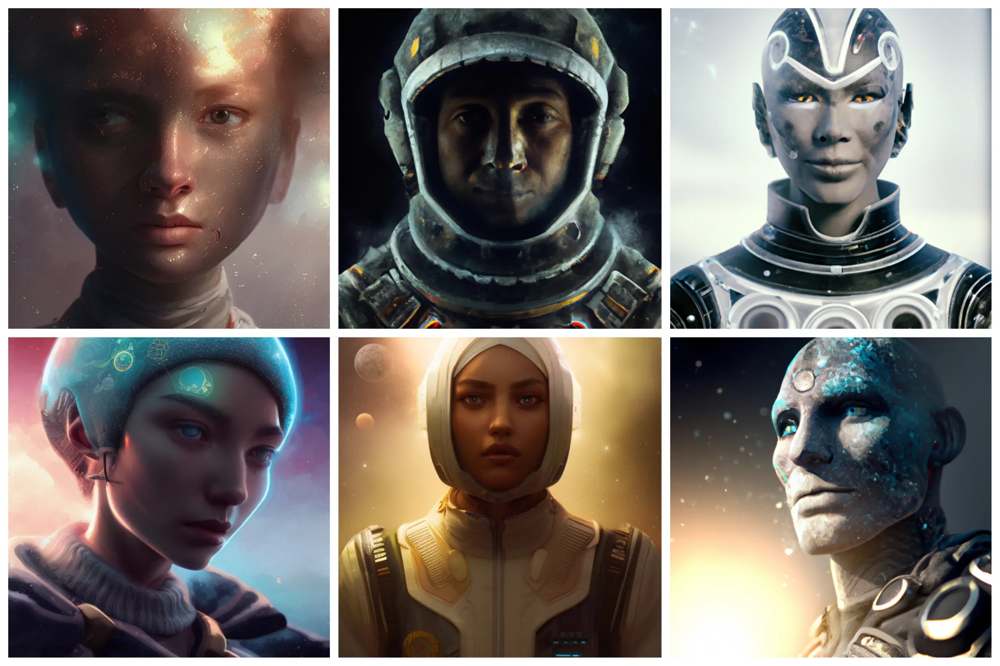

### Fantasy

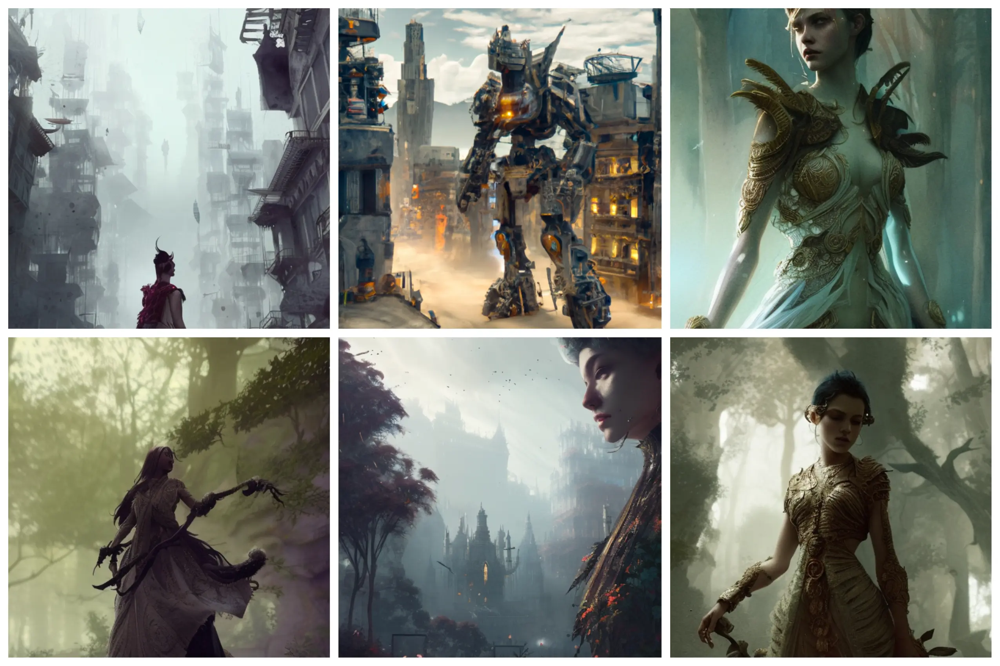
### Fantasy Portrait

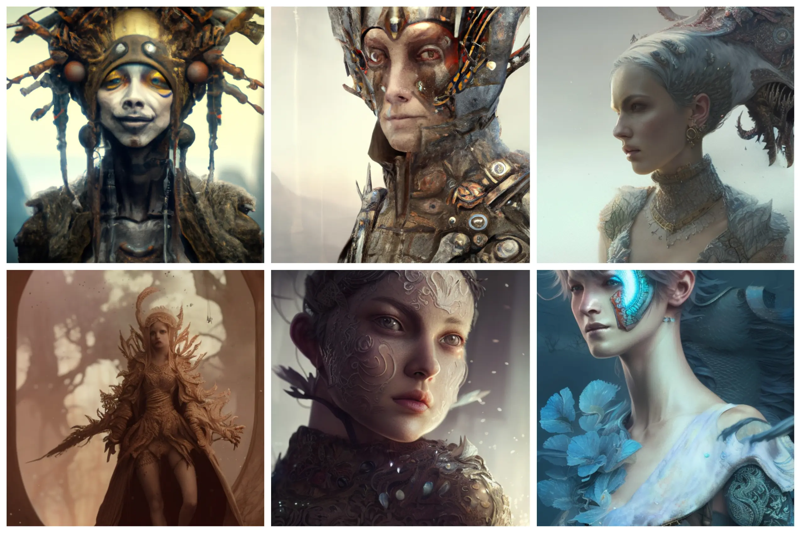
