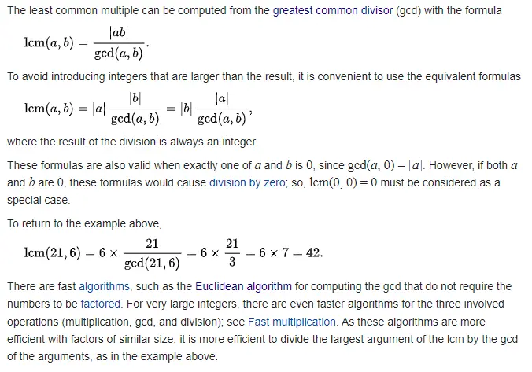

The problem today is about calculating the least common multiple of a set of numbers. In mathematics, the least common multiple of two positive integers `a` and `b`, denoted by `LCM(a,b)`, is the smallest natural number that is divisible by both `a` and `b`. But let's start with the definition of the problem:

### The Problem: Least Common Multiple

link to the [kata](https://www.codewars.com/kata/5259acb16021e9d8a60010af)

Write a function that calculates the least common multiple of its arguments; each argument is assumed to be a non-negative integer. In the case that there are no arguments (or the provided array in compiled languages is empty), return `1`. If any argument is `0`, return `0`.

### The Solution


To solve the problem, I can follow the instructions on Wikipedia:



It is essentially a matter of using the greatest common divisor. But how do you calculate the greatest common divisor? I talked about it a few days ago [in another post](https://el3um4s.medium.com/how-to-find-the-greatest-common-divisor-in-javascript-c1333aa313db):

```js
const gcd = (x, y) => (y === 0 ? x : gcd(y, x % y));
```

Therefore, the problem of calculating the least common multiple in JavaScript can be solved in just two lines:

```js
const gcd = (x, y) => (y === 0 ? x : gcd(y, x % y));

const lcm = (...n) => n.reduce((x, y) => (x * y) / gcd(x, y));
```
