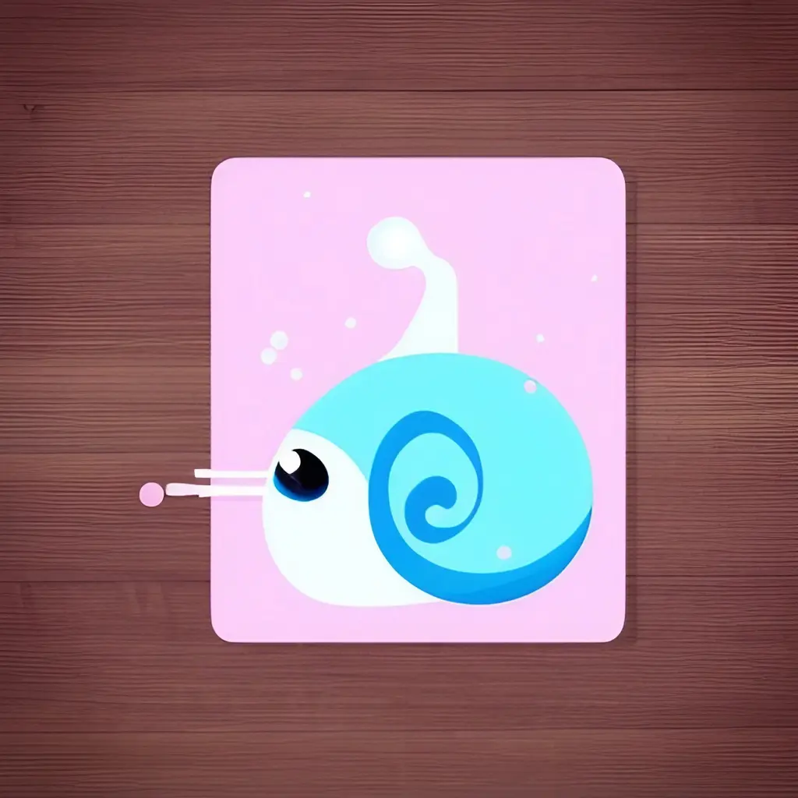
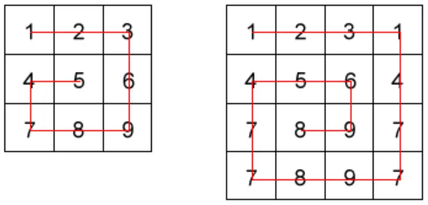
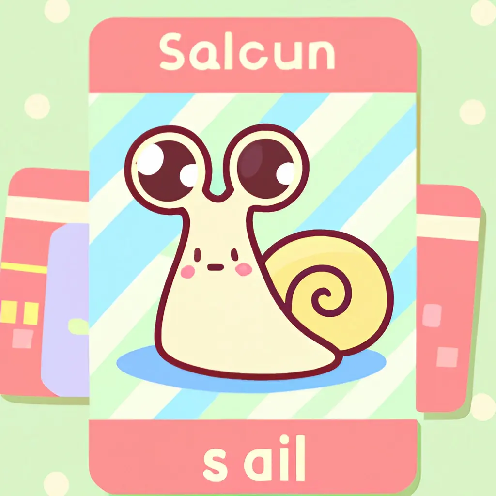
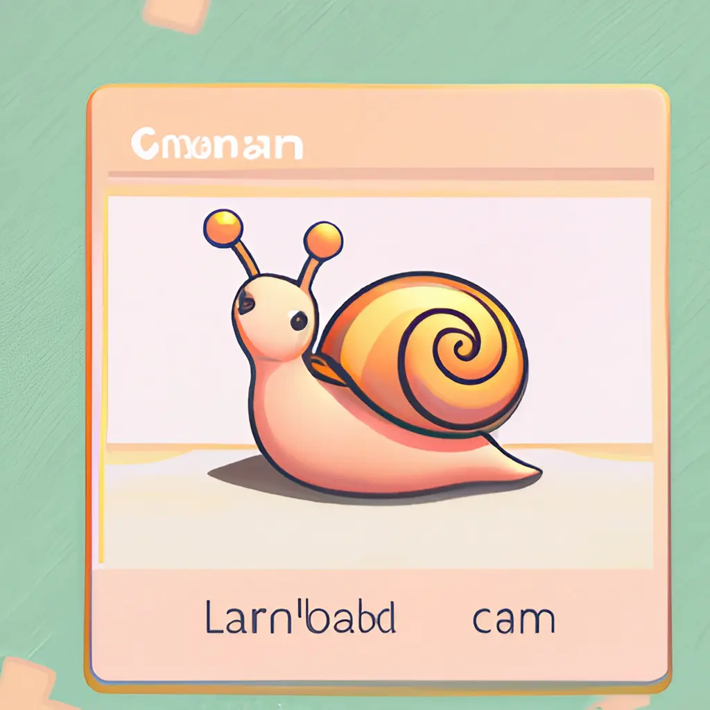

The problem today is a level 4 Kyu problem according to the CodeWars scale. It is a matrix problem in JavaScript. Or to put it another way, it is a problem of spatial sorting in a two-dimensional array. But let's start with the text of the problem.

### The Problem: Snail Sort

link to the [kata](https://www.codewars.com/kata/521c2db8ddc89b9b7a0000c1)



Given an `n x n` array, return the array elements arranged from outermost elements to the middle element, traveling clockwise.

```
array = [[1,2,3],
         [4,5,6],
         [7,8,9]]

snail(array) #=> [1,2,3,6,9,8,7,4,5]
```

For better understanding, please follow the numbers of the next array consecutively:

```
array = [[1,2,3],
         [8,9,4],
         [7,6,5]]

snail(array) #=> [1,2,3,4,5,6,7,8,9]
```

This image will illustrate things more clearly:



NOTE: The idea is not sort the elements from the lowest value to the highest; the idea is to traverse the 2-d array in a clockwise snailshell pattern.

NOTE 2: The `0x0` (empty matrix) is represented as en empty array inside an array `[[]]`.

### The Solutions



The interesting thing about this problem is that we can solve it in several ways. We can imagine a cursor following the path of a spiral, and each time we move it, we remove the element that is in the current position. This solution is quite intuitive and conceptually simple. We can extend this solution to solve the problem more efficiently. Instead of removing one element at a time, we can remove the entire side. To do this, we can once again imagine moving a cursor following the path of a spiral, but this time instead of removing the element that is in the current position, we remove the entire side. Or we can rotate the matrix itself so that the first element of the first row is obtained, and then continue rotating the matrix until no element remains.

The two solutions are these. The "cursor" one:

```js
const snail = (arr) =>
  [...Array(arr.length)].reduce(
    (pre) => (
      pre.push(...arr.shift(), ...arr.map((val) => val.pop())),
      arr.reverse().map((val) => val.reverse()),
      pre
    ),
    []
  );
```

And this is the solution that rotates the matrix:

```js
const rotate = (arr) =>
  arr.length ? arr[0].map((_, i) => arr.map((_, j) => arr[j][i])) : [];
const snail = (arr) =>
  arr.length ? [...arr[0], ...snail(rotate(arr.slice(1)).reverse())] : [];
```

### My Solution



But obviously the solution does not appear magically. And, to be completely honest, my first solution was less elegant. However, CodeWars allows you to compare your solution with the solutions of others. But let's see my original idea, and the steps I followed.

First, I set a variable `result` where to add the various numbers as I go. I initialize it to an empty array.

```js
let result = [];
```

Then I need a loop that allows me to repeat the operation until the matrix is empty. To do this, I use a `while` loop that repeats as long as the length of the matrix is greater than zero.

```js
while (arr.length > 0) {
  // ...
}
```

Inside the loop, I need to perform several operations:

1. Remove the first element of the matrix and add it to the `result` variable
2. Remove the last element of each row of the matrix and add it to the `result` variable
3. Remove the last element of the matrix and add it to the `result` variable
4. Remove the first element of each row of the matrix and add it to the `result` variable

Obviously, I also have to delete the various elements at the same time. To do this, I use the `shift` and `pop` methods of JavaScript. Both methods modify the original array, the first extracting the first element, the second the last.

I translate the various steps into code. To get the first element I use this code:

```js
result = [...result, ...arr.shift()];
```

To get the last element of each row I use this code:

```js
for (let i = 0; i < arr.length; i++) {
  const x = arr[i].pop();
  result = [...result, x];
}
```

To get the last row of the matrix, I just use the `pop` method:

```js
const last = arr.length > 0 ? arr.pop() : [];
```

But since the order of the individual elements of the last row must be reversed, I use the `reverse` method:

```js
const revertedLast = arr.length > 0 ? arr.pop().reverse() : [];
```

Finally, to get the first element of each row, I use the `shift` method again:

```js
for (let i = arr.length - 1; i >= 0; i--) {
  const x = arr[i].shift();
  result = [...result, x];
}
```

Putting all the steps together I get my original solution:

```js
const snail = (arr) => {
  let result = [];

  while (arr.length > 0) {
    result = [...result, ...arr.shift()];

    for (let i = 0; i < arr.length; i++) {
      const x = arr[i].pop();
      result = [...result, x];
    }

    const revertedLast = arr.length > 0 ? arr.pop().reverse() : [];
    result = [...result, ...revertedLast];

    for (let i = arr.length - 1; i >= 0; i--) {
      const x = arr[i].shift();
      result = [...result, x];
    }
  }

  return result;
};
```

### Refactoring


My solution is not very elegant, I can try to simplify it by eliminating the assignments to the `result` variable.

```js
const snail = (arr) => {
  let result = [];

  while (arr.length > 0) {
    result.push(...arr.shift());

    for (let i = 0; i < arr.length; i++) {
      result.push(arr[i].pop());
    }

    if (arr.length > 0) {
      result.push(...arr.pop().reverse());
    }

    for (let i = arr.length - 1; i >= 0; i--) {
      result.push(arr[i].shift());
    }
  }

  return result;
};
```

I can rewrite the first `for` loop more concisely using the `map` method of JavaScript:

```js
//     for (let i = 0; i < arr.length; i++) {
//       result.push(arr[i].pop());
//     }

result.push(...arr.map((row) => row.pop()).filter(Boolean));
```

I can also modify the second `for` loop in the same way:

```js
//     for (let i = arr.length - 1; i >= 0; i--) {
//       result.push(arr[i].shift());
//     }

result.push(
  ...arr
    .reverse()
    .map((row) => row.shift())
    .filter(Boolean)
);

arr.reverse();
```

However, I must remember to reverse the matrix again before starting the `while` loop again.

The function becomes this:

```js
const snail = (arr) => {
  let result = [];

  while (arr.length > 0) {
    result.push(...arr.shift());

    result.push(...arr.map((row) => row.pop()).filter(Boolean));

    if (arr.length === 0) break;

    result.push(...arr.pop().reverse());

    result.push(
      ...arr
        .reverse()
        .map((row) => row.shift())
        .filter(Boolean)
    );

    arr.reverse();
  }

  return result;
};
```

### Another solution


Here my abilities stop. To improve my solution, I had to study the solution of others. Here is the solution I found:

```js
const snail = (arr) =>
  [...Array(arr.length)].reduce(
    (pre) => (
      pre.push(...arr.shift(), ...arr.map((val) => val.pop())),
      arr.reverse().map((val) => val.reverse()),
      pre
    ),
    []
  );
```

The function uses the `Array.reduce()` method with an empty array as the initial value to build up the result array `pre` containing the elements in snail order.

The spread operator (`...`) is used to add the elements of `arr` to the result array `pre` in the desired order.

The `Array(arr.length)` expression creates an array of the same length as `arr` filled with undefined elements. The spread operator (`...`) is used to spread the elements of this array into the `reduce` method's callback function as individual arguments.

The callback function starts by using the `Array.shift()` method to remove the first element of `arr` (which is the first row of the 2D array) and adding it to the result array pre using the spread operator (`...`).

Next, the callback function uses the `Array.map()` method to iterate through `arr` and remove the last element of each inner array (using the `Array.pop()` method) and add it to the result array `pre` using the spread operator (`...`).

After that, the callback function uses the `Array.reverse()` method to reverse the order of the inner arrays in `arr`, and then uses the `Array.map()` method to reverse the order of the elements in each inner array.

Finally, the callback function returns the result array `pre`.

The `reduce` method then repeats this process until it has iterated through all the elements of `arr`, at which point it returns the result array `pre` containing the elements of `arr` in snail order.

And with that, I am finished for now.
