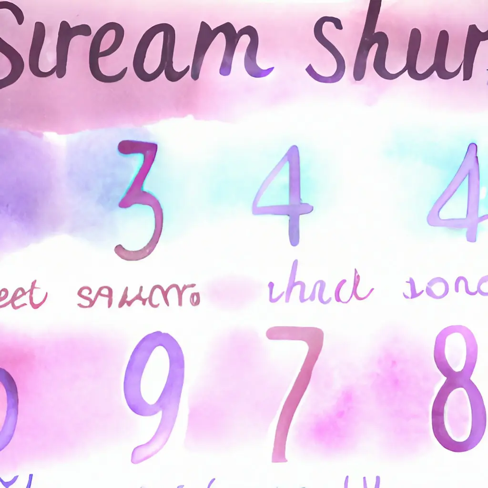
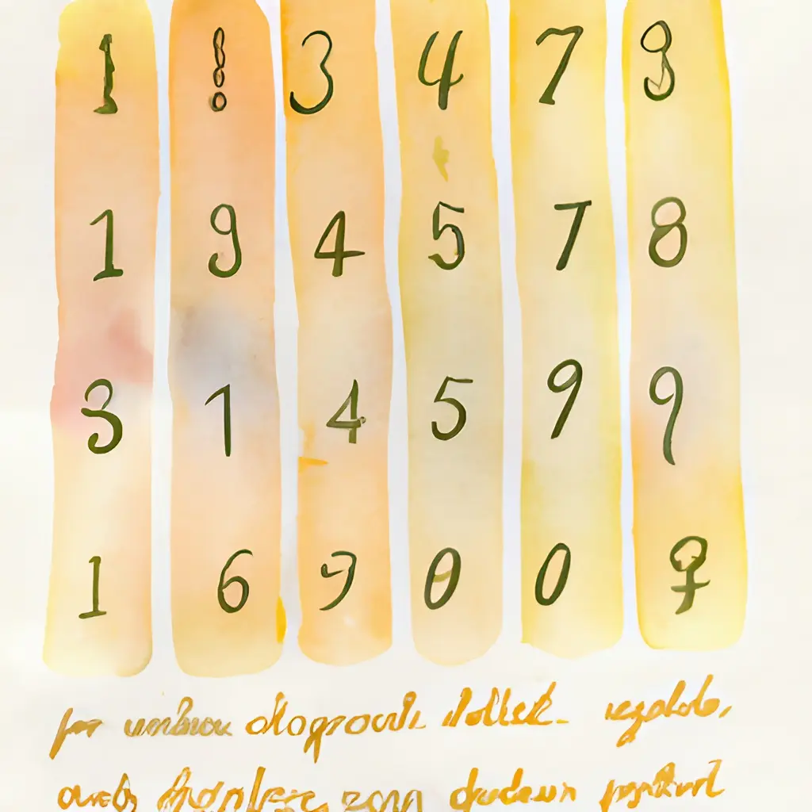

The problem today is quite simple. It concerns arrays, strings, and character encoding within JavaScript. In addition to a pinch of elementary mathematics, specifically the sum of numbers. But let's start from the beginning, that is, from the problem text.

### The Problem: Highest Scoring Word

link to the [kata](https://www.codewars.com/kata/57eb8fcdf670e99d9b000272)



Given a string of words, you need to find the highest scoring word.

Each letter of a word scores points according to its position in the alphabet: `a = 1`, `b = 2`, `c = 3` etc.

For example, the score of `abad` is `8` (`1 + 2 + 1 + 4`).

You need to return the highest scoring word as a string.

If two words score the same, return the word that appears earliest in the original string.

All letters will be lowercase and all inputs will be valid.

### My Solution



The problem can be broken down into some simpler problems.

1. divide the sentence into words
2. calculate the value of each word
3. find the highest value
4. return the first word with the highest value

To transform a sentence into an array of words, I can use the [String.split()](https://developer.mozilla.org/en-US/docs/Web/JavaScript/Reference/Global_Objects/String/split) method with the argument ` `.

```js
const words = "hello world";
const listWords = words.split(" ");

console.log(listWords); // ["hello", "world"]
```

To calculate the value of each word, I can use two methods. I can create a dictionary containing the letters of the alphabet and use it to assign a value to each word:

```js
const charToScore = { 'a': 1, 'b': 2, 'c': 3, ...}
```

But I think that this is not the best way. To solve this problem, I can use the [String.charCodeAt()](https://developer.mozilla.org/en-US/docs/Web/JavaScript/Reference/Global_Objects/String/charCodeAt) method to get the ASCII code value of each character. This way, I can calculate the value of each word simply by summing the values of each character.

```js
const word = "hello";
const value = [...word].reduce((a, c) => a + c.charCodeAt(0), 0);

console.log(value); // 532
```

There is however a problem: the value of `a` is `97`, that of `b` is `98` and so on. To solve this problem I have to subtract 96 from each value. In this way, the value of `a` becomes `1`, that of `b` becomes `2` and so on.

```js
const word = "hello";
const value = [...word].reduce((a, c) => a + (c.charCodeAt(0) - 96), 0);

console.log(value); // 52
```

The next step is to find the highest value among those assigned to words. I can use the [Math.max()](https://developer.mozilla.org/en-US/docs/Web/JavaScript/Reference/Global_Objects/Math/max) method to find the highest value among those contained in an array.

```js
const values = [1, 2, 3, 4, 5];
const maxValue = Math.max(...values);

console.log(maxValue); // 5
```

But we need the word corresponding to the value, not the value itself. To find the word corresponding to the highest value, I can use the [Array.indexOf()](https://developer.mozilla.org/en-US/docs/Web/JavaScript/Reference/Global_Objects/Array/indexOf) method.

```js
const values = [1, 2, 3, 4, 5];
const maxValue = Math.max(...values);
const indexMaxValue = values.indexOf(maxValue);

console.log(indexMaxValue); // 4
```

By combining the various pieces, I can finally write my solution.

```js
const getValues = (w) =>
  w
    .split(" ")
    .map((w) => [...w].reduce((a, c) => a + (c.charCodeAt(0) - 96), 0));
const indexMax = (x) => x.indexOf(Math.max(...x));

const high = (x) => {
  const listWords = x.split(" ");
  const listValue = getValues(x);
  const maxValue = indexMax(listValue);

  return listWords[maxValue];
};
```

### A Better Solution


But I can solve the same problem with a different approach. Instead of assigning a value to each word, looking for the maximum value and then looking for which word corresponds to the value, I can simply sort the words based on the value they have. In this way, the word with the highest value will be the first in the list.

To do this, I use the [Array.sort()](https://developer.mozilla.org/en-US/docs/Web/JavaScript/Reference/Global_Objects/Array/sort) method.

```js
const value = (w) => [...w].reduce((a, c) => a + (c.charCodeAt(0) - 96), 0);

const high = (x) => {
  const order = x.split(" ").sort((a, b) => value(b) - value(a));
  return order[0];
};
```

I can turn everything into an arrow function. This allows us to solve the problem with just two lines of JavaScript code.

```js
const value = (w) => [...w].reduce((a, c) => a + (c.charCodeAt(0) - 96), 0);
const high = (x) => x.split(" ").sort((a, b) => value(b) - value(a))[0];
```

A more extreme solution combines both lines in a single function.

```js
const high = (x) =>
  x
    .split(" ")
    .sort(
      (a, b) =>
        [...b].reduce((z, c) => z + (c.charCodeAt(0) - 96), 0) -
        [...a].reduce((z, c) => z + (c.charCodeAt(0) - 96), 0)
    )[0];
```
