During the past few weeks, I started using ArcGIS Pro, perhaps the most powerful GIS software available on the market. ArcGIS Pro is a newer and advanced version of the software ArcMap, developed by Esri. ArcGIS Pro offers a wide range of tools and functionalities for analyzing and visualizing geographic data. You can create customized maps, analyze data, perform spatial analysis, create geoprocessing models, and much more. The problem is that there are no affordable courses available to learn how to use it. So, I'm facing a series of issues, often trivial ones, but they are slowing me down.

One of these issues is how to add Google Maps data layers to the maps. In other software (e.g., QGIS), you can use the `Add XYZ Tiles Layer (TMS)` function to directly connect to Google services. ArcGIS, on the other hand, uses a different command: `Add data from Path`.

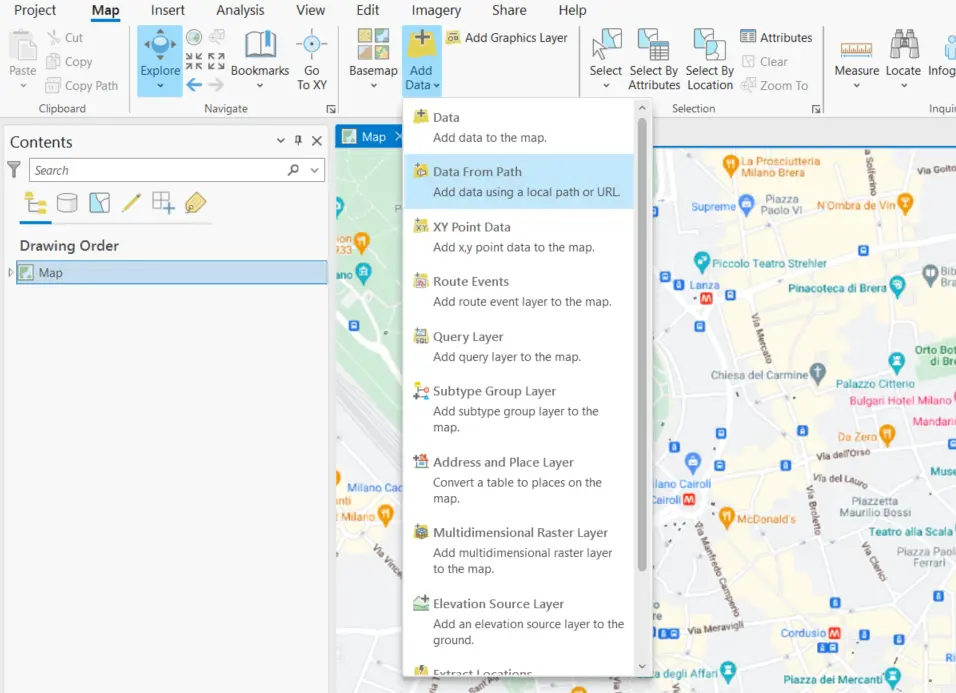

To use this function, we need to select the `Map Menu`, then go to `Layer` and click on `Add Data`. Among the various available options, we choose `Data From Path`.

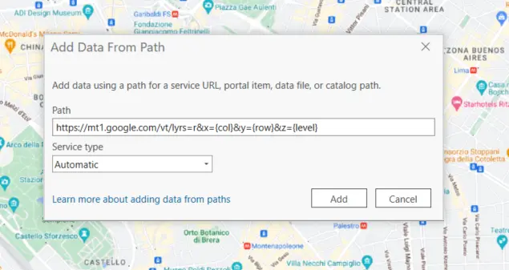

Here, we can enter the URL for the maps and the `Service Type` to use. We can leave the type set to _Automatic_. But when it comes to the URL, there is some research to be done. First, we need to find the URL of the Google Maps service. Fortunately, someone has dedicated some time to this issue. The "Southern California Government GIS User Group" published [a post in 2014](https://socalgis.org/2014/02/05/my-adventure-with-google-maps-in-arcmap/) (updated in [2020](https://socalgis.org/2020/12/02/add-google-maps-to-arcmap-and-pro/)) on this topic a few years ago: it's a good starting point. In this post, they explain how to find the URL of the Google Maps service. And indeed, starting from there, I found a series of URLs that work with ArcGIS Pro. These are the links I found: [list of URLs].

**Google Map**

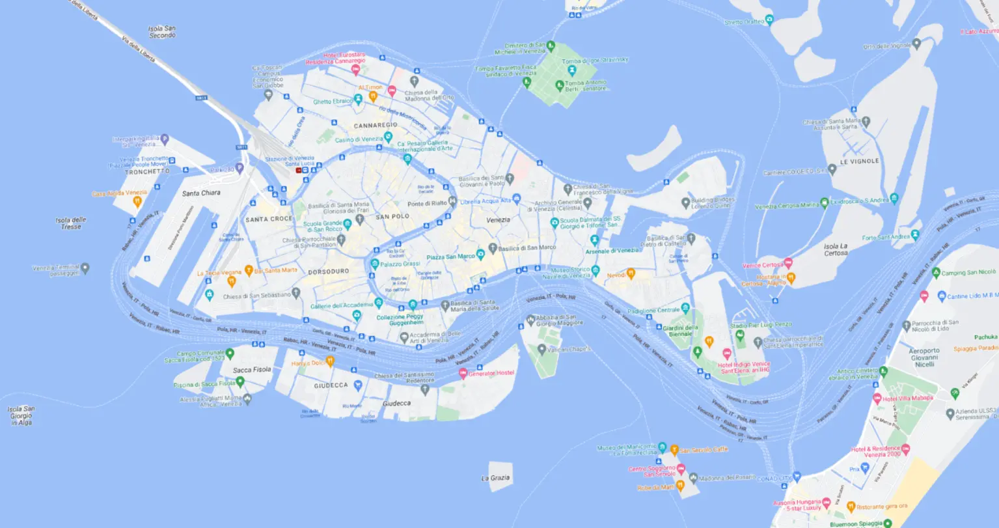

`https://mt1.google.com/vt/lyrs=r&x={col}&y={row}&z={level}`

**Google Satellite Hybrid**

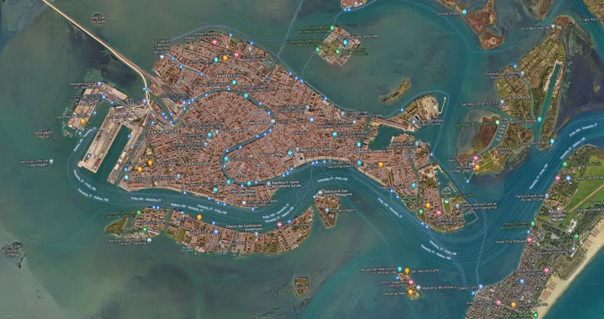

`https://mt1.google.com/vt/lyrs=y&x={col}&y={row}&z={level}`

**Google Earth Basemap**

`https://mt1.google.com/vt/lyrs=s&x={col}&y={row}&z={level}`

**Google Labels**

`https://mt.google.com/vt/lyrs=h&hl=en&z={level}&x={col}&y={row}` (Note: instead of `hl=en`, you can insert a different language, e.g.,` hl=it`)

**Google Aerial**

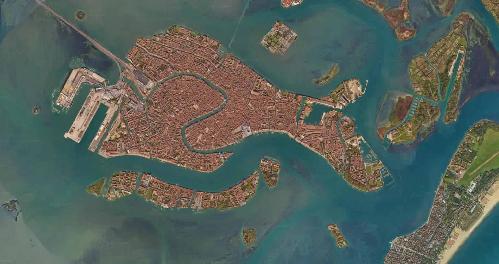

`https://mt.google.com/vt/lyrs=s&hl=en&z={level}&x={col}&y={row}`

**Google Terrain**

`https://mt1.google.com/vt/lyrs=p&x={col}&y={row}&z={level}`

**Google Roads**

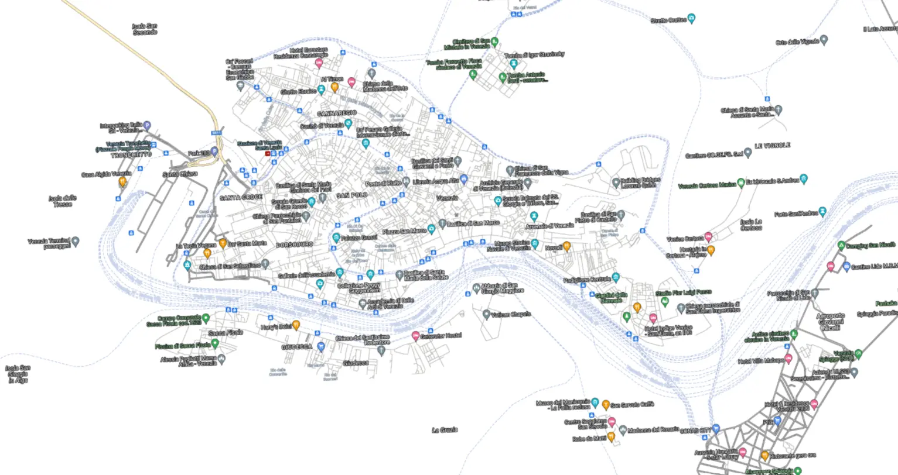

`https://mt1.google.com/vt/lyrs=h&x={col}&y={row}&z={level}`

**OpenStreetMap**

`https://a.tile.openstreetmap.org/{level}/{col}/{row}.png`

**OpenStreetMap Blueprint**

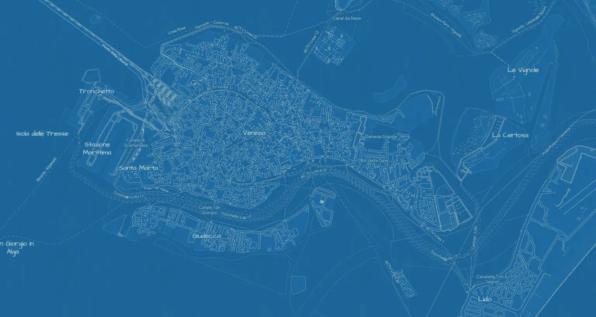

`https://www.arcgis.com/sharing/rest/content/items/80be160f0ca1413d898ad4e90d197278/resources/styles/root.json`

**OpenStreetMap Light Gray Canvas**

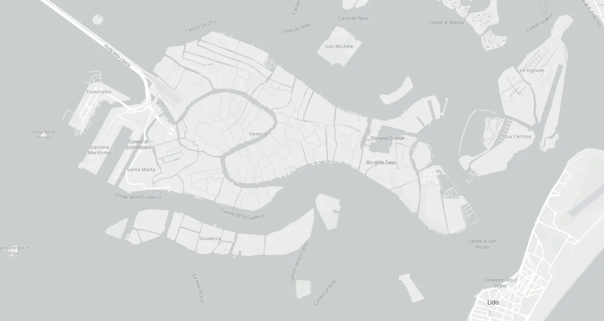

`https://www.arcgis.com/sharing/rest/content/items/29a71939af7a498584f44c4feca7249b/resources/styles/root.json`

`https://www.arcgis.com/sharing/rest/content/items/1932e7d4432d45dabc0d4d13109c1f09/resources/styles/root.json`

**OpenStreetMap Dark Gray Canvas**

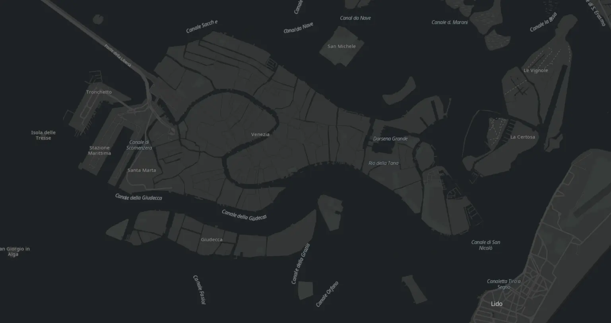

`https://www.arcgis.com/sharing/rest/content/items/b49a8db3fe6e4f9f99cb713aee150e8d/resources/styles/root.json`

`https://www.arcgis.com/sharing/rest/content/items/cb38f2afc497482a85579dce4c3ff4ed/resources/styles/root.json`

**OpenStreetMap Navigation**

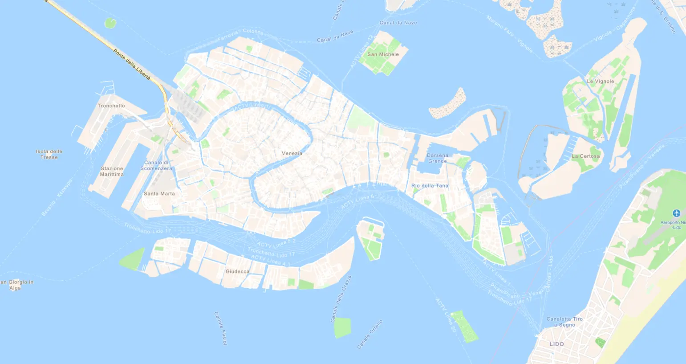

`https://www.arcgis.com/sharing/rest/content/items/f886634ab3f349f18199bf554bf75ee3/resources/styles/root.json`

**OpenStreetMap Navigation Dark**

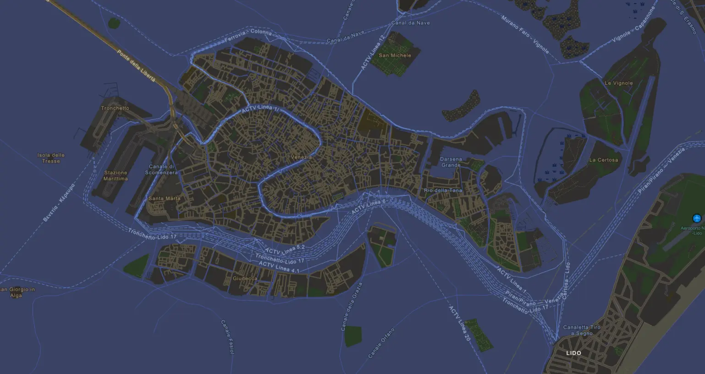

`https://www.arcgis.com/sharing/rest/content/items/92966c7ebc3d4ddaac34050560568bad/resources/styles/root.json`

**Stamen Toner**

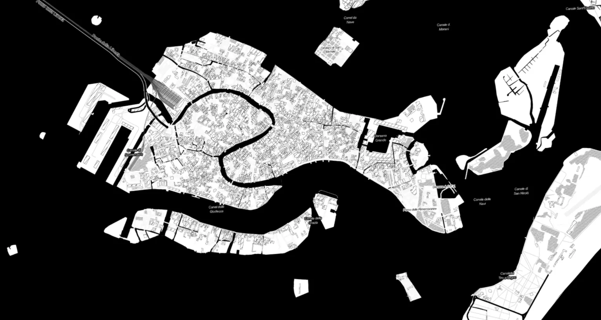

`https://stamen-tiles.a.ssl.fastly.net/toner/{z}/{x}/{y}.png`

**Stamen Terrain**

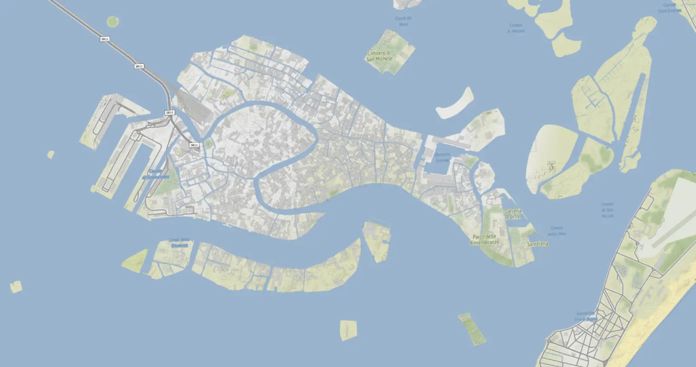

`https://stamen-tiles.a.ssl.fastly.net/terrain/{z}/{x}/{y}.jpg`

**Stamen Watercolor**

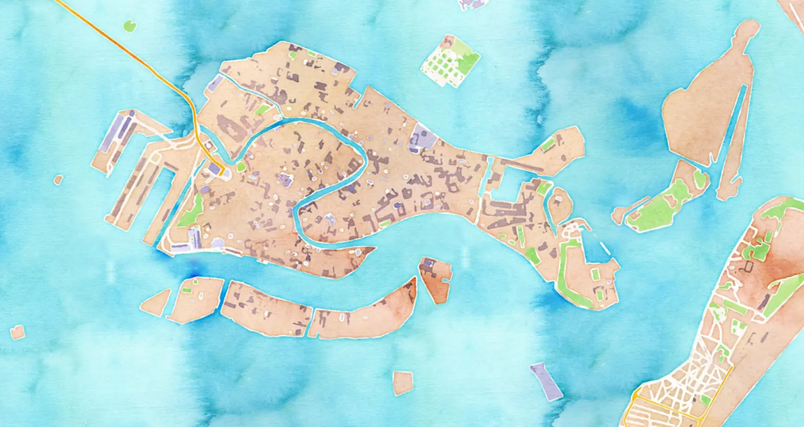

`https://stamen-tiles.a.ssl.fastly.net/watercolor/{z}/{x}/{y}.jpg`
