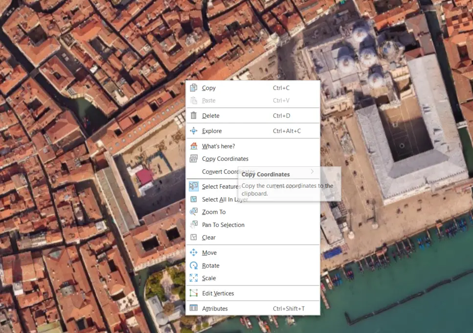
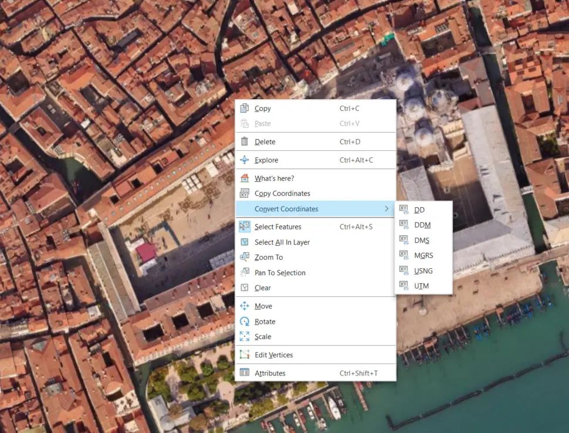
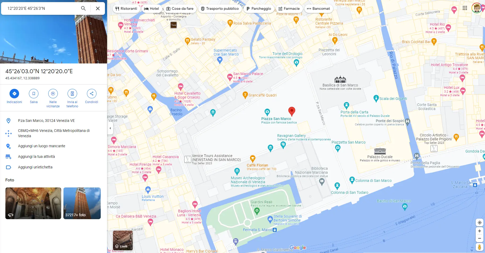
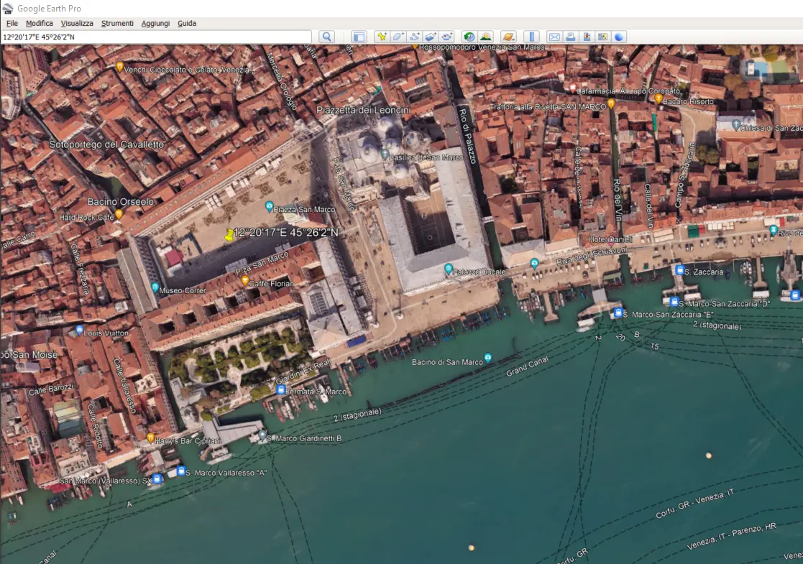

Continuing the series of the articles on ArcGIS Pro, today we will see how to view the coordinates of a point in Google Maps. This is a very useful operation when you have to locate a point on a map and you have the coordinates in a different format than the one used by Google Maps. In this case, we will see how to convert the coordinates of a point from the format used by ArcGIS Pro to the format used by Google Maps.

First, we need the ArcGIS Pro coordinates of the point we want to locate on Google Maps. To do this, we open the map in ArcGIS Pro and right-click on the point we want to locate. Then we select `Copy Coordinates`.



We obtain the coordinates of the point in the format used by ArcGIS Pro:

```
761.114,86E 5.036.590,18N m
```

Now we need to convert the coordinates to the format used by Google Maps. To do this, we can simply usa another command in ArcGIS Pro. Right-click again on the point we want to locate and select `Convert Coordinates`.



We can choose between different formats:

- **DD**: Convert to Decimal Degrees - `12,3385427°E 45,4340893°N`
- **DDM**: Convert to Decimal Degrees Minutes - `12°20,3059545'E 45°26,0473060'N `
- **DMS**: Convert to Degrees Minutes Seconds - `12°20'17"E 45°26'2"N`
- **MGRS**: Convert to Military Grid Reference System - `33TTL 91795 34615`
- **USNG**: Convert to United States National Grid - `33T TL 91797 34628`
- **UTM**: Convert to Universal Transverse Mercator - `33T 291801 5034620`

For ours purposes, we can choose `DDM -  Decimal Degrees Minutes` or `MGRS - Military Grid Reference System`. In this case, we choose `DDM`.

ArcGIS Pro will copy the coordinates to the clipboard in the format we have chosen. We can use the coordinates in the format we have chosen to locate the point on Google Maps via a simple search.



From this, we can see the Stree View of the point we have located.


We can also use the converted coordinates to locate the point on Google Earth.


