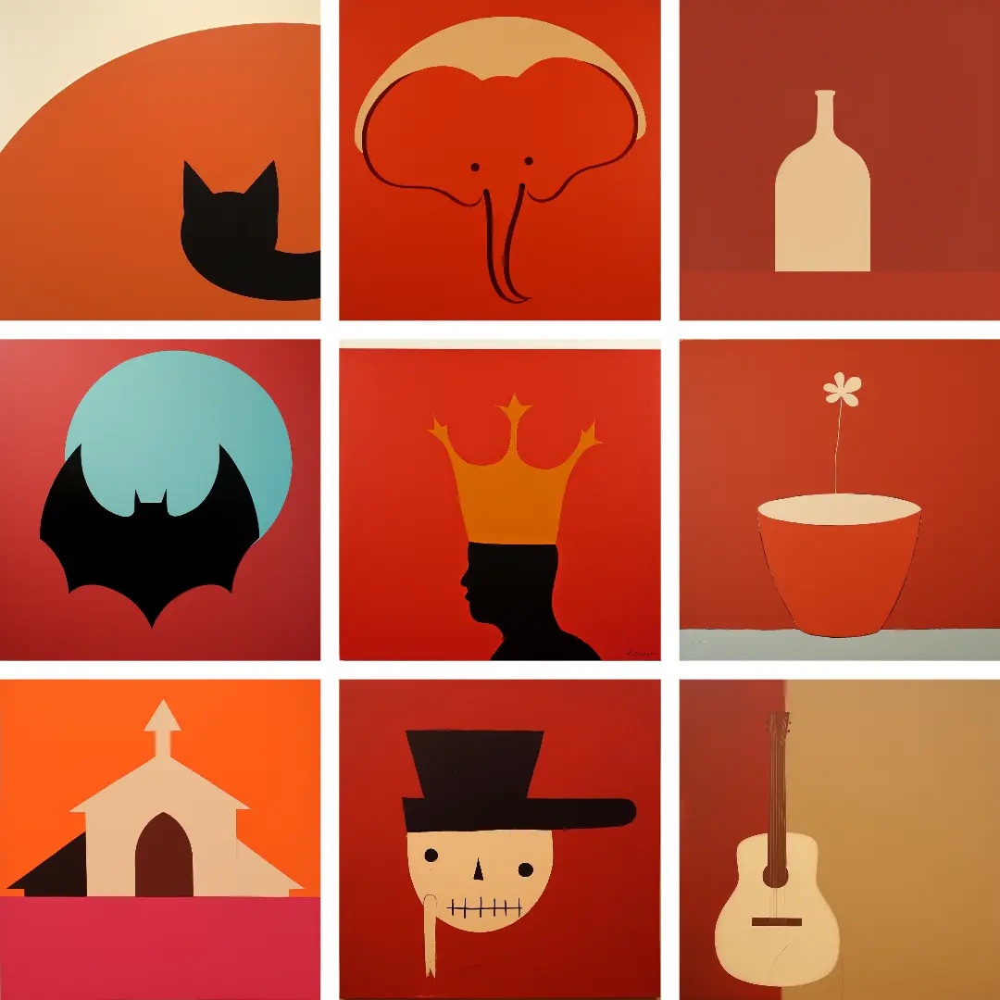
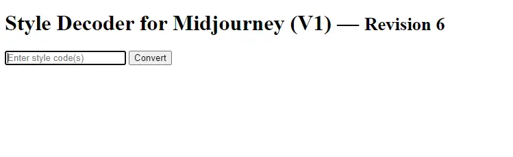
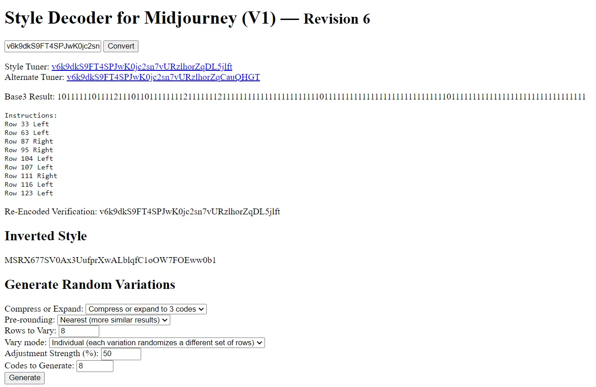
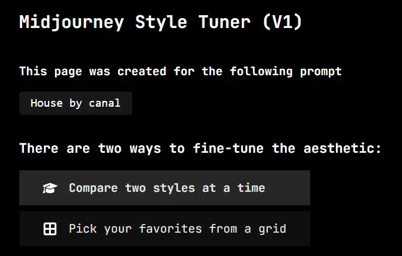
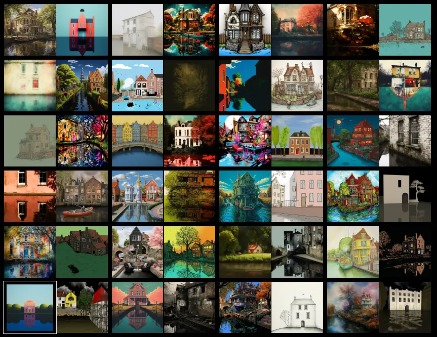
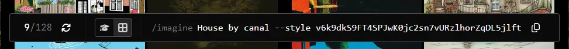
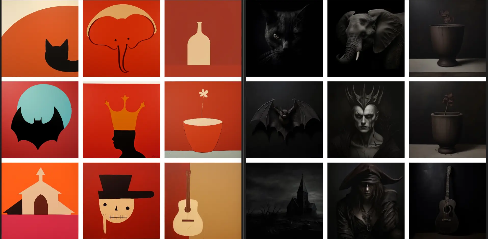

One of the most interesting features of Midjourney is the ability to create customized styles. The `/tune` function interprets the prompt and allows refining and personalizing the style of images generated by Artificial Intelligence. This way, it’s possible to maintain a stylistic consistency across different iterations. However, like any tool, it requires some practice to handle it well. A good way to start is by studying the various styles already available and trying to understand how to replicate them.

But what’s the problem? Well, styles are shared in this way:

```text
Description: Flat abstract illustration.
Prompt Template:  [3-5 words single focus subject], abstract --style v6k9dkS9FT4SPJwK0jc2sn7vURzlhorZqDL5jlft
[contributed by @Mardiray]
```

Mardiray has created several interesting styles, and this one in particular: it allows creating abstract illustrations, very suitable for illustrating posts.



I tried to replicate the same style using commands like these:

```text
/tune prompt: illustration abstract flat
/tune prompt: flat abstract
/tune prompt: solid color flat abstract
```

The problem is that I only get abstract images, and generally less beautiful ones. After a few failed attempts, I began to wonder how to understand what the original command used by Mardiray to generate the style was.

There are two methods for this kind of “reverse engineering”. The first, the simplest, is to use this link: [Style Decoder for Midjourney (V1) — Revision 6](ttps://cdn.kaetemi.be/dl/mj/style_dec_r6.html):



After pasting the style code (in this case `v6k9dkS9FT4SPJwK0jc2sn7vURzlhorZqDL5jlft`) into the text box, I click on `Convert`:



I get a series of useful information, but what now interests me are the first lines, with two links:

- Style Tuner: [v6k9dkS9FT4SPJwK0jc2sn7vURzlhorZqDL5jlft](https://tuner.midjourney.com/code/v6k9dkS9FT4SPJwK0jc2sn7vURzlhorZqDL5jlft)
- Alternate Tuner: [v6k9dkS9FT4SPJwK0jc2sn7vURzlhorZqCauQHGT](https://tuner.midjourney.com/code/v6k9dkS9FT4SPJwK0jc2sn7vURzlhorZqCauQHGT)

Clicking on the first link, I get the original prompt, `House by canal`



Immediately below are the generated images, with those selected highlighted, allowing Midjourney to create the customized style.



At the bottom of the page, I find an example prompt with the created style



```text
/imagine prompt: House by canal --style v6k9dkS9FT4SPJwK0jc2sn7vURzlhorZqDL5jlft
```

The second method is just as simple but doesn’t work if the style was originated from the `--style random` command.

To obtain the origin prompt of the style, it’s enough to replace `<code>` with the style at this address:

```text
https://tuner.midjourney.com/code/<code>
```

Using the same style as an example, I get: [https://tuner.midjourney.com/code/v6k9dkS9FT4SPJwK0jc2sn7vURzlhorZqDL5jlft](https://tuner.midjourney.com/code/v6k9dkS9FT4SPJwK0jc2sn7vURzlhorZqDL5jlft). After clicking on the address, I get a new address in the format:

```text
https://tuner.midjourney.com/<tuner>?answer=<code>
```

In my case, [https://tuner.midjourney.com/kMU8tgR?answer=v6k9dkS9FT4SPJwK0jc2sn7vURzlhorZqDL5jlft](https://tuner.midjourney.com/kMU8tgR?answer=v6k9dkS9FT4SPJwK0jc2sn7vURzlhorZqDL5jlft).

Besides the possibility of studying the original prompts, and thus improving one’s artistic skills, being able to access the original tuner’s URL allows experimenting without having to use `Fast Time`.

For example, I can modify the same style to get a decidedly darker effect:

```
Description: Realistic dark illustration.
Prompt Template:  [3-5 words single focus subject], dark --style 14yasUfsTj8AuhAwbpNP599Sykn4Rde4B36j
```

If I recreate the same images from the first example using this new style and compare the result, I get this


