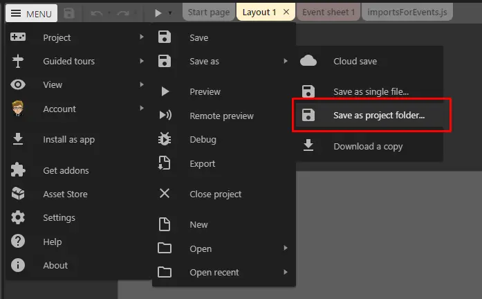
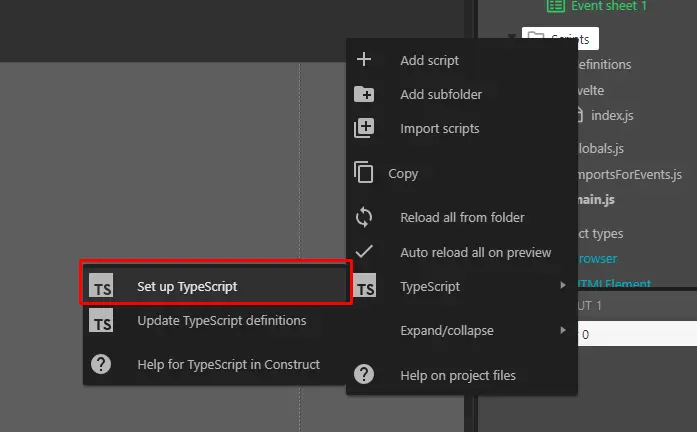
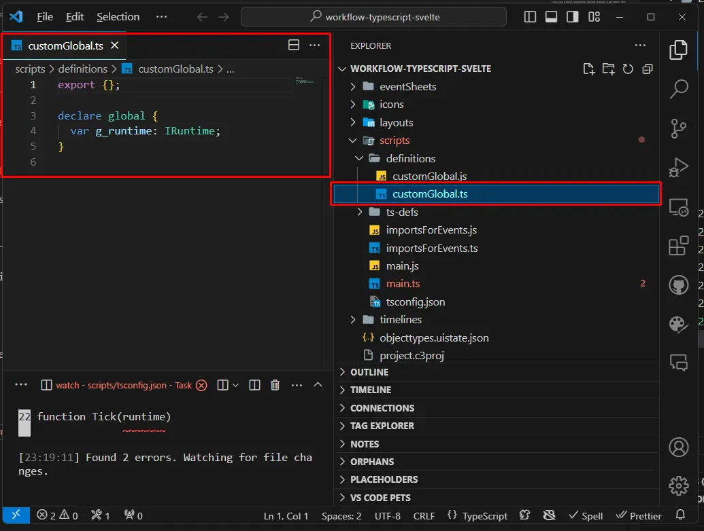
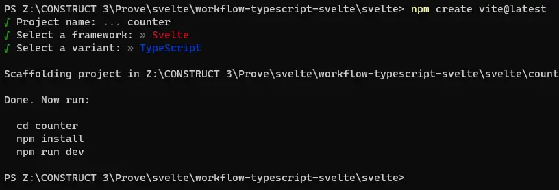
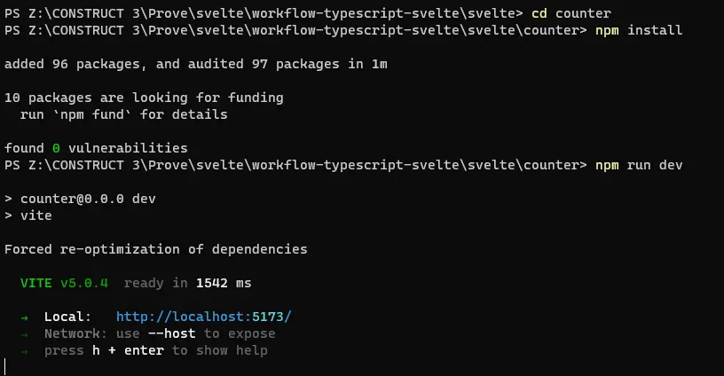
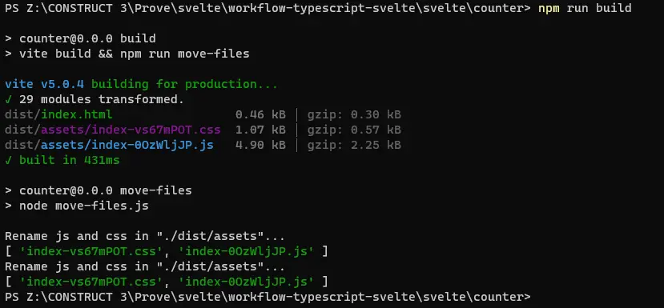
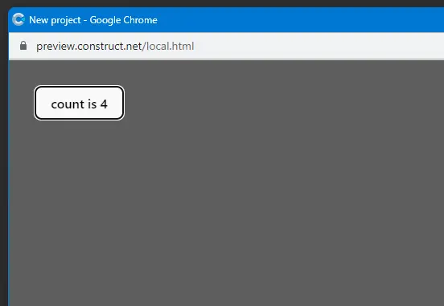
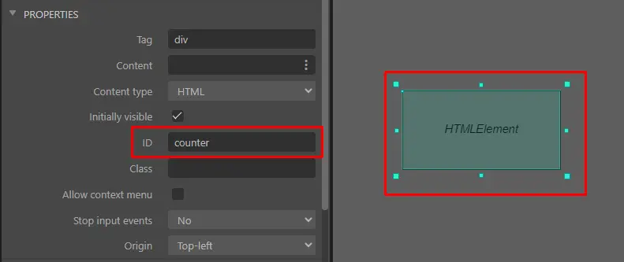

The latest version of Construct 3 introduces an interesting feature: the ability to use TypeScript. Ashley wrote a comprehensive guide on the various steps to follow (you can find it [here](https://www.construct.net/en/tutorials/using-typescript-construct-3003)). Building upon this, I want to add some notes on how to integrate Svelte into a Construct project.

These notes are divided into two parts. In the first part, I'll summarize the main steps to use TypeScript within C3. It's a condensed version of Ashley's guide. In the second part, I'll focus on using Svelte, reproducing the simplest example:


## TypeScript & Construct

### Configure Your Computer

The first thing to do is make sure you have [Node.js](https://nodejs.org/) installed on your computer. Secondly install TypeScript from the terminal using the command `npm install -g typescript`. You can check the installed version using the command `tsc --version`.

Ashley also mentions this potential error:


### Create the Project

After setting up your computer, you can create a project in Construct. Save the project "As Folder" using the command `Menu ► Project ► Save as ► Save as project folder...`



The next step is right-click on `Scripts` and choose `TypeScript ► Set up TypeScript`.



Since you'll be working on files on your PC but testing changes through Construct, it's a good idea to enable the "_Auto reload all on preview_" option.


Now you can open the project with your preferred text editor. In my case, I use Visual Studio Code.

In VS Code, I use the key combination `Ctrl + Shift + B` to select `tsc: watch` and enable the automatic compilation of `.ts` files into `.js`.


### Utilities

C3 sets up the project with all the essential files, but you can add some files to simplify your future workflow.

I create the file `scripts/definitions/customGlobal.ts`:

```ts
export {};

declare global {
  var g_runtime: IRuntime;
}
```



This allows me to customize `globalThis`.

Then I add the file `scripts/definitions/defs.ts`:

```ts
export interface Globals {}
```

This interface will be useful for adding global variables to the application. To use it, I create the file `scripts/globals.ts`

```ts
import type { Globals } from "./definitions/defs";
const Globals: Globals = {};
export default Globals;
```

Now it's time to organize the files generated by Construct. I open `scripts/main.ts`, delete all the content, and write:

```ts
runOnStartup(async (runtime: IRuntime) => {
  globalThis.g_runtime = runtime;
});
```

This code allows me to invoke the runtime directly from C3.

Finally, I modify the file `importsForEvents.ts`:

```ts
import * as Globals from "./globals.js";
```

This file allows Construct's Event Sheets to communicate directly with the code generated from TypeScript.

## Svelte & Construct

### Set Up Svelte

So far, we've covered configuring C3 and TypeScript. Now it's time to add [Svelte](https://svelte.dev/).

Remember the purpose of this tutorial: creating a button that counts clicks. In other words, replicating a basic example.

To do this, the first thing to do is create a folder to save the Svelte-related files. I'll be creative and call this folder `Svelte`. From within it, I open a terminal and use the command:

```bash
npm create vite@latest
```



I chose the project name as `counter`, the framework as `Svelte`, and the variant as `TypeScript`.

Still from the terminal, I use the commands:

```bash
cd counter
npm install
npm run dev
```



Using the link `http://localhost:5173`, I can see the HTML page generated by Svelte:


### Clean Up Svelte Code

We can simplify the code to keep only the part that interests us, the `Counter` component. I modify the file `\svelte\counter\src\App.svelte`:

```html
<script lang="ts">
  import Counter from "./lib/Counter.svelte";
</script>

<main>
  <div class="card">
    <Counter />
  </div>
</main>

<style>
  .card {
    position: absolute;
    top: 0;
    left: 0;
    padding: 2em;
  }
</style>
```

I then add a style to `\svelte\counter\src\lib\Counter.svelte`:

```html
<script lang="ts">
  let count: number = 0;
  const increment = () => {
    count += 1;
  };
</script>

<button on:click={increment}>
  count is {count}
</button>

<style>
  button:hover {
    background-color: rgb(247, 218, 146);
    color: rgb(30, 4, 4);
  }
</style>
```

Finally, I modify the file `\svelte\counter\src\main.ts`:

```ts
import "./app.css";
import App from "./App.svelte";

const app = new App({
  target: document.body,
});

export default app;
```

This way, the component is inserted directly into the page. In my opinion, it's not the best solution; I'll explain a better method later.

After these changes, the Svelte preview shows this:


### Compile Svelte Code

To use this component in Construct, I need to compile it and get the files to import into C3.

I use the command:

```bash
npm run build
```


This command creates two files: `\svelte\counter\dist\assets\index-XXXXX.css` and `\svelte\counter\dist\assets\index-XXXXX.js`. To use them with Construct, I need to copy them to the folders `\files\` and `\scripts\`. You can do this manually, but I recommend creating a script that handles moving the files to the correct location and renaming them more simply. I create the file `\svelte\counter\move-files.js`:

```js
import { existsSync, readdirSync, copyFileSync } from "fs";
import path from "path";

function renameDist(arg) {
  const { dir, match, replace, destination } = arg;
  console.log(`Rename js and css in "${dir}"...`);
  if (existsSync(dir)) {
    const files = readdirSync(dir);
    console.log(files);
    files
      .filter((file) => file.match(match))
      .forEach((file) => {
        const filePath = path.join(dir, file);
        const newFilePath = path.join(
          destination,
          file.replace(match, replace)
        );
        copyFileSync(filePath, newFilePath);
      });
  }
}

const dir = "./dist/assets";

renameDist({
  dir,
  match: RegExp(/\-(.*?)\.js/, "gi"),
  replace: ".js",
  destination: "../../scripts/svelte",
});

renameDist({
  dir,
  match: RegExp(/\-(.*?)\.css/, "gi"),
  replace: ".css",
  destination: "../../files",
});
```

I modify the file `\svelte\counter\package.json`:

```json
{
  // ...
  "scripts": {
    "build": "vite build && npm run move-files",
    "move-files": "node move-files.js"
  }
  // ...
}
```

If the folders `\files` and `\scripts\svelte` don't exist, create them. Run the command in the terminal:

```bash
npm run build
```



### Integrate Svelte in Construct 3

I go back to the file `\scripts\importsForEvents.ts` and add:

```ts
//@ts-ignore
import * as svelte from "./svelte/index.js";
```

Then I import the stylesheet:

```text
+ System: On start of layout
-> Browser: Load stylesheet from "index.css"
```


I then show the project preview with Construct:


### Insert a Svelte Component into an HTML Element

So far, we've inserted a Svelte component into an HTML page using Construct. But it's more useful to insert the component directly into the structure created by C3. To do this, create an HTML element in the project and assign it an ID (for example, `counter`).



I then modify the file `\svelte\counter\src\main.ts` to load the component directly into the Construct HTML element:

```ts
import "./app.css";
import App from "./App.svelte";

const app = new App({
  target: document.getElementById("counter"),
});

export default app;
```

But it's better to tweak the code a bit more to allow Construct to dynamically load the component. To do this, I use `globalThis` to which I add a `Counter` property.

```ts
import "./app.css";
import App from "./App.svelte";

declare global {
  var Counter: unknown;
}

globalThis.Counter = () =>
  new App({
    target: document.getElementById("counter") || document.body,
  });

export default globalThis.Counter;
```

From an Event Sheet, I use the JavaScript code:

```js
globalThis.Counter();
```

This way, I finally get the result:


<!-- Posso in alternativa modificare l'interfaccia `Globals` in `\scripts\definitions\defs.ts`:

```ts
export interface Globals {
  app: Function;
}
```

in modo da poter importare direttamente il modulo in `\scripts\globals.ts`

```ts
import type { Globals } from "./definitions/defs";
const Globals: Globals = {
  //@ts-ignore
  app: import("./svelte/index.js"),
};
export default Globals;
``` -->
