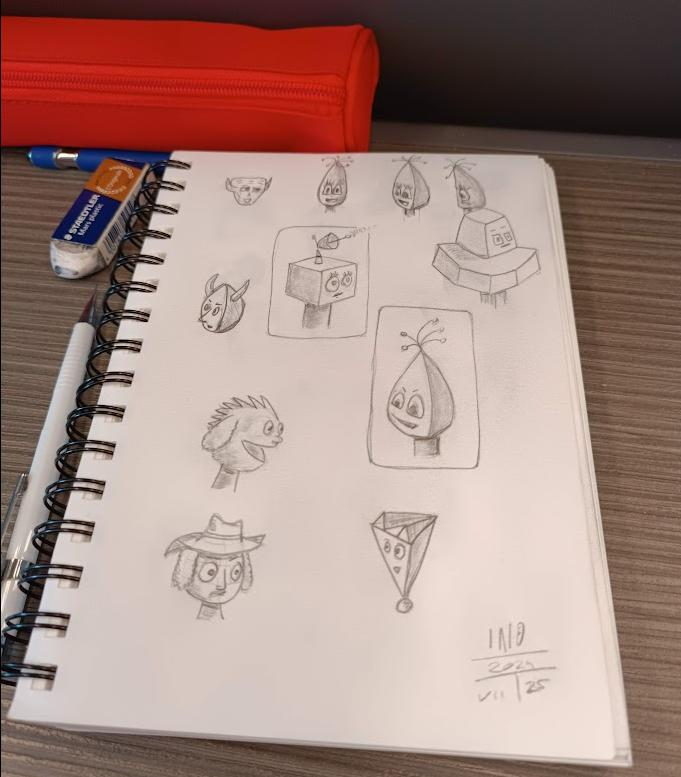

Over the past few months, I've been focusing a lot on drawing. Last spring, I injured my leg and was immobilized for a while. In addition to spending a lot of time reading, at my wife's suggestion, I picked up a pencil and paper again. I started taking an online drawing course (on [https://www.21-draw.com/](https://www.21-draw.com/)) and... I'm still drawing now.

The interesting thing is that the more I draw, the less I feel the need to use AI to generate images. Drawing with a pencil first, then with a graphics tablet, has become a habit that relaxes me, makes me feel good, and de-stresses me.

I don't have a well-defined style yet, not at all. But I like exploring this artistic side of me, which I didn't even know I had anymore. And the more I explore, the more I discover interesting things about myself and how I see the world.

I have discovered, or rather rediscovered, the beauty of creating something that truly exists in the material world. Drawing in a sketchbook means transferring a part of me into an object. Painting a canvas with acrylics, or cardboard with watercolors, means giving life to something tangible. Real. Something you can touch.

I had forgotten this satisfaction, this joy linked to creation.

The more time passes and the more drawings I make, the more I learn and the more I realize how much drawing reflects something of me. It is becoming a way to express myself, to communicate with those close to me and with the world.

In the last 18 months, I've changed my life, changing jobs and many of my old acquaintances. I have faced a significant bereavement. I closed a chapter of myself that I considered fundamental but that over the decades had become something else entirely.

In the midst of all these changes, I realized that I needed to tell my loved ones about myself. And to share myself. But above all, I needed, I need, to make myself understood.

Drawing is becoming this. A way to express myself. As I thought writing was for me.

Drawing has also changed the way I see writing and photography. I am not able to unite the two worlds, but I am beginning to feel the need to tell stories. To use drawings together with words. And mix it all with photography. I'm starting to experiment.

Which, in my case, still means discovering and learning the basics. But my head is buzzing with creative ideas like it hasn't been in a really long time.

And I can't wait to find out how many of these I'll be able to achieve.
