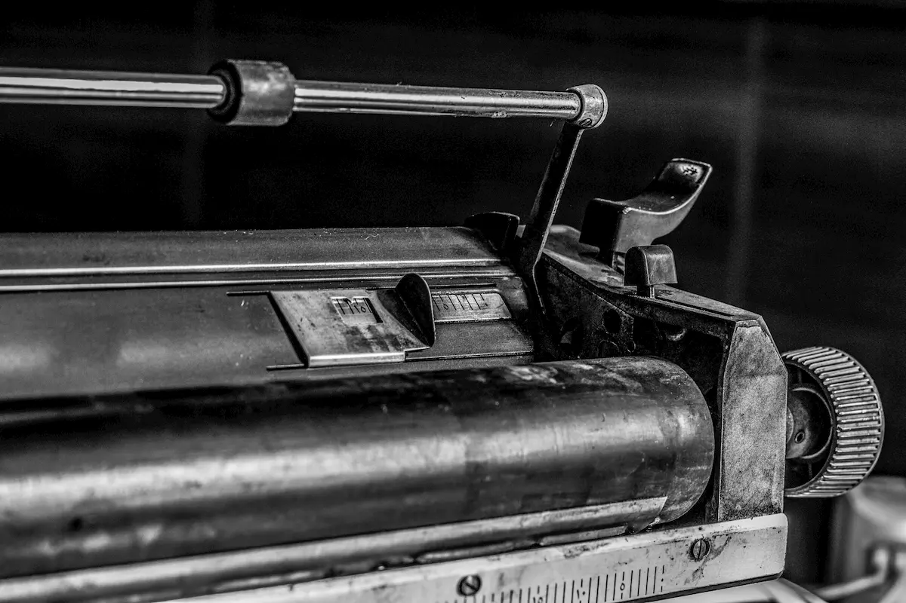
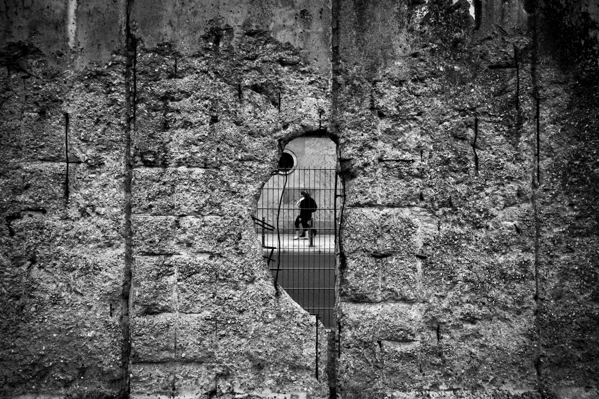
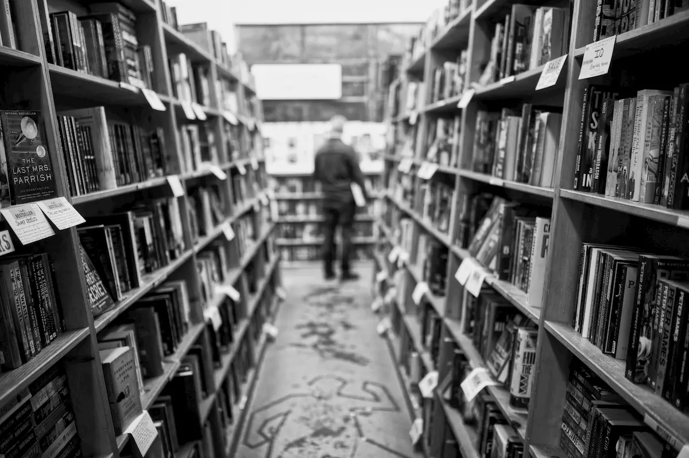

Ecco. Finito. Ho appena concluso la lettura – o forse dovrei chiamarlo studio? – di una ventina di pagine. Il tema? **Il blog e la scrittura nella rete**. L’autore, che poi è un’autrice: **Chiara Rivella**. Ed è giunta l’ora della mia sintesi, e del mio logorroico ripetere. Un po’ come facevo a scuola: inchiodavo mia madre in cucina a sentir parlare di rivoluzione francese, teoremi matematici e martoriare l’inglese e il francese. Posso chiedere scusa pubblicamente a tutta l’Inghilterra? Magari un’altra volta.

Quindi, di cosa parla quello che ho letto? Di tante cose interessanti, e di tante cose inutili. No, non inutili in senso assoluto: inutili per me, che sono tutto fuorché un’esperto. Anzi, da questa lettura mi aspettavo un’indicazione: lo fò o no lo fò il mio bel post personale?

### La Storia Dei Blog

L’inizio è interessante, storicamente parlando. Ancor di più se uno prova ad usare Google Plus o Facebook e scopre che tutti i protagonisti della storia dei blog sono in questi social network. Fa comunque impressione scoprire che _Dave Winer_, **il primo protoblogger** con _Scripting News_, _Jorn Barger_, l’autore del **primo blog della storia**, e _Peter Merholz_, quello che ha detto _we blog_ per primo, ecco, tutti questi tre sono qui, a portata di click. E, no, non ho dimenticato il **primo blogger italiano**, _Antonio Cavedoni_, con il suo _Blogorroico_ del 2000.

Ma non è quello che mi interessava sapere. Anche se mi è interessato scoprirlo. Più che sulla nascita e sullo sviluppo dei blog è la parte successiva, appena accennata, che mi voglio soffermare. Capisco, forse sto commettendo un torto, spero non grave, mettendo l’attenzione su un aspetto marginale, tra tutti quelli che posso prendere. Ma è proprio l’aspetto che più mi ha fatto riflettere.

Prima di proseguire dico subito una cosa: i consigli su come scrivere, e anche le dritte per tenere un blog vanno bene. E sono proprio l’aspetto centrale di queste pagine. Ma, capitemi, io sono ben prima di quella fase. Cioè, lo voglio tenere un blog? E, sopratutto, lo posso conservare in vita?

### Differenze Tra Blog e Social Network

Ok, basta logorrea e passiamo alle due cose che più mi hanno colpito. Che poi sono due confronti. Il primo tra blog e social network. Il secondo tra l’editoria su internet e quella tradizionale.

Partiamo da Blog e Social Network. Dai miei appunti posso trarre 4 punti di diversità importanti.

  1. **i blog sono accessibili a tutti**, mentre quello che pubblichiamo su Social Network no. Quindi, se il mio ego mi richiede una visibilità maggiore devo per forza cominciare a scrivere in uno spazio aperto, senza la protezione di mamma Google o di babbo Facebook.
  2. **i blog sono strumenti d’informazione**. Mentre i social network servono più per la trasmissione di stati d’animo, di sensazioni e di emozioni. Ma io non ho assolutamente l’intenzione di fare informazione: mica ne sono in grado. Ma, a volte, mi piace anche parlare di cose serie. Ok, lo so: internet, e il rapporto mediato da uno schermo non è il medium adatto ad un discorso serio. Non attraverso un Social Network, per lo meno.
  3. **il blog è un compagno di vita**. E i social network sono più dei flirt, una storia di passione importante, ma destinata a finire presto. E qui mi tocca pendolare verso i blog, nuovamente. O verso un diario personale. Che poi, alla fine, nel mio caso è una cosa simile: scrivo per mettere in chiaro i miei pensieri, e farlo in pubblico è un vincolo per… bé, farlo veramente.
  4. **i blog possono essere di più ampio respiro**, rispetto ad un social network. Bene, è proprio quello che mi serve. Non restare confinato allo spazio, alla fine ristretto, di un post. E magari poter mettere le immagini dove meglio mi pare e dove mi piace. Cosa che non sempre si può fare sui social network.

### E Quelle Tra Blog Ed Editoria Tradizionale

Il passo successivo è scontato, direi quasi ovvio. Ad un certo punto l’autrice sfiora un tema interessane, e sui cui non avevo, e non ho, ancora riflettuto a fondo. Cosa? I diversi modi con cui leggiamo un romanzo, un giornale e su internet.

  - Quando leggiamo un **romanzo** stiamo attenti ad ogni parola, ad ogni frase. Io, per lo meno mi immergo nella lettura e nulla, nemmeno la mia fermata della metropolitana, riesce a distogliermi. Mi faccio rapire, cullare dalle parole e trasportare in un mondo diverso. È, per certi aspetti, **un’esperienza totalizzante**.
  - Diversa è la lettura del **quotidiano**. Quello cartaceo, la mattina. È un rito, per me. È la mia preghiera mattutina, il mio entrare in contatto con il mondo reale. E non una fuga in un mondo incantato, ma la ricerca delle informazioni che mi servono, per lavoro o anche no. Sfoglio il giornale, il Corsera di solito, e cerco notizie. **Divoro le notizie, non mi interessano le opinioni**, voglio i fatti. E dopo aver saziato la mia fame, solo allora torno a cercare gli editoriali, per sentire un po’ che c’ha da dire la nostra intellighenzia, nella sua illusione di contare qualcosa.
  - La lettura su **internet**, infine, è una lettura ancora diversa. E’ un’**azione frammentata, rapida**, che scatta da un’argomento all’altro e che difficilmente si sofferma su qualcosa. E’ una lettura da party: si va da una portata all’altra, assaggiando spizzichi e bocconi. Ed è una lettura utile, sicuramente. Ma non è una lettura che mi soddisfa.

Anche la scrittura di un blog deve adattarsi a questo. Almeno stando alle indicazioni, più che sensate dell’autrice. Ma, onestamente, se devo scrivere per venire macinato, spezzettato, saltato e infine dimenticato… non so come dirlo. Forse è meglio riprendere in mano il mio vecchio caro diario, la mia vecchia stilografica e continuare a rovinare un quaderno.

Ma qui, in realtà, il discorso dovrebbe ampliarsi un pochetto. E dovrebbe divenire una riflessione, e un ragionamento, sul perché si scrive. O su chi sia il destinatario delle nostre parole. E, tanto per cambiare, torno punto e a capo.

Tranquilli, la finisco qui. Auguro una buona vita a chiunque sia arrivato alla fine di questa pagina. E anche agli altri, va là, che alla fine sono buono anch’io.
