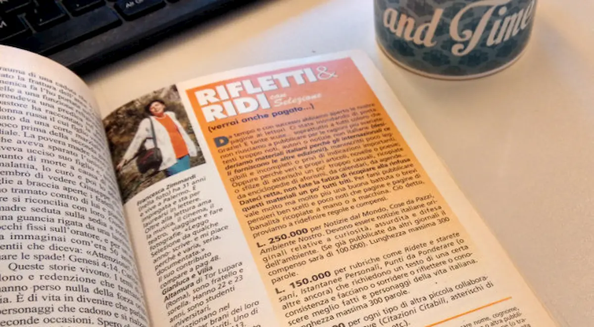

- _Pronto?_
- _Pronto, sono G. Ho un lavoro interessante per lei?_
- _Ok, mi dica._
- _Si tratta di questo: mi servono 3000 recensioni di luoghi turistici italiani._
- _Va bene. Per quando?_
- _Entro fine mese._
- _Scusi?_
- _Sì, entro dieci giorni
- _3000 recensioni originali in dieci giorni?_
- _Certo, ma le pago._
- _E ci mancherebbe altro. E quanto?_
- _30 centesimi l’una._
- _Eh?_
- _Sono 900 euro, in tutto._
- _No, guardi, non ho capito bene._
- _È facile: lei mi fa 3000, tremila, recensioni da almeno 150–200 parole. Ognuna gliela pago 30 centesimi, in tutto fanno 900 euro lordi._
- _Intende tremila copia incolla da Wikipedia?_
- _No, recensioni originali._
- _D’accordo. Ci penso un attimo. La richiamo io._
- _Le do il mio numero di telefono._
- _Non si preoccupi, lo trovo io._
- _Ma…_

**CLICK!**

- _Chi era amore?_
- _Un tale, G. Cercava qualcuno da truffare._
- _Posso farti una domanda, Iaia?_
- _Prima o poi la smetterai di domandarmi se puoi fare una domanda?_
- _No._
- _Và, idiota. Che vuoi?_
- _Ricordi dove ho messo il numero del Readers’ Digest?_
- _Eh?_
- _Sì, Selezione, quella rivista che ho preso al super perché raccoglievano le offerte per Telethon._
- _Sì, la bancarella con tutte le robe vecchie e rovinate: ci hai passato mezz’ora e alla fine hai preso quella che costava meno…_
- _Beh, tre soldi sono sempre tre soldi._
- _E infatti tu hai donato un euro solo, pulcioso!_
- _Vabbè, ma che c’entra adesso? Ricordi dove l’ho messa?_
- _Boh. Prova a guardare nel mobiletto del bagno._

- _Bravissima amore! Trovato!_
- _Bene. E… quindi?_
- _Guarda qui._
- _Dove?_
- _Qui, dove c’è scritto “verrai anche pagato”._

- _Cosa? 250 000 lire per 300 parole? 50 000 lire per una citazione?_
- _Eh già. Bei tempi quelli del Gennaio ’97, no?_
- _Dannazione, siamo nati nell’epoca sbagliata, Iaio._
- _130 euro per un pezzo. E comunque non meno di 25 euro per qualcosa di semplice._
- _Adesso invece…Mi hanno proposto 30 centesimi per pezzo... Sai una cosa?_
- _Cosa?_
- _Quasi quasi spedisco curriculum a Selezione._
- _Non puoi._
- _Perché no?_
- _È fallita. O comunque non pubblica più qui da noi._
- _Davvero?_
- _Davvero. Dal 2007, mi pare._
- _Dannazione._
- _Dannazione._
