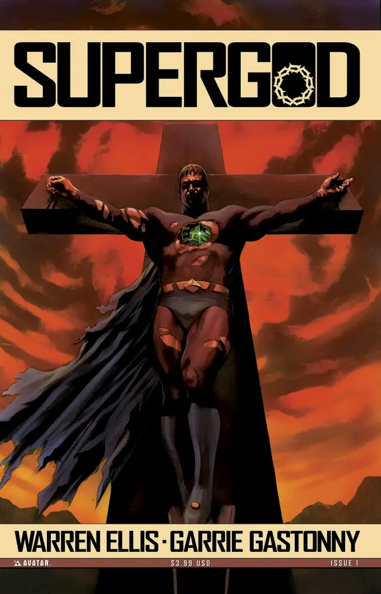
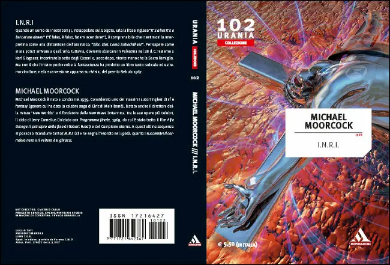
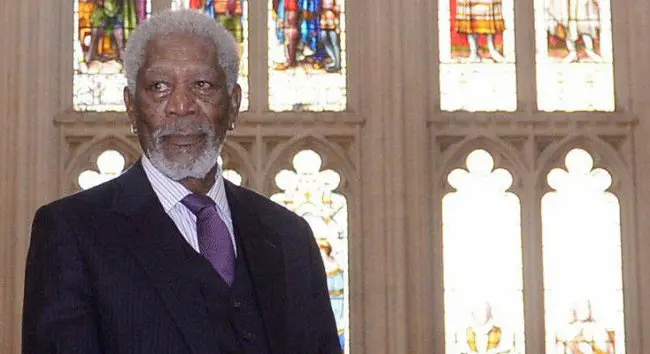

Giuro, non ero cosciente quando li ho presi. Li ho comprati domenica, in Stazione Centrale. Sì, nella vecchia nuova Stazione Centrale di Milano, quella costruita nel 1931 per sostituire quella del 1864. La Stazione Centrale trasformata in un centro commerciale. No, non chiedermi quali negozi ci sono: conosco solo la Feltrinelli – su 3 piani -, la farmacia e un bar dove ogni tanto prendo un caffè.

Ma non è di treni che voglio parlare, anche se la mia infanzia è legata, in maniera indissolubile alla vecchia gloriosa Lima e ai suoi modellini – e alla gigantesca locomotiva vedevo ogni mattina, andando alla vecchia scuola elementare del paese. No, non è di treni che voglio parlare. Ma di libri. Se mi lasci chiamare libro un romanzo di fantascienza e un fumetto edito dalle edizioni BD.

Sto divagando. La pioggia continua a bussare alla mia finestra, e culla la mia mente. E penso di quando è strano accorgersi solo dopo averli letti, solo dopo averli finiti, di come le copertine di questi due libri si somiglino. Il primo, **I.N.R.I.** di **Michael Moorcock** ha un bellissimo Cristo d’argento. Sofferente, straziante, evocativo. E, per una volta, Urania azzecca una copertina: rappresenta la storia contenuta nel libro. Evviva! Una storia strana, al limite con il blasfemo e sconfinante nella dolcezza.

Il secondo libro, il fumetto, è **SuperGod** di **Warren Ellis** e di **Garrie Gastonny**. E anche qui abbiamo un Cristo appeso in croce. Ma è un Cristo cupo, un Cristo Superman. Ed è un Cristo cattivo, con un cielo rosso alle spalle che non fa presagire nulla di buono. E la storia non è una storia buona. E’ una storia blasfema, cattiva, senza redenzione. Triste, forse troppo triste.

### SuperGod

INRI è del 1966, SuperGod del 2011: 45 anni separano queste due immaginazioni. Storie, fantasie, chiamiamole come vogliamo. Sono storie di fantascienza, sicuramente. Ma **sono anche, e forse soprattutto, la storia di come noi creiamo i nostri dei, a nostro uso e consumo**. Ma sopratutto a nostra immagine e somiglianza.

In SuperGod un’umanità mai pacificata si lancia in una corsa agli armamenti che supera ogni peggiore immaginazione. Ogni nazione, ogni potenza vuole creare la propria divinità, il proprio vitello d’oro in grado di garantire protezione e potenza. Ma gli dei, tutti gli dei, sono insondabili alla mente dell’uomo. E agiranno per un fine superiore, il loro fine superiore. Peccato che i loro scopi non prevedano noi, gli esseri umani.

Sicuramente è **una visione cupa, razionalistica e tragica della religione**. E’ una visione del mondo contemporaneo malinconica, e senza speranza. Non c’è nemmeno un futuro a cui aggrapparsi, né la possibilità, remota, di risolvere una situazione sfuggita completamente al controllo degli umani.

### I.N.R.I.

Diverso, invece, è la prospettiva offerta da Michael Moorcock. Siamo sempre di fronte alla creazione di Dio da parte dell’uomo, ma non per portare distruzione. No, assistiamo, seguendo le vicende narrate nel romanzo, alla nascita, alla vita e alla morte di Gesù di Nazareth. Ma non il Cristo narrato dai Vangeli. O, meglio, **scopriamo che il Messia alla base dei Vangeli non è altri che un viaggiatore nel tempo**. Karl Glogauer affronta un difficile viaggio nel passato per poter finalmente conoscere Gesù, e **scoprire se la propria fede ha un senso**.

San Tommaso? Sì, è un moderno San Tommaso, con la necessità di verificare, e sopratutto di incontrare il proprio Messia. Ma la realtà è diversa da quello che si immaginava: nel 28 d.C. Gesù, figlio di Maria e di Giuseppe è tutto fuorché il Figlio di Dio. Anzi. Sarà Karl stesso, trascinato dal bisogno di credere vero il Vangelo a dar vita alla predicazione, ai miracoli e alla crocifissione. E **a sacrificare la propria vita per dare un senso a tutta la storia futura. Ma soprattutto alla propria esistenza.**

### 45 anni

Sono 45 gli anni che dividono questi due racconti. La storia, alla fine, è la stessa raccontata in due varianti. E’ triste, o per lo meno lo è per me, pensare come negli ultimi decenni sia cambiata la visione delle cose. **Negli anni ’60 il Dio creato dall’uomo è un dio benigno**, tutto sommato salvifico. **Oggi**, nel secondo decennio del 2000, gli dei dell’uomo sono… no, non malvagi. **Sono divinità per cui l’uomo non ha senso**. Come a rappresentare questa nostra povera umanità sballottata dagli eventi, dalle crisi, dalle guerre e dalle catastrofi naturali. Come se non ci fosse più motivo per aver fiducia nel futuro. Anzi, è quasi come se ci fosse la certezza di non avere più futuro, davanti a noi.

Non so, per carattere mio personale **il mio preferito è il primo: credo fermamente che la nostra specie, che noi esseri umani abbiamo un grande futuro davanti**. Sì, è un futuro tutto da conquistare, anche con fatica e con sudore. Ma **abbiamo un futuro davanti**. Sì.
