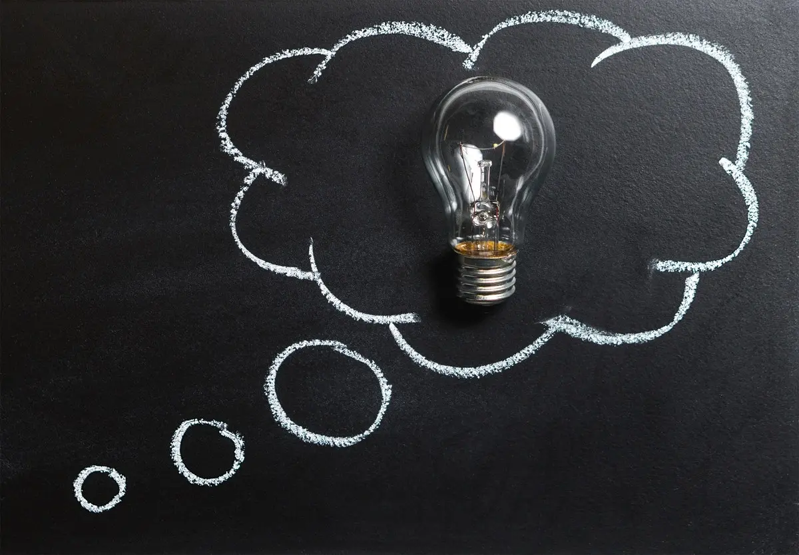
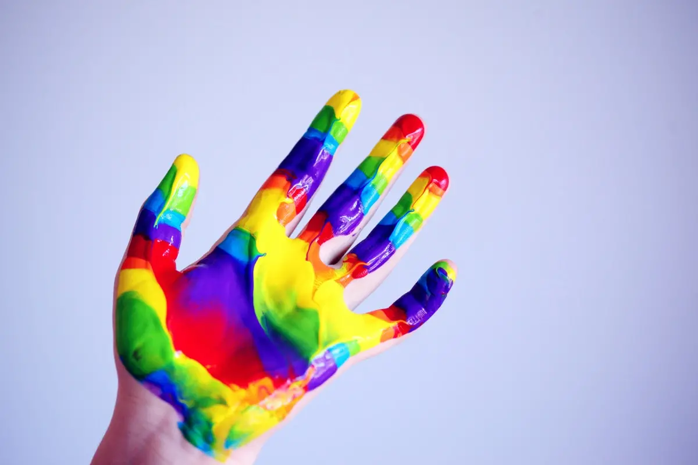

Siamo onesti, hai mai avuto un’idea geniale sotto la doccia? Sicuramente sì: non importa se è stata una grande idea, ma nel bene e nel male tutti abbiamo avuto delle epifanie sotto la doccia. Grandi o piccole che siano, la cosa strabiliante è che mentre siamo sotto l’acqua calda pare più facile pensare in maniera creativa. E, sorpresa, effettivamente è così: la doccia è un luogo magico. Ed è il luogo ideale per fare una pausa creativa. Ma perché?

Lo so, la domanda è strana, ma se ci pensi un attimino non lo è nemmeno troppo. In fin dei conti capire perché la doccia fa pensare fuori dagli schemi può essere utile per riuscire a fare delle pause creative anche in altre occasioni. Ma, prima di tutto, cos’è una pausa creativa?

### Cos’è una pausa creativa?

**Edward De Bono** è probabilmente il primo a utilizzare questo termine – “pausa creativa” – nella sua accezione completa. E descrive la pausa creativa come un’azione cosciente, deliberata: è una pausa che ci auto imponiamo, del tempo da usare per prendere in considerazioni soluzioni alternative a un problema. Una pausa da fare anche quando le cose stanno andando alla perfezione: “alcuni dei risultati migliori arrivano quando smettiamo di pensare a quello che nessun altro ha smesso di pensare”. De Bono suggerisce che non occorrono necessariamente delle pause lunghe: a volte **anche solo 30 secondi possono bastare**.

Ovviamente Edward De Bono non è l’unico a parlare di pause creative. Lajos Székely, in un saggio pubblicato nel 1967 su [International Journal of Psychoanalysis](http://www.pep-web.org/document.php?id=PAQ.038.0505A), descrive così le pause creative:

> La “Pausa Creativa” è definita come l’intervallo di tempo che inizia quando il pensatore smette di preoccuparsi consapevolmente di un problema irrisolti, e termia quando la soluzione del problema appare inaspettatamente nella coscienza.

Entrambi concordano sulla necessità di una interruzione auto imposta, ovvero sul decidere di smettere di pensare a un problema, e di fare una pausa. E la doccia è, per forza di cose, una pausa in mezzo alle altre attività.

### Come fare una vera pausa creativa

Ma non è solo questo. Se bastasse fare uno stacco per risolvere tutti i problemi sarebbe davvero bello. E facile. Sfortunatamente non è così. Quindi, perché una doccia può essere creativa e una pausa a caso no? Per capirlo, e per capire come rendere creativi anche altri momenti, vediamo cosa rende così speciale una doccia:

  - **è difficile distrarsi**: farsi una doccia significa isolarci da tutto. Niente lavoro, niente smartphone, niente libri, niente che ci possa distrarre. Quando ti fai una doccia non hai altra scelta che concentrarti sul lavarti e sul pensare. Puoi continuare i pensieri di prima, senza distrazioni, oppure lasciare vagare la mente liberamente, o ancora concentrarti su qualcosa di nuovo.
  - **serve poco impegno per lavarsi**: lavarsi è un’attività quasi automatica. Non ci devi dedicare tanta attenzione, e la routine del bagnarsi, insaponarsi e risciacquarsi non ha bisogno di pensieri coscienti. Di conseguenza la nostra mente è costretta a pensare ad altro, che lo vogliamo o no: mentre ci laviamo siamo obbligati a pensare a qualcosa di nuovo.
  - **la doccia crea una specie di “rumore bianco“**: il suono dell’acqua spruzzata dall’ugello crea, cadendo a terra, una specie di rumore bianco. Cioè un rumore “caratterizzato dall’assenza di periodicità nel tempo e da ampiezza costante su tutto lo spettro di frequenze” (fonte: Wikipedia). Perché è importante? Perché è un suono che aiuta la concentrazione eliminando i rumori irritanti e fastidiosi. In pratica è il rumore ideale per pensare, e per lavorare.
  - **il cambiamento dello scenario pone le basi per l’imprevisto**: uno dei modi migliori per pensare cose nuove è provare nuove esperienze. O per lo meno provare a cambiare qualcosa in quello che stiamo facendo. E fare la doccia è esattamente questo: si cambia luogo (ovviamente), si cambia abbigliamento, si cambia temperatura corporea e si aggiunge l’acqua. Pare una sciocchezza, ma tutti questi cambiamenti, per quanto minimi, obbligano la nostra mente a considerare nuovi aspetti alle vecchie questioni.

  Ovviamente non sempre è possibile farsi una doccia per pensare meglio. Cioè, te l’immagini io che a metà riunione mi alzo, esco, vado a farmi una doccia, e ritorno? Minimo minimo mi licenziano, o mi mandano al manicomio. Però sono tutti elementi utili per capire come fare una pausa creativa

    1. devi ridurre al minimo le distrazioni, compreso la musica e il rumore.
    2. devi lasciare che il corpo si impegni in un compito semplice, banale e ripetitivo per lasciare libera la mente di pensare ad altro.
    3. devi cambiare stanza o ambiente.

  Se ci pensi ci sono molte attività simili alla doccia da poter utilizzare come pause creative, dal mangiare al camminare fino al disegnare. Ovviamente sta a te trovare il tipo di pausa più adatto ai tuoi tempi e alle tue necessità.
