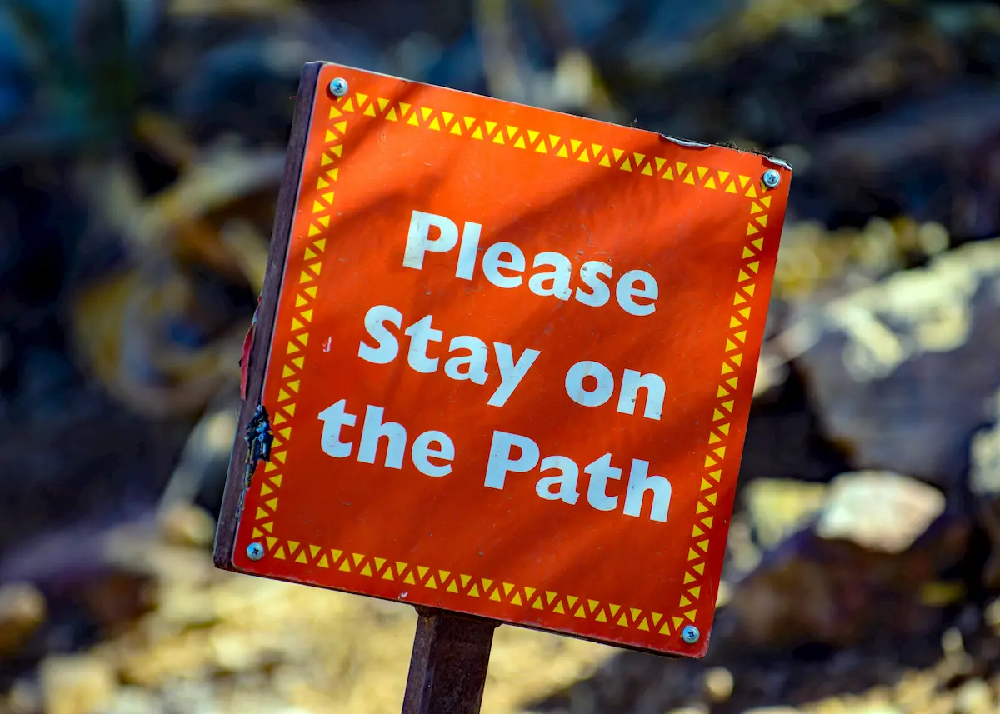
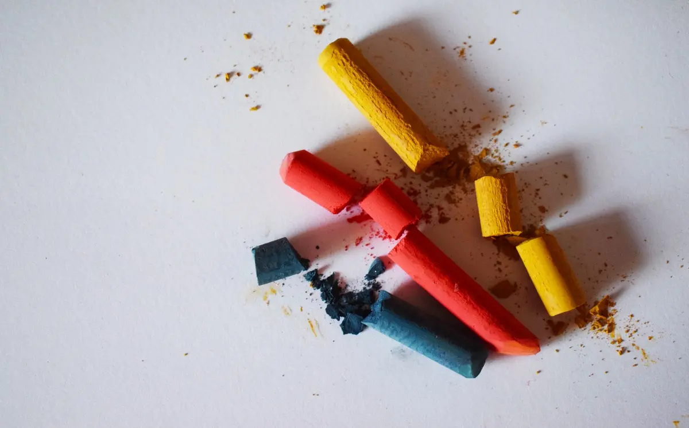
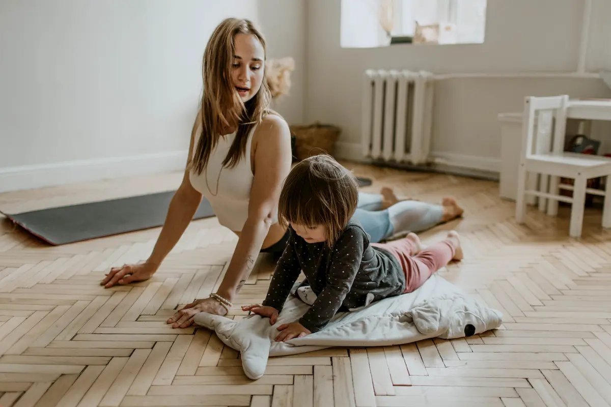

Sì, lo so, non sono bravo a fare le recensioni. Non ho le conoscenze tecniche per sfrucugliare un libro o un racconto alla ricerca di sviste, errori e imprecisioni. E, onestamente, non ne ho nemmeno voglia: se una storia mi prende non sto lì a preoccuparmi del _POV_, dello _Show, don’t tell_, dell’_info dump_ e di cose del genere. Amo le storie, e mi basta che siano buone. Certo, anche la storia più bella può essere rovinata, se non si sa scrivere. E uno scrittore deve conoscere tutte queste tecniche e saperle maneggiare alla perfezione. Però sono sempre più convinto di alcune cose

  1. per scrivere bisogna [**conoscere bene le regole**](https://blog.stranianelli.com/come-scrivere-un-racconto/) decidere se **infrangere** o no le regole;

Ne ha già parlato Claudia su Tra Musica e Parole qualche tempo fa. E sono d’accordo con lei. Aggiungo però una cosa:

  - solo con l’esercizio si migliora.

Che poi è proprio il motivo per cui mi sono ripromesso di scrivere ogni settimana qualcosa: raccontini, post o anche semplici considerazioni.

### Creatività è conoscere le regole

Conoscere le regole è fondamentale, in qualsiasi ambito, qualsiasi cosa si faccia. A volte – ok, spesso – sento raccontare la favola del “genio innato”. **Non esiste genio innato**, non è mai esistito e non potrà mai esistere. Sono troppo secco? Forse, ma non credo.  Edison definiva, efficacemente, il genio composto per il 99% da sudore. E dava solo un 1% di peso all’ispirazione.

Aspetta, aspetta, lo so cosa stai pensando: solo poco fa parlavo dell’importanza di saper [come fare una pausa creativa](https://blog.stranianelli.com/come-fare-una-pausa-creativa/) e oggi dico che l’ispirazione pesa poco o niente? Beh, sì, ma è tutto meno contraddittorio rispetto all’apparenza. La **pausa creativa** è, per definizione,  una pausa, un momento di stacco dal lavoro. Altrimenti non sarebbe una pausa, no?

L’ispirazione deriva in maniera diretta dalla conoscenza delle regole, e dalla padronanza delle stesse. Se non mi credi prova a pensare a un qualsiasi lavoro. Qui sto parlando di scrittura, ma si può astrarre a qualsiasi livello. Quindi, per scrivere dei per lo meno:

  - saper **leggere**;
  - conoscere la **grammatica**;
  - avere la capacità di riconoscere il ruolo dei vari gruppi di parole all’interno dalle frasi (cioè saper fare l’**analisi logica**);

Basta questo? Certo che no, a meno che tu non voglia limitarti ai pensieri delle elementari. Servono altre conoscenze, un minimo più approfondite:

  - conoscere le **varie parti** di un testo (per lo meno sapere cos’è un’introduzione, qual è lo svolgimento e riconoscere la conclusione);
  - saper fare una scaletta, o una qualche forma di **bozza** (ah, la cara vecchia brutta copia);
  - conoscere le basi per una **revisione** del testo.

È tutto? Assolutamente no. Servono ancora altre competenze specifiche, e dipendo da cosa vogliamo scrivere. Un articolo di giornale, una recensione, un racconto, una cronaca, un saggio, un libro, **ogni cosa ha i propri canoni**, le proprie regole e – anche – i propri trucchi.

Pensare che tutte queste conoscenze arrivino in noi tramite l’ispirazione è assurdo. L’ispirazione, il colpo di genio, l’illuminazione, chiamala come vuoi, ci permette di utilizzare in modo nuovo le regole e le tecniche. Regole e tecniche non possono essere sostituite, purtroppo.

### Creatività è rompere le regole

Imparare costa fatica e tempo. Richiede studio e una certa dose di dedizione. Tutto questo per **poter arrivare al punto di ignorare le regole**. Ehi, non sbarrare gli occhi! È proprio così: lo scopo finale è assimilare talmente bene le regole da poterle ignorare. Anche se sembra assurdo, fidati non è così.

Come? Non ti fidi? Fai bene. Allora proviamo a vederla in questa maniera. Prendiamo un artista a caso: Stefano Belisari, in arte **Elio**. Artista eclettico, penso sia l’emblema di quanto possa essere dissacrante la musica: nelle sue canzoni, nei suoi concerti, rompe costantemente gli schemi. In particolar modo quelli logici. Ma per quanto sia geniale, la sua genialità è frutta di un misto di lavoro, studio ed esperienza. Elio è **diplomato** in flauto traverso al Conservatorio di Milano, e ha anche una **laurea** in Ingegneria Elettronica. Tutte cose facili, no?

Solo grazie alla piena padronanza delle regole e della tecnica si può decidere se e quali regole rompere. Vale in tutti gli ambiti, dall’arte all’ingegneria passando per la letteratura, l’architettura e lo sport.

### Creatività è esercizio

Molto esercizio per la verità. Serve esercizio per imparare le basi della scrittura, della musica, di qualsiasi cosa. E serve molto esercizio per padroneggiare bene una qualsiasi tecnica. Ci sono anche delle ragioni fisiologiche sul perché è così: più volte ripetiamo un’azione più il nostro cervello consolida i movimenti necessari per ripetere l’azione stessa. Il risultato è poter dedicare sempre meno attenzione a come si svolge un’azione permettendo alla nostra mente di concentrarsi più a fondo su altri aspetti.

Per spiegare meglio quello che intendo penso sia sufficiente un esempio banale: il camminare. Nessuno di noi si concentra su come camminare. Dopo aver imparato a fare i primi passi, e dopo averne fatti a sufficienza da essere autonomi, possiamo camminare senza pensare continuamente “_muovo la gamba sinistra, adesso quella destra, adesso la sinistra, la destra, la sinistra, la destra…_“. Anzi, più camminiamo più acquisiamo sicurezza e più possiamo sperimentare: camminare su un muretto, saltellare, correre, camminare all’indietro e persino il **moonwalk**.

Vale per il camminare, vale anche per tutto il resto: più facciamo esercizio più miglioriamo la nostra tecnica e più possiamo sperimentare senza il rischio di cadere e di farci del male. E, se proprio vogliamo, possiamo anche dire che queste sono le **regole per la creatività**

  1. una perfetta conoscenza della tecnica
  2. molto, molto, ma davvero molto esercizio
  3. il coraggio di rompere le regole

Peccato sia più facile dirlo che farlo, no?
