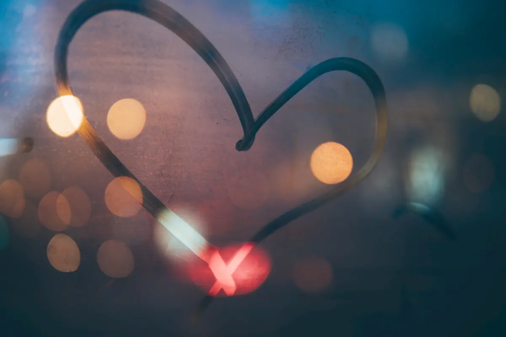
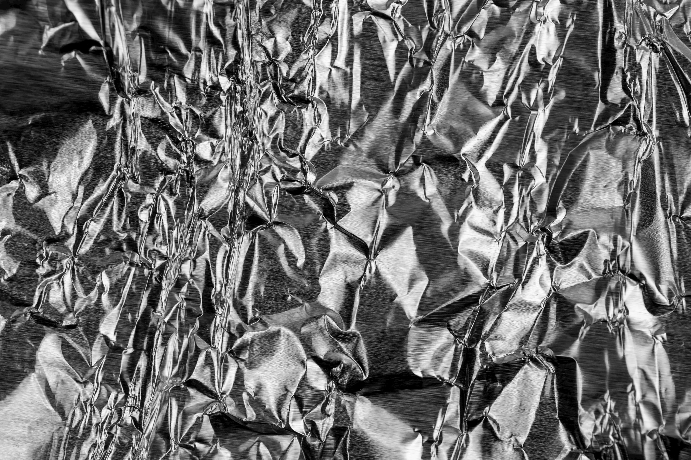

- _Che c’è amore?_
- _Nulla… a parte un capello bianco._

Lo trovo mentre mi faccio la barba. È lì, svetta in mezzo agli altri.

- _Sto diventando vecchio, amore._
- _Non dire sciocchezze. Vieni qui._

Mi guarda stesa con quel suo sorrisetto malizioso, un angolo della bocca leggermente aperto, gli occhi grandi e le braccia spalancate, pronte per abbracciarmi e accogliermi. Mi lascio accarezzare e coccolare. E lei accetta le mie carezze e i miei baci. Per un po’ non pensiamo più a nulla, solo a noi due, ai nostri corpi e al nostro amore.

- _A che pensi amore?_
- _A nulla._
- _Dai, che hai? Ancora questa storia dei capelli bianchi?_

Dannazione, come cavolo fa a conoscermi così bene? La guardo, annuisco. Lei scoppia a ridere, e mi bacia.

- _Vorrà dire che ti farò la tinta, scemo mio._
- _La tinta?_
- _Sì, vuoi?_

Le sue mani scivolano sul mio corpo, accarezzano i miei fianchi. I suoi denti mi mordicchiano il lobo dell’orecchio. Non mi accorgo nemmeno di aver risposto prima di ricominciare a far l’amore.

Apro gli occhi, l’altro lato del letto è vuoto. Iaia sta combinando qualcosa in cucina, la sento muoversi. Spotify trasmette la canzone del grazie.

- _Ciao amore!_

Sorride raggiante, sventolando un rotolo di carta stagnola.

- _È ora della tinta!_

Spalanco gli occhi.

- _Scusa?_
- _La tinta. Eravamo d’accordo. Non ricordi?_
- _No!_

Inutile resistere. Mi prende per mano e mi alza a forza dal letto. Incespico nelle ciabatte. Mi spinge in bagno, si mette i guanti in lattice e comincia a spennellare la mia testa. Mi gira, mi rigira, inclina la mia testa, la alza, la abbassa. Cerco di capirci qualcosa.

- _Caffè…_

Biascico.

- _Non c’è tempo, dobbiamo farti i colpi di sole!_

Posa il pennello.

- _Abbiamo finito?_

Spero.

- _No, adesso serve la stagnola._
- _Stagnola? Vuoi farmi al forno?_
- _Certo!_

E mi avvolge la testa.

- _Sicura che gli alieni non possano rubarmi le idee?_
- _Idiota._
- _Grazie…_
- _È un idiota d’amore, amore._

Il suo bacio, improvviso e intenso, mi fa dimenticare per un attimo la stagnola.

- _Fa caldo._
- _Certo che fa caldo. Serve a quello la stagnola._
- _Posso toglierla?_
- _No!_

Finalmente, dopo un’eternità è l’ora di togliere il cappello di stagnola. Iaia mi prende per mano, mi porta davanti allo specchio.

- _Vedi?_
- _Ma… sono biondo!?_
- _Già._

Scoppia a ridere. Poi mi abbraccia, mi stampa un bacio nella guancia e cinguetta

- _E non hai più nessun capello bianco!_
- _E sono anche molto più bello!_
- _Beh, adesso non esagerare._
- _Tu invece sei meravigliosa._

La avvicino a me e le sfioro le labbra con le mie. Con una mano comincio ad accarezzarle la schiena in cerca del gancetto del reggiseno. Sospira, mi bacia, la sua lingua gioca con la mia. Mi poggia le mani sul petto, accarezza lasciva e… mi allontana con uno spintone.

- _Eh no, ruffiano! Adesso tocca a me._
- _A te?_
- _A fare i colpi di sole. Dai aiutami._
