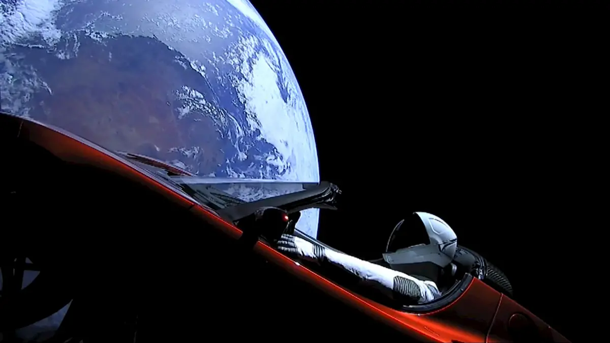

È finita un’altra settimana di #100DaysOfCode e devo dire di essere soddisfatto: ho cominciato il corso su **Vuejs** e sto iniziando a capire. Non ho ancora ben chiaro l’utilizzo pratico ma il professore spiega bene, lentamente e in maniera esaustiva. E, soprattutto, è partito dalle basi, senza dare nulla per scontato. In questo modo, pian pianino, sono arrivato a costruire la mia prima app con VueJS.

Oltre a questo, ho scoperto l’esistenza di [codewars](https://www.codewars.com/): una palestra dove allenarsi nel coding, confrontando le proprie soluzioni con gli altri partecipanti. Si basa sulla filosofia dei dojo e prevede un sistema di ranking basato su kyu e dan. Io, ovviamente, sono 8th kyu 1st dan: cioè una schiappa ?

Un’altra cosa bella dei 100 giorni è sapere di non essere il solo ad affrontare la sfida. Oltre alla mia metà, impegnata con successo nei #100DaysOfBeading, ci sono molti altri appassionati con più o meno esperienza. Ogni tanto incappo in qualcuno di questi, alcuni poi tengono dei blog quotidiani o quasi. [RecordedThoughts](https://recodedthoughts.com/) è uno di questi, e mi piace leggere cosa scrive, i suoi progressi e le sue considerazioni. Mi piace talmente tanto da farmi rammaricare di non aver fatto lo stesso.

### Non solo codice

Ma questa settimana è stata interessante anche per un’altra ragione: il lancio del **Falcon Heavy** e la _tamarissima_ Tesla nello spazio. È la prima volta che riesco a vedere in diretta il lancio di un Falcon e, dai, mi sono emozionato. Vedere i motori accendersi, il razzo partire, e poi i due booster (si chiamano così, vero?) tornare indietro e atterrare in sincrono: alla fine il 2000 è arrivato.

### Il log della settimana

`28th day` Ho Cominciato un nuovo corso Udemy: [VueJS 2 – The Complete Guide](https://www.udemy.com/vuejs-2-the-complete-guide/). Per il momento ho guardato la section 1 (in pratica l’introduzione) e fatto il primo esercizio.
Momentaneamente ho creato una cartella su GitHub dove salvare gli esercizi fatti. Poi, quando comincerò con i progetti più grandi farò un repository specifico.

`29th day` Andato avanti con il corso su VueJS 2. Pare essere uno strumento utile. Anche se devo capire bene come sia possibile utilizzare dati più complessi rispetto a un oggetto contenuto nella dichiarazione new Vue().
Fatto il primo esercizio del corso.

`30th day` Ancora VueJS. Imparato come intercettare eventi del mouse e della tastiera. Inoltre visto l’utilizzo degli event modifiers. Fatto il secondo esercizio del corso.

`31st day` Ancora VueJS: mi pare di andare lentissimo. Oggi ho visto:

  - two way binding
  - computed
  - watch

Ho fatto il terzo esercizio del corso.

`32nd day` Oggi VueJS e la gestione del CSS. Ho cominciato il quarto esercizio del corso.

`33rd day` Finito l’esercizio 4 del corso su VueJS. Ancora abbastanza nebuloso l’utilizzo pratico delle tecniche che sto imparando. O, meglio, capisco come sia possibile modificare il DOM in maniera tutto sommato semplice tramite VueJS. Però non vedo come usare i data per applicazioni più complesse.

`34th day` Ho finito la prima versione dell’esercizio The Monster Slayer. Devo ammettere che, effettivamente, VueJS semplifica molto il lavoro. Questa versione è abbastanza acerba, ha del codice ripetuto e una gestione abbastanza dozzinale dei dati del player e del monster. Ma, dai, è la mia prima vera app con VueJS: evviva!
