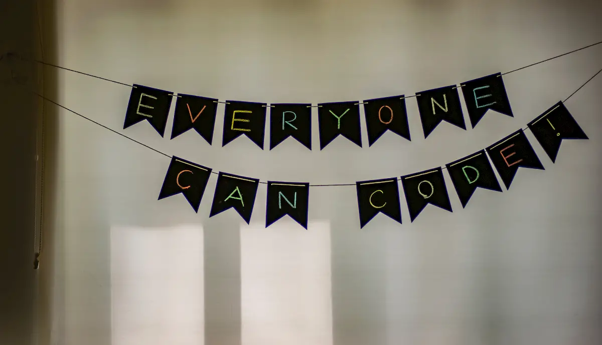

Alla fine ho cominciato davvero i **#100DaysOfCode**. Che, per chi non lo sapesse, vuol dire fare coding almeno un’ora al giorno. Tutti i giorni. Per 100 giorni.

E oggi, indovina ?, è stato il giorno 28. **La quarta settimana**.

All’inizio pensavo, volevo, scrivere un post riassuntivo della prima settimana. Ma non l’ho fatto. In realtà non ho scritto per tanto, molto, troppo tempo. Ma questa è un’altra storia.

Torniamo sul coding, e partiamo dal principio.

### Perché?

Perché era una cosa che ho sempre voluto fare, migliore la mia conoscenza di JavaScript. E perché mi servirà per una cosa di lavoro. E perché ho sete di conoscenza. No, meglio, perché **sono curioso**. E anche incredibilmente pigro.

Si sa, il modo migliore per imparare è fare. E fare con continuità. Quindi, se voglio imparare e migliorare devo mettermi di _buzzo_ buono e ricominciare a studiare. Obbligarmi a fare 100 giorni è il mio modo di spronarmi.

Lo so, sono strano. Ma fare così è servito a tanti. Ma tanti davvero. A patto di seguire alcune semplici regole.

### Regole

Semplici e poche:

  1. programma almeno un’ora al giorno, ogni giorno, per cento giorni
  2. tieni un diario pubblico, un log, in qualcosa che permetta a tutti di vedere a che punto sei
  3. twitta, o comunque sprona, almeno due altri partecipanti ai #100Giorni

Ovviamente le regole non sono ferree: in base ai propri impegni, ai propri casini, si possono adattare. Però la regola base è fare coding ogni giorno, e comunque non perdere due giorni di fila.

### Uno sprint

E la sai una cosa? Funziona davvero. Per me sta funzionando, e molto. In queste quattro settimane sono riuscito a combinare molto di più che in tutto l’ultimo anno. Giusto per vantarmi un po’;-) in 4 settimane ho:

  1. preso il certificato **Free Code Camp’s Front End Development**
  2. finito il corso di Udemy su **Electron for Desktop Apps**
  3. costruito due giochi per browser (**Tic Tac Toe Game** e **Simon Game**)
  4. realizzato un’**app electron** per ricavare informazioni su file video
  5. riprodotto due app electron (una per fare To Do List, l’altra per convertire video da un formato all’altro)
  6.
Mettere in fila, una dietro l’altra, le cose fatte mi ha fatto scoprire che la mia produttività (nello studio) è aumentata, e di molto.

Non solo, ho imparato anche come modificare il layout della tastiera di Windows. E poi ho scoperto il **Markdown**.

Penso sia il modo più veloce per scrivere e formattare nello stesso tempo il testo. Dopo aver finito il corso Udacity su come scrivere la documentazione di un progetto non ho più smesso di scrivere con Markdown. Certo, non ho ancora trovato un editor davvero adatto alle mie esigenze ma sto ancora testandone alcuni. E poi, ecco, è possibile usare Markdown anche per scrivere su WordPress.
