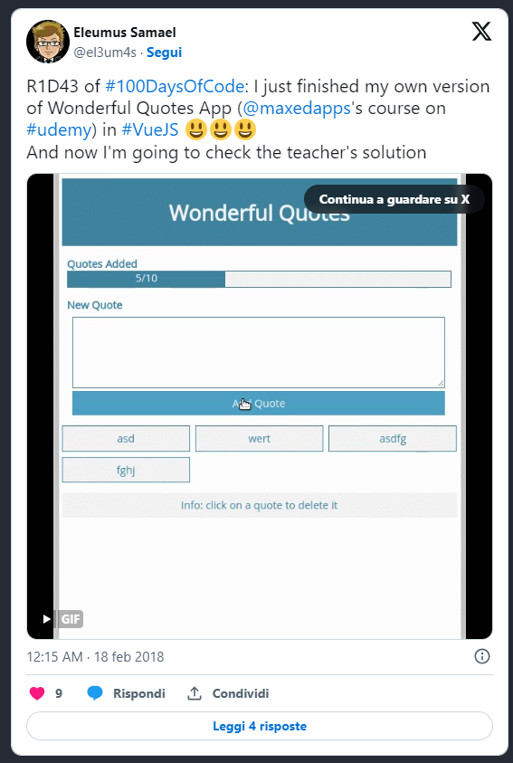
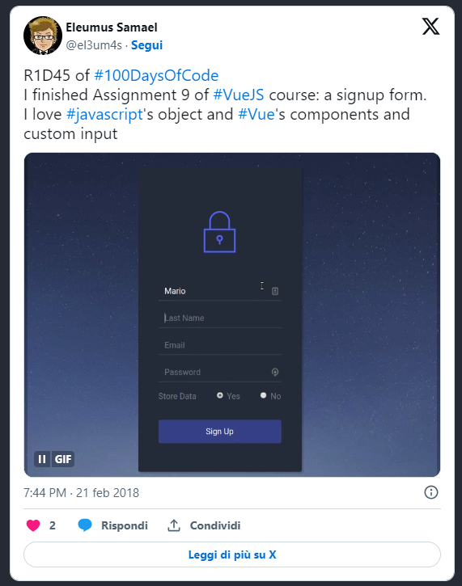

Una settimana un po’ strana questa che si è appena conclusa. Non sono stato benissimo e il mio coding ne ha risentito, sia in quantità che in qualità. In più si è aggiunto un viaggio non previsto, e non prevedibile, che mi ha tolto altro tempo prezioso. Nonostante questo sono comunque andato avanti con il corso su **VueJS** di Udemy. Ho finito due progetti del corso:

  - Wonderful Quotes
  - Form Sign Up

e mi sto avvicinando alla fine. Non penso di finire entro il 50° giorno, al momento sono al 46mo. Però non vedo l’ora di avere una panoramica degli strumenti che offre VueJS per poter cominciare a lavorare a un progetto pratico. Penso che dopo aver finito il corso proverò a rifare i progetti di **FreeCodeCamp** per mettermi alla prova.

Resta ancora da capire se e quando affrontare l’argomento canvas. Al momento non mi serve ma mi piacerebbe andarci un po’ dentro anche per affrontare meglio la creazione di giochi con **Construct 3**. Troppe cose da fare, troppo poco tempo, dannazione?.

### Il log della settimana

`42nd day` Oggi ho fatto molto. Ho deciso di partire sostanzialmente da zero con il progretto **Wonderful Quotes**, e di non utilizzare bootstrap. Un po’ perché, in onestà, non mi sento a mio agio con questo strumento. E, sopratutto, perché da quando ho scoperto **css grid** ho deciso di usarlo il più possibile. Comunque, ho costruito la struttura della pagina, ho creato i componenti e sistemato le funzionni necessarie per aggiungere ed eliminare le citazioni. Mancano ancora da sistemare un paio di cose:

  1. rendere un po’ più bellina l’animazione della progress barra
  2. eventualmente impostare un effetto di dissolvenza per il messaggio di errore
  3. capire se ha senso usare le props in alcuni componenti piuttosto che importarte direttamente i dati

L’ultimo punto è più una domanda, e devo studiare ancora un pochetto perché evidentemnte mi sfugge qual è il metodo corretto per usare le varie opzioni di VueJS.

`43rd day` Finito l’app del progetto **Wonderful Quotes**: sono soddisfatto perché funziona come deve. Dei tre punti di ieri, li ho sistemati tutti e tre. Inoltre ho aggiunto un messaggio di errore se si prova a inserire una citazione vuota.



Ho notato una cosa, mentre lavoravo sull’effetto di dissolvenza: VueJS ha un suo sistema per gestire l’inserimento (e l’eliminazione) di nuovi elementi in maniera elegante. Per il momento però mi sono limitato a un po’ di CSS.

`44th day` Ho modificato leggermente l’app Wonderful Quotes: adesso quando il mouse passa sopra una delle citazioni la citazione stessa diventa rossiccia. E il mouse ha la forma del puntantore e non della freccetta classica. Ho anche finito la correzione dell’esercizio, mi pare di aver fatto quasi tutto correttamente.

`45th day` Ho fatto (e finito) l’esercizio Form Sign Up. Si tratta di una pagina web per registrarsi a un servizio. Lo scopo era imparare a maneggiare i controlli delle form e creare degli custom input. E a proposito di custom input, ho perso un sacco di tempo per far funzionare il componente FullName.vue: scrivevo

```js
props: { 
	fullName: {type: Object} 
	}
props: ['fullName']
props: { fullName: Object}
```

e in ogni tentativo ho avuto messaggi di errore. Perché? Perché va usato in questa forma:

```js
props: {
	value: { type: Object }
	}
props: ['value']
props: { value: Object }
```

Cioè, da quello che ho capito, quando si crea un custom input si passa il valore tramite la keyword **value**.



`46th day` Seguito la correzione dell’esercizio Form Sign Up e fatto la sezione 12 sulle Directives.
