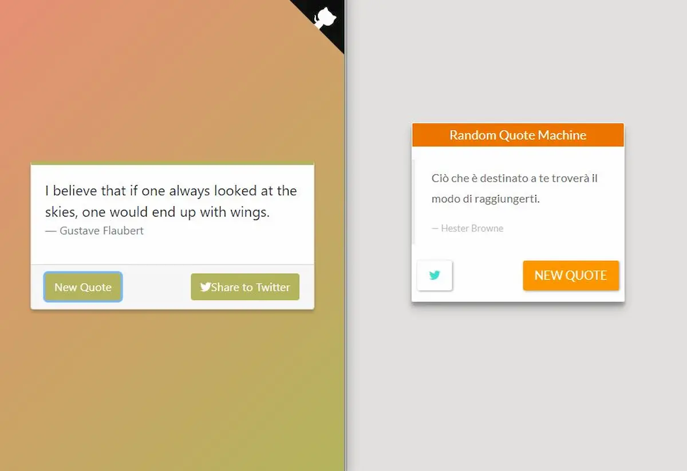
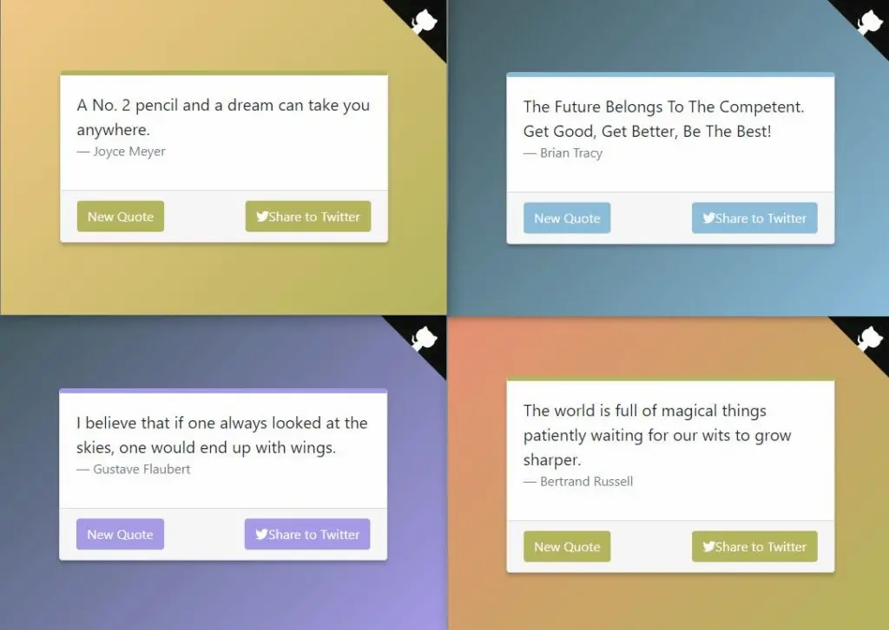

Se c’è una cosa di cui mi lamento spesso, è la mia capacità di cominciare mille cose e di finirne nessuna. O quasi nessuna. Il problema è che dopo aver fatto 50 (**cinquanta ????? giorni!**) inizio a chiedermi l’utilizzo pratico di quello che sto imparando. E la tentazione di mollare qui, a metà strada, è forte. Per fortuna i **#100DaysOfCode** prevedono un diario quotidiano su cui registrare i propri progressi. Serve sì come log dei propri passi, ma ho scoperto un’altra funzione importante: ricordare tutta la strada fatta fin qui. Rileggere il diario di bordo della mia avventura, adesso che sono al giro di boa, mi ha fatto vedere lucidamente i miei progressi. Certo, mi manca ancora molta strada, e sono mille le cose da imparare ma… insomma… dai… quanto sto diventando bravino ?. Non bravo, per quello ce ne vuole, ma i puntini della mia formazione stanno un po’ alla volta andando al loro posto. E questo mi fa star bene.

### Una citazione è una citazione è una citazione

Mi sono bloccato su un aspetto di VueJS: le transiction. Penso sia dovuto a una mia scarsa conoscenza delle animazioni e delle transiction in CSS, problema che dovrò affrontare prima o poi. Per il momento ho affrontato il problema staccando la testa da VueJS e concentrandomi su due aspetti:

- ho rifatto un progetto di FreeCodeCamp
- ho seguito un corso di Udacity sulla Canvas in HTML5

Il secondo punto, il corso Udacity, mi ha un po’ deluso: è stato abbastanza semplice e superficiale. Però mi ha dato un’infarinatura di come funziona la Canvas: in futuro approfondirò la questione.

Invece del progetto [**Random Quote Machine**](https://github.com/el3um4s/100-days-of-code/tree/master/FreeCodeCamp/FCC-Random-Quote-Machine) sono soddisfatto: la versione nuova, costruita con VueJS, è venuta è più elegante.

A sinistra la la nuova versione (creata usando VueJS). A destra la versione dell’anno scorso (fatta con JQuery).

Oltre a essere più bellina, la nuova versione cambia colore ogni volta che viene generata una nuova citazione.

Mi piace molto il gradiente e i pulsanti con il colore abbinato. E mi piace sopratutto che con meno codice ho creato un’applicazione più elegante, leggera, flessibile. Sì, lo so, pare uno spottone, ma aver ridotto il tutto a **130 righe** di codice contro le 300 di prima è un buon risultato, per me.

### Il log della settimana

`47th day` Questi giorni sono complicati, ieri non sono riuscito a fare nulla: stavo troppo male. Per fortuna le regole dei #100DaysOfCode permettono di saltare un giorno (ma non di saltare più giorni consecutivi). Oggi ho completato la sezione 13, **Filters e Mixins**. Non ho capito bene il perché di questi nomi ma non mi preoccupa troppo. Un filter serve per modificare come appare a schermo un dato, senza modificare il dato stesso. Un Mixin, invece, serve per scrivere del codice riutilizzabile in più compomenti diversi. Penso siano entrambi degli strumenti utili.

`48th day` Finalmente sono riuscito a lavorare un pochino senza troppi impicci. Non avevo voglia di studiare e di affrontare un altro capitolo del corso, quindi ho deciso di provare a mettere in pratica quanto imparato finora. Ho rifatto uno dei progetti di FreeCodeCamp, **Random Quote Machine**. È un’app molto semplice: mostra una citazione (più o meno famosa) e cliccando sul pulsante New Quote ne mostra una nuova scelta casualmente da un archivio. È la seconda volta che rifaccio questo esercizio, ma è la prima votla che sono davvero soddisfatto del risultato ottenuto. VueJS è una soluzione facile, veloce e sopratutto comoda.

`49th day` Oggi non ho propria voglia di studiare cose complicate. Le transiction e le animazioni in VueJS sono più difficili da comprendere rispetto a quello che immaginavo. Per non perdere completamente il giorno ho deciso di guardare un video corso di Udacity: [HTML5 Canvas](https://eu.udacity.com/course/html5-canvas–ud292). L’argomento mi interessa, sopratutto nella prospettiva di riprendere in mano Construct. Comunque, ho seguito e fatto tutti gli esercizi della prima sezione. Mi manca da fare il progetto di metà corso.

`50th day` Finito il corso Udacity su HTML5 Canvas. Beh, corso è una parola grossa: è più una infarinatura sui concetti base. Però è stato interessante. Adesso però è il momento di tornare su VueJS.
