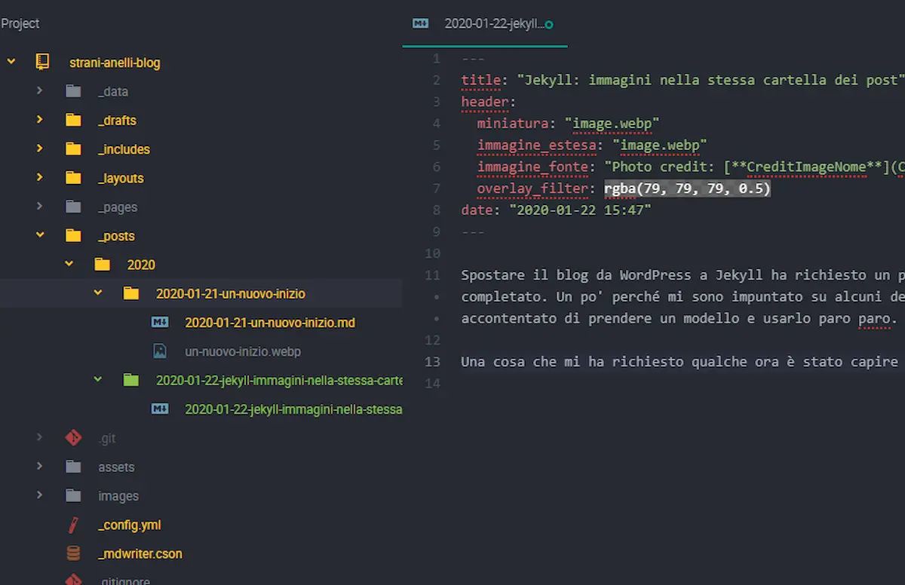

Spostare il blog da WordPress a Jekyll ha richiesto un po' di tempo. E a dire il vero è un processo non ancora completato. Un po' perché mi sono impuntato su alcuni dettagli (tutto sommato inutili). Ma anche perché non mi sono accontentato di prendere un modello e usarlo paro paro. Anche se la stragrande maggioranza del codice di questo blog è basata su [Minimal Mistakes](https://github.com/mmistakes/minimal-mistakes).

Una cosa che mi ha richiesto qualche ora è stato capire come gestire i post e le immagini da usare nei post stessi.

Jekyll di suo richiede di tenere separata la directory con i post da quella con le immagini. Non so se è una scelta di progettazione voluta o una conseguenza data dal fatto che Jekyll non salva le risorse contenute nelle cartelle che cominciano con l'_underscore_ ( _ ). Fatto sta che se si prova ad accedere a un'immagine contenuta in \_post non si ottiene nulla. C'è però un modo per riuscirci, senza dover ricorrere a plugin.



Premessa: questo blog utilizza le GitHub Pages e quindi si appoggia su un repository pubblico. Di conseguenza le risorse che utilizzo sono tutte online, anche quelle che salvo dentro le cartelle speciali di Jekyll. Quindi, perché non usarle direttamente invece di ricaricarle nuovamente? Da qui l'idea di collegare le immagini direttamente al mio repository. Per farlo è sufficiente conoscere l'url corrispondente. Url che è nella forma di:

```txt
https://raw.githubusercontent.com/username/repository/branch/_posts/nome_immagine.webp
```

Ovviamente scrivere ogni volta questo può essere foriero di innumerevoli errori. Quindi ho aggiunto una voce al file`\_config.yml`:

```yml
repository: "el3um4s/strani-anelli-blog"
branch: "master"
immagini: "https://raw.githubusercontent.com/el3um4s/strani-anelli-blog/master/_posts/"
```

Il passo successivo è stato capire come far sì che ogni articoli avesse una sua cartella con all'interno le immagini utilizzate. Qui mi è venuto in aiuto una scelta fatta per semplice questione di gusto:

```yml
permalink: /:title/
```

Avendo scelto di usare questa configurazione posso ottenere il nome del post e il nome della cartella nello stesso identico modo usando la variabile

```text
{{ page.url }}
```

Se unisco le due cose ottengo:

```text

```

che nel caso di questo articolo significa: "`{{site.immagini}}{{page.url | remove_first: "/"}}nome-immagine.webp`". Però c'è un problema. Così facendo posso avere ogni articolo nella sua bella cartellina, e avere il tutto in ordine alfabetico. Che é sì più ordinato rispetto ad avere le immagini tutte mischiate ma rischia di diventare molto confuso quando si tratta di lavorare con molti articoli. E io voglio dover trattare molti articoli diversi: fa parte dei [miei obiettivi per i #100DaysOfCode](https://blog.stranianelli.com/un-nuovo-inizio/).

Quindi che fare?

Beh, salvare i post divisi per anno può essere il primo passo. E il successivo è ordinare le cartelle in ordine di data. Questo è abbastanza semplice, basta chiamare la cartella con lo stesso nome del file markdown del post. Così facendo posso ricavare l'anno tramite:

```yml
{{ page.date | date: "%Y"}}
```

A me interessa però avere la data completa, perché il posto è salvato nel formato "_ANNO-MESE-GIORNO-Titolo-del-Post_":

```yml
{{ page.date | date: "%Y/%Y-%m-%d"}}
```

Unendo tutto questo ottengo:

```yml
{{site.immagini}}{{ page.date | date: "%Y/%Y-%m-%d"}}-{{page.url | remove_first: "/"}}nome-immagine.webp
```

ovvero "`_{{site.immagini}}{{ page.date | date: "%Y/%Y-%m-%d"}}-{{page.url | remove_first: "/"}}funziona.webp_`"


Ovviamente non sono soddisfatto di questo risultato: è comunque una serie lunga di caratteri da digitare, ed è facile sbagliare. Come si può semplificare? Usando un plugin per Atom: [Markdown-Writer for Atom](https://atom.io/packages/markdown-writer). Andando a modificare il file _\_mdwriter.cson_ posso far sì che le immagini vengano salvate direttamente nella cartella dell'articolo, e che venga scritta automaticamente la stringa giusta per poterla visualizzare.

```yml
sitePostsDir: "_posts/{year}/{year}-{month}-{day}-{inserisci-titolo}/"
siteImagesDir: "{directory}"
newPostFileName: "{year}-{month}-{day}-{slug}{extension}"
imageTag: ''
relativeImagePath: true
renameImageOnCopy: true
```

Direi che è tutto. Non resta altro che mettere il [collegamento al repository del blog](https://github.com/el3um4s/strani-anelli-blog), dove c'è anche il file Markdown di questo articolo.
