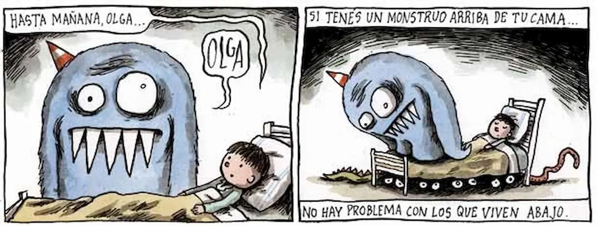
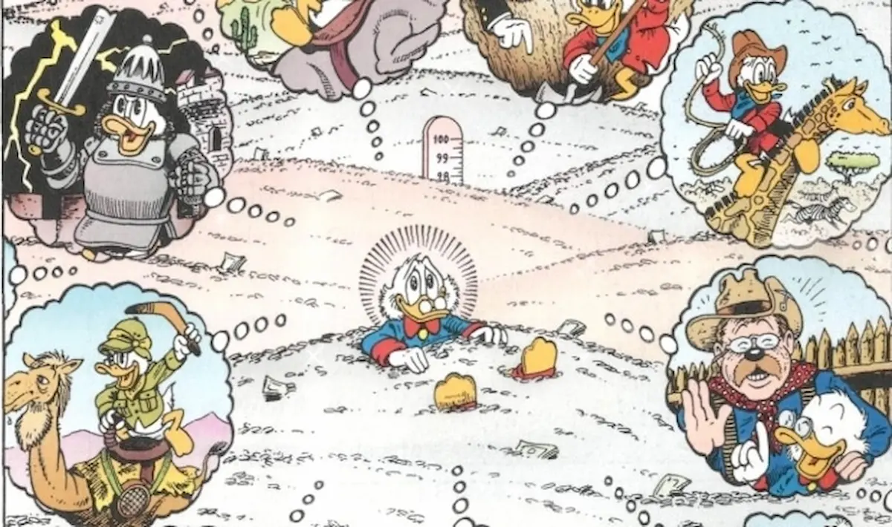

Continuo a ragionare sulla'_Aphantasia_. Questi sono alcune piccole _"rivelazioni"_ su alcuni aspetti che avevo, evidentemente, non compreso appieno. Del tipo, che se a me uno dice di _non pensare all'ippopotamo_ io non penso a nessun ippopotamo. Non mi appare nessun pop up con l'immagine dell'ippopotamo della pubblicità, o quelli in tutù di Fantasia, o altro. Per te, dotato di _Fantasia_, sì, invece, vero?

Quando un bambino dice di _vedere il mostro nell'armadio_, lo sta effettivamente vedendo con l'_occhio del cervello_. Ovvero, ha davvero l'immagine mentale dell'uomo nero che esce a ghermirlo. E vale lo stesso per l'_amico immaginario_: è, lì, presente e visibile nella sua mente.

Chi soffre di disturbo da stress post traumatico è in una condizione molto, ma molto, davvero molto peggiore di quello che ho sempre pensato. Perché il trauma si ripresenta in tutta la sua "realtà", e lo si rivede e rivive davvero.

Quando leggo un libro mi interessano le storie: descrizioni, per quanto ben fatte, non mi trasmettono né emozioni né men che meno alcuna immagine. Amo leggere, perché amo le storie e le idee. Per te, invece, quando leggi che

> Il cielo sopra il porto aveva il colore della televisione sintonizzata su un canale morto

vedi davvero il cielo, il porto e persino il colore della televisione. O almento un televisore.

Quando giocavo a Dungeons and Dragons, ai tempi dell'università, i miei compagi di avventura vedevano davvero il mio halfling muoversi nel Dungeons. Oddio, ora che ci penso vedevano anche il dungeon, le gallerie, le caverne.

Quando nei fumetti i personaggi vedono delle immagini nelle nuvolette, le vedono davvero. Non è una metafora per trasmettere pensieri ed emozioni senza dilungarsi in descrizioni e mille parole.

E ora che ci penso, quando nei manuali di scrittura si dice _Show, don't tell_, per far permettere al lettore di _vedere la scena schiudersi davanti a sé_, si intende in maniera letterale. E questo spiega anche come mai molti riescono a descrivere i mille dettagli di un'ambientazione mentre il massimo che io posso ottenere, senza preparazione è:

> John entrò nel grande mercato coperto. Gli aromi delle spezie, e urla dei mercanti, i colori delle stoffe e il correre dei bambini: eccola lì, la sua infanzia, proprio come la ricordava.

Che poi, per come ho sempre inteso io, John mica ricordava con immagini, odori e suoni. Era una metafara. Dannazione, John Doe, hai più fantasia di me :stuck_out_tongue_winking_eye:.

I flashback sono davvero dei flashback. Nel senso che vedi davvero le immagini, o i video, nella mente, come appare nei film. Ok, magari con diversi gradi di nitidezza, ma il concetto è questo, no?

Ma quando le persone fanno fatica a dimenticare i torti, e le cose brutte, è perché rivivono davvero gli eventi passati nella propria mente? Li rivivono e li rivedono, e questo impedisce loro di dimenticare e quindi di perdonare? Non ne sono completamente sicuro, ma penso che sia questa la ragione per la quale tendo a non serbare rancore.

Quando ti consigliano di immaginare il proprio _posto felice_ io faccio sempre fatica. Non ho nessuna immagine, ma proprio nulla. È un concetto che ho sempre fatto fatica a comprendere. Questo perché per te, che sei dotato di _fantasia_, è possibile immaginare, che ne so, una spiaggia, con le onde, la sabbia e magari anche la brezza e un tramonto che indora tutto il paesaggio. E se ti chiedo di aggiungere un paio di palme e un pinguino che si avvicina portando un vassoio, ecco tu immagini anche il succo di frutta con gli ombrellini colorati. Quanti ombrellini immagini? Uno, due o tre?

E a me fa specie pensare che mentre parlo di pinguini camerieri in una spiaggia caraibica, qualcuno possa davvero vedere tutto questo con la propria mente.

Ma, quando si parla di _rimettere ordine nei propri pensieri_, si intende letterlamente, vero? Perché per me non è così, i pensieri sono un flusso ordinato di frasi di senso compiuto. È come se una voce muta parlasse, ma spiegando le cose. Anche la scrittura è così: non devo isolare i concetti, basta prenderli così come appaiono nella mia menti e scriverli.

I sogni a occhi aperti sono davvero come dei sogni. Perdersi nei proprio pensieri va inteso in senso letterale.

Quando nei film fanno vedere la creazione degli identikit, mi sono sempre chiesto come fosse possibile ottenere delle immagini così precise partendo da delle descrizioni. Ho sempre pensato che un po' fosse un limite mio, che non osservo bene le persone, e un po' che i vari disegnatori fossero anche dei bravi psicologi per interpretare dei ricordi testuali. Invece, è davvero come nei film: il testimone descrive l'immagine che ha nella testa e il disegnatore semplicemente disegna.

Per dormire _conta le pecore_ non è una metafora. Per me sì, ma per te è proprio possibile vedere le pecore saltare sullo steccato.

Quando si parla in pubblico, un consiglio famoso recita di combattere l'imbarazzo e la paura immaginando il pubblico in mutande. Non avevo mai capito il senso di questa metafora. Adesso ho realizzato che si intende in maniera letterale.

Mi sono sempre chiesto come mai affrontando alcuni discorsi a tavola ai miei commensali passasse l'appetito. Beh, ora è tutto più chiaro come mai, perché appare loro davanti l'immagine in maniera vivida. Pensavo fosse solo una cosa divertente da pensare per alleggerire la tensione.

Improvvisamente è diventato molto disturbante scoprire che si può letteralmente _immaginare qualcuno nudo_. Il che fa di me una persona molto pura, immagino.

Non mi è chiara una cosa: quanto è possibile indurre immagini mentali alle altre persone. Per dire, è possibile sfruttare questa caratteristica per indurre una persona ad avere un bel ricordo di un posto o di una situazione legandole delle immagini mentali indotte? O anche, semplicemente, rendere più divertente una conversazione facendo apparire cose assurde nelle mente degli altri. Tipo, non so, un topino che arriva spingendo una grossa forma di formaggio. Ovviamente il topino indossa un cappello a punta, rosso.

Quando qualcuno dice di _pensare con le parole_, penso intenda _vedendo le parole nella propria testa_. Su questo non sono ben sicuro, ma mi pare di aver capito che è come se apparissero. Per me non ci sono né parole da vedere ne voci da sentire. Non ho ancora capito come descrivere questa cosa.

Quindi le lingue pittografiche e quelle con gli ideogrammi sono la rappresentazione più vicina al modo comune di pensare? Se è così, per fortuna sono nato in un luogo con le lettere, altrimenti sarei spacciato :grin:.

Non sono mai riuscito a usare con successo le mappe mentali. Questo perché sono uno strumento creato per chi ragiona per immagini: parte da una figura e segue le altre, sfruttando l'immagine mentale della mappa.

Il palazzo della memoria di Sherlock Holmes non è una metafora. Il personaggio vede davvero nella propria mente il palazzo dei ricordi. E lo vedono tutti, chi più chi meno.

È davvero difficile, per chi non è un'aphant, concentrarsi sul momento presente. Continuano ad avere pop up pubblicitari sul passato, il futuro, i problemi, le aspirazioni, e così via. Effettivamente, a pensarci bene, come cavolo fate a concentrarvi su qualsiasi cosa con tutto questo casino nella testa?

Quando l'allenatore mi diceva di _fare l'esercizio nella testa_, in modo da _immaginare bene i movimenti da compiere_, intendeva in maniera letterale. Ed ecco perché sono sempre stato una capra in atletica :smile:.
