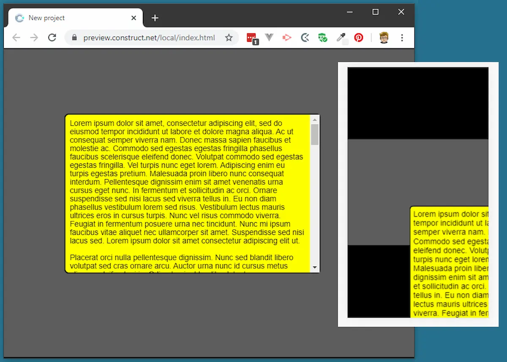

Devo ammettere che un po' mi inorgoglisce quando qualcuno mi chiede come fare qualcosa con uno dei plugin che ho creato. Anche quando alla fine salta fuori che il problema è legato il mio plugin. L'ultimo in ordine di tempo è una domanda su [HTMLElement](https://www.construct.net/en/make-games/addons/190/html-element), un plugin nato con lo scopo di semplificare l'inserimenti di elementi HTML5 nei giochi Construct 3. Penso sia un plugin da riscrivere completamente, e magari approfitto di questi #100DaysOfCode per farlo.

Allora, quale è il problema? Il problema è legato a qualcosa legato ai browser degli smartphone. Per un motivo che non mi è chiaro, anche perché non ho indagato, gli elementi HTMLElement appaiono posizionati correttamente su desktop mentre su smartphone sono fuori posizione:

La cosa interessante è che usando una vecchissima versione di Construct 3 non si presenta questo problema. Volendo potrei mettermi a indagare a fondo ma, per quella che era la domanda fatta, è possibile trovare una soluzione, anche se un po' macchinosa. Il file [**Workaround-2020-02-16.c3p**](./Workaround-2020-02-16.c3p) contiene una demo, ma non è questo quello di cui voglio parlare.

Esiste un modo per ottenere lo stesso risultato usando semplicemente il plugin ufficiale TestInput senza ricorrere ad altri strumenti. È sufficiente usare il comando `Set CSS style`:

~~~text
+ System: On start of layout
-> TextInput: Set CSS style "background-color" to "yellow"
-> TextInput: Set CSS style "border-width" to "2px"
-> TextInput: Set CSS style "border-radius" to "16px"
-> TextInput: Set CSS style "padding" to "16px"
~~~

Tutto qui. Non servono né addons né altro. Questo file [**text-input-css-vanilla.c3p**](./text-input-css-vanilla.c3p) contiene una dimostrazione di questo piccolo pezzetto di codice.
