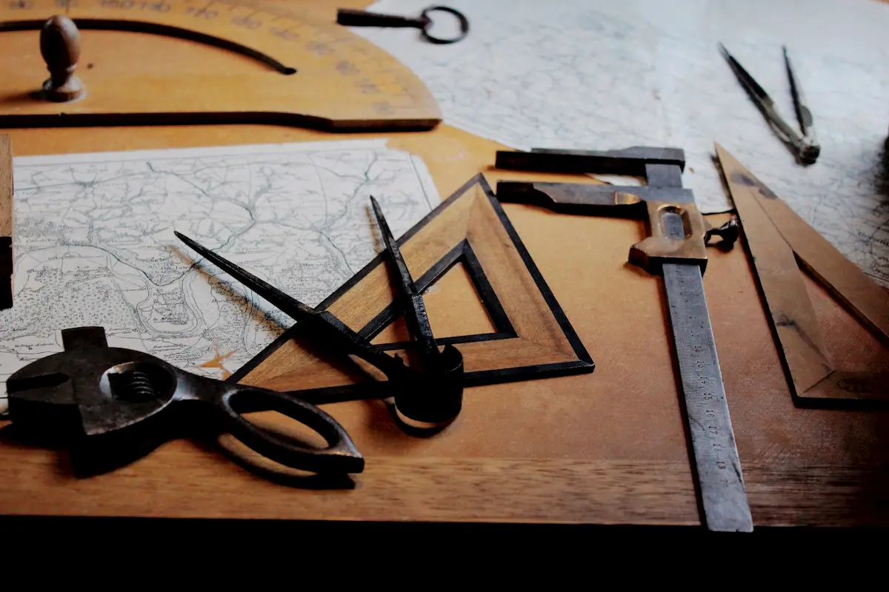

Rispetto a WordPress preferisco scrivere con Jekyll. Non so bene il perché, ma mi trovo meglio a scrivere su un file di testo, con Atom, rispetto che accedere a WordPress. Anche se, e questo lo devo ammettere, le prime volte può essere un po' disorientante questo cambio di paradigma. Per questo ho deciso di segnarmi qui un paio di appunti sul metodo che, al momento, sto seguendo.

### Cosa mi serve

Comincio con la cassetta degli attrezzi. Ecco quello che utilizzo:

1. [GitHub Desktop](https://desktop.github.com/) per gestire la sincronizzazione con il [repository del blog](https://github.com/el3um4s/strani-anelli-blog)
2. [Atom](https://atom.io/) per scrivere gli articoli direttamente sul PC senza dover per forza essere connesso a internet.
3. Alcuni plugin per Atom:
   1. [Markdown-Writer](https://atom.io/packages/markdown-writer) per aggiungere alcune funzioni utili come l'auto compilazione del Front Matter e l'inserimento automatico delle immagini.
   2. [Toolbar for Markdown-Writer](https://atom.io/packages/tool-bar-markdown-writer) una barra degli strumenti per avere in Atom i classici pulsanti da editor di testo: grasseto, corsivo, inserisci immagini, inserisci link e così via (richiede [Atom Tool Bar](https://atom.io/packages/tool-bar)).
   3. [Todo Show Package](https://atom.io/packages/todo-show) per tenere sotto controllo le note sulle cose da fare. Non la uso tantissimo per la scrittura ma mi sento a disagio senza. Tipo la mia copertina di Linus
4. [Squoosh](https://squoosh.app/) per ridurre le dimensioni delle immagini e, principalmente, per convertirle in `WEBP`. Perché mi sono intrippato con l'[usare immagini WebP con Jekyll](https://blog.stranianelli.com/jekyll-e-webp/)

### Premessa

Una volta capito, è proprio semplice. Ovviamente la prima cosa da fare è assicurarsi di avere il repository locale sincronizzato con quello online, giusto per scrupolo. Poi apro il repository con Atom e utilizzo il comando _Add New Post_ del plugin _Markdown-Writer_.

Qui occorre una premessa: ho personalizzato il file _\_mdwriter.cson_ per adattarlo alle mie esigenze. Quindi ho modificato alcune parti.

Innanzi tutto mi sono assicurato che il file venga creato dove voglio io:

~~~json
sitePostsDir: "_posts/{year}/{year}-{month}-{day}-{inserisci-titolo}/"
siteImagesDir: "{directory}"
~~~

In pratica se oggi creo un articolo la voce `sitePostsDir` dice ad Atom di creare un file nella cartella `\_post/2020/2020-02-03-titolo-del-pezzo`. In questo modo quando voglio scrivere qualcosa non devo stare a preoccuparmi della struttura delle directory del repository.

La voce `siteImagesDir` fa lo stesso con le immagini: in pratica quando inserisco una figura tramite il comando del plugin, l'immagine stessa viene copiata nella stessa directory del post. Così posso sfruttare a pieno la possibilità di tenere [immagini e post nella stessa cartella in Jekyll](https://blog.stranianelli.com/jekyll-immagini-nella-stessa-cartella-dei-post/).

Fatto questo sono passato a modificare la voce `frontMatter`:

~~~json
frontMatter: """
---
title: "{title}"
usa_webp: true
header:
  immagine_tipo: "jpg"
  miniatura: "image"
  immagine_estesa: "image"
  immagine_fonte: "Photo credit: [**CreditImageNome**](CreditImageURL)"
  overlay_filter: rgba(79, 79, 79, 0.5)
date: "{date}"
categories:
  - Senza Categoria
tags:
  - Altro
---
"""
~~~

in modo da avere uno schema per guidarmi nella compilazione del Front Matter dell'articolo.

### Scrivere e pubblicare con Jekyll

Quindi, creo un nuovo file con il comando _Add New Post_ e mi ritrovo con il Front Matter precompilato. Il passo successivo è... scrivere. Posso farlo direttamente in Markdown, aiutandomi con la barra dell'editor. Barra che uso principalmente per inserire le immagini.

Dopo aver finito la scrittura posso pubblicare il tutto su GitHub. Volendo potrei usare la finestra `Git - GitHub` integrata con Atom. Personalemente preferisco passare prima tramite GitHub Desktop ma, ecco, questa è solamente una mia abitudine. Si può ovviamente fare un commit anche da linea di comando, o usando [GitKraken](https://www.gitkraken.com/) o direttamente da Atom.

Basta, è tutto qui: nel giro di qualche istante GitHub Pages si occupa dell'aggiornamento del sito.
