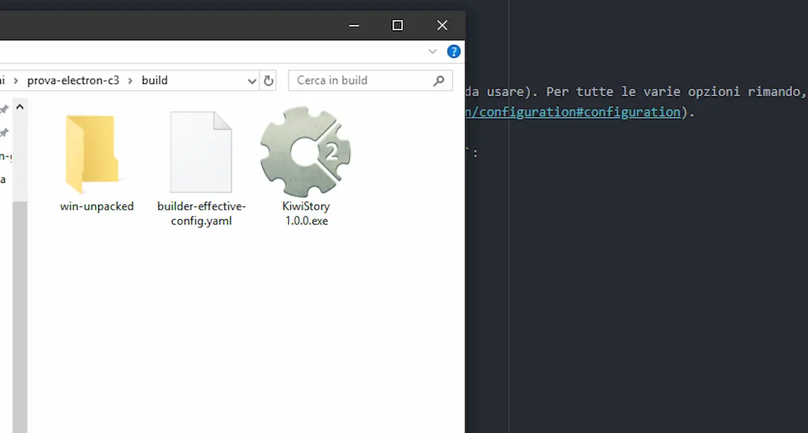
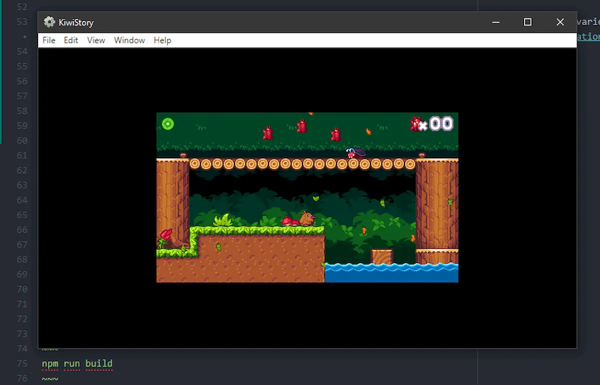

Continuo il discorso di ieri su [come usare ElectronJS e Construct 3](https://blog.stranianelli.com/construct-3-ed-electron-avviare-un-gioco/). Finora abbiamo visto come è possibile eseguire un file HTML con dentro un gioco creato con C3. Oggi voglio spiegare come creare un eseguibile. In pratica il famoso file unico su cui cliccare per far partire il gioco.

### electron-builder

Per poterlo fare utilizzo [electron-builder](https://www.electron.build/) ([qui il repository su GitHub](https://github.com/electron-userland/electron-builder)), una soluzione completa per creare file pronti per essere distribuiti. Quindi, per prima cosa installiamolo digitando sulla linea di comando:

~~~
npm install electron-builder --save-dev
~~~

### Aggiorno package.json

Per poter creare i vari file eseguibili devo aggiornare il file `package.json` aggiungendo alcuni parametri.

Innanzi tutto aggiungo la voce `build`:

~~~json
"build": {
    "productName": "KiwiStory",
    "appId": "com.scirra.kiwistory",
    "directories": {
      "output": "build"
    },
    "win": {
      "target": "portable",
      "icon": "src/icons/icon.ico"
    },
    "linux": {
      "icon": "src/icons"
    }
  }
~~~

In questo modo posso impostare alcune opzioni importanti (tra cui l'icona da usare). Per tutte le varie opzioni rimando, ovviamene, alla pagina [Configuration del sito ufficiale](https://www.electron.build/configuration/configuration#configuration).

Per compilare effettivamente il gioco vanno aggiunti anche alcuni `scripts`:

~~~json
"scripts": {
  "test": "echo \"Error: no test specified\" && exit 1",
  "start": "electron .",
  "build": "electron-builder",
  "pack": "electron-builder --dir",
  "dist": "electron-builder",
  "dist:32win": "build --win --ia32 ",
  "dist:64win": "build --win --x64",
  "dist:32deb": "build --linux --ia32",
  "dist:64deb": "build --linux --x64",
  "postinstall": "electron-builder install-app-deps"
}
~~~

Per compilare il gioco basta digitare sulla riga di comando

~~~
npm run build
~~~

Su Windows viene creata una cartella `build` con dentro il file creato:

Basterà cliccarci sopra per avviare il gioco.

Come ieri, ecco i file su cui ho lavorato, con le modifiche di oggi

* [index.js](https://raw.githubusercontent.com/el3um4s/strani-anelli-blog/master/_posts/2020/2020-02-19-construct-3-ed-electron-creare-un-file-eseguibile/index)
* [package.json](https://raw.githubusercontent.com/el3um4s/strani-anelli-blog/master/_posts/2020/2020-02-19-construct-3-ed-electron-creare-un-file-eseguibile/package)
