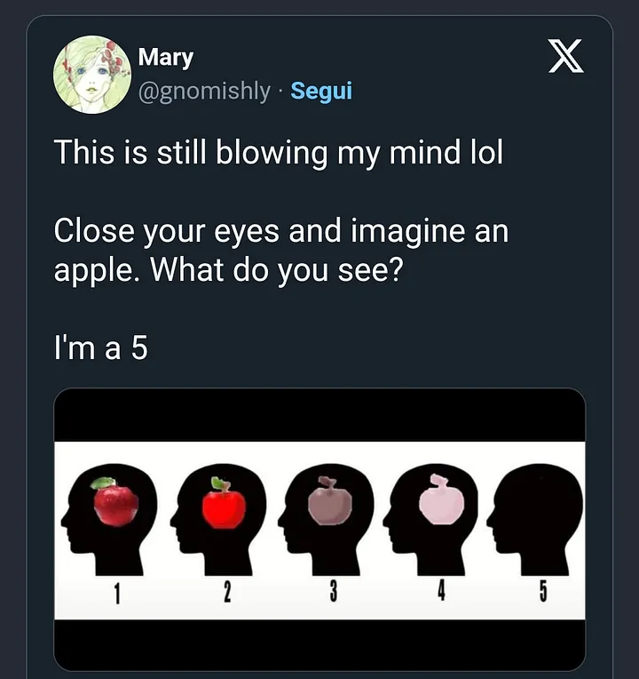

A volte succede che, all'improvviso, tutto abbia un senso. Che i pezzetti del puzzle vadano al loro posto, come nel finale di un film. Questa è la sensazione che si prova, a un certo punto, quando si scopre l'_Aphantasia_. E ci si rende conto che, sì, per la stragrande maggioranza delle persone è normale avere delle visioni nel cervello. Certo, non le chiamano visioni, sono le _immagini nel cervello_, la _fantasia_, l'_immaginare le cose_. Per me non è così. Per me e per, circa, il 2 per cento della popolazione. Ma questa è solamente una stima, perché di studi approfonditi non ce ne sono.

### Cosa è l'Aphantasia?

Partiamo da cosa non è: non è quello che capita quando qualcuno ti dice di pensare una mela e, eccola lì, la mela, proprio davanti ai tuoi occhi. Magari non sarà una mela rossa, succosa, lucida. Magari è in bianco e nero. Ma è lì, che aleggia da qualche parte nella tua mente, una bella immagine nitida.

Chi ha l'Aphantasia non vede nessuna immagine. Non vede nulla, nero totale. Per dirla con twitter, l'Aphantasia è il numero 5:

O, per dirla, con [Wikipedia](https://en.wikipedia.org/wiki/Aphantasia), `non è capace di visualizzare nessuna immagine mentale, come se l’occhio della mente fosse completamente cieco`.

Non è un fenomeno nuovo, probabilmente è una condizione comune a moltissime persone, nel corso del tempo. Però non ci sono studi al riguardo. Però qualcosa c'è. Le prime tracce risalgono al 1880, da una serie di osservazioni fatte da Francis Galton. Però poi bisogna saltare al 2015, quando [Adam Zeman pubblica uno studio](https://www.sciencedirect.com/science/article/pii/S0010945215001781) su un paziente che gli si era presentato 10 anni prima, nel 2005. Questo signore, il paziente, di 65 anni aveva bussato alla porta del dottor Zeman, neurologo inglese, perché aveva perso la capacità di costruire le immagini mentali dopo un intervento chirurgico. È un caso unico, non ci sono in letteruatura medica altri casi del genere: finora non si aveva notizia di persone che avessero perso la capacità di immaginare.

Mi rendo conto, mentre scrivo questo, di una cosa: dal mio punto di vista è come se stessi scrivendo un racconto: per me la normalità è non vedere le immagini. È come quando, qualche anno fa, scrivevo dei racconti. In _[Metti che un dinosauro...](https://blog.stranianelli.com/metti-che-un-dinosauro-brandelli/)_ parlavo di immaginare, di figurarsi. Non parlavo davvero, per me erano metafore. Per me è una metafora parlare di qualcuno che ha perso la capacità di visualizzare le immagini nella mente.

Se non fosse che, per te, le _metafore sono davvero delle immagini_.

Comunque, fatto sta che Zeman si studia questo caso clinico, scopre che qualche percorso neuronale è saltato, e pubblica questo studio. Finito? No, perché iniziano ad arrivare altri pazienti, pazienti che non hanno la capacità di visualizzare le immagini. Ma non a seguito di interventi chirurgici o di incidenti. Non hanno perso nessuna capacità, semplicemente non l'hanno mai avuta. E cosa scopre? Per il momento niente, è ancora troppo presto per trarre delle conclusioni.

### E io?

Io sto cominciando a fare i conti con questa nuova realtà. Letteralmente una nuova realtà. Perché ho appena scoperto che quando si dice _far finta di vedere l'elefante nella stanza_, ecco, tu ti immagini davvero _l'elefante_. Il che non vuol dire che ci sia davvero un elefante, è un modo di dire. Ma è un modo di dire che ha radici reali. Come tante altre cose. Ne riparlerò.

Per il momento voglio segnarmi alcune cose, cioè la fasi di questa epifania (invisibile :smile:):

1. **Euforia**: ovvero, caspita, allora c'è una ragione per le cose. È per questo che [mi sono sempre sentito diverso, strano](https://blog.stranianelli.com/innegabile-vantaggio-dell-essere-strano/). Ed ecco perché ho così poca memoria visiva per le persone, gli ambienti, le situazioni...
2. **perché questo spiega tutto**: ma davvero tutto. La seconda fase è la ricerca di una correlazione tra tutti gli aspetti della mia vita e questa condizione. Tutto, improvvisamente, appare avere un senso. Poi, è ovvio, è una suggestione. Però mi sono ritrovato a ripercorrere situazioni, frasi, cose. E ogni volta a dirmi "ecco perché…"
3. **ma se fosse una cosa grave?**: ma come ogni cosa che è fuori dalla norma, comincia la preoccupazione. Perché non si comincia solamente a dare un senso al comportamento altrui, si comincia a credere che il proprio comportamento è a sua volta una conseguenza di questa condizione. Mi sono interrogato, mi sono persino straziato nel tentativo di comprendere se fossi a rischio di qualche malattia. O se, non avendo una mente "normale" la malattia mi avesse già preso. Penso sia stata la fase più dura, e posso dire che solamente grazie a mia moglie non è durata molto a lungo
4. **ok, sono così**: l'ultima fase, credo, è quella in cui mi trovo adesso. La fase dell'accettazione, perché alla fine se la mia mente ha funzionato tutto sommato abbastanza bene fino ad adesso perché mai dovrebbe cominciare a tradirmi proprio ora? Quindi va bene così, i miei pensieri seguono dei percorsi diversi, ma questo non è necessariamente un male. E nemmeno la causa di alcun male.

### Quindi?

Quindi non lo so. Per me l'elefante continua a non esserci realmente, non lo vendo e non lo immagino. Ma continuo a vedere la realtà, ad affrontare problemi e a mettermi in gioco.

Mi piacerebbe, però, capire alcune cose. Una tra tutte, se si posso usare a mio vantaggio questa mia nuova consapevolezza. Intendo, conoscendo come funziona il mio cervello posso fare più velocemente e meglio le cose che amo fare?
