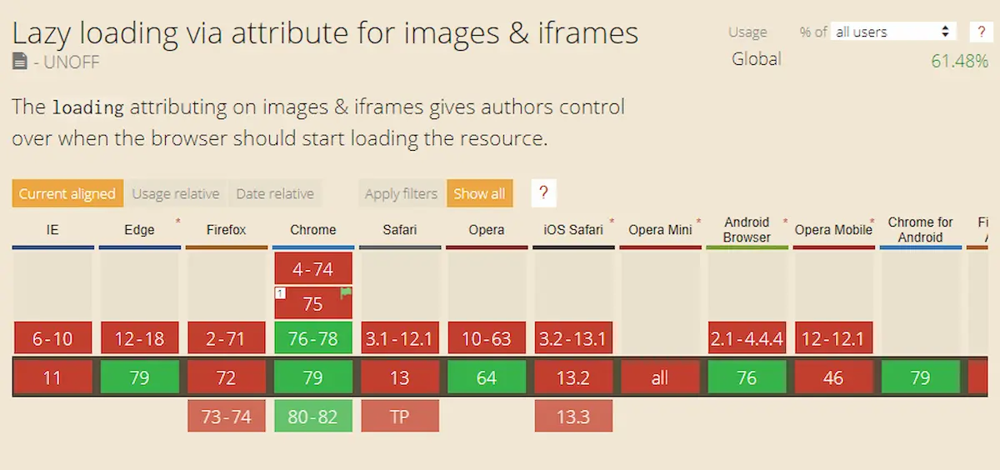

Quando si comincia un lavoro si corre il rischio di non finirlo mai. Ma non per pigrizia. Al contrario per perfezionismo. Mi sono accorto di stare correndo lo stesso rischio con la sistemazione del blog di mia mogli e del mio. Mi sto divertendo a modificare e migliorare [Tra Musica e Parole](https://www.tramusicaeparole.com/), l'ultima cosa è il _caricamento lento_ delle immagini. O _lazy Loading_ per dirla in inglese.

Sono partito da questo [articolo di Andrea Verlicchi](https://www.andreaverlicchi.eu/native-lazy-loading-with-vanilla-lazyload/) di qualche mese fa. Ci sono capitato per caso, mi ha incuriosito e mi sono messo a giocarci.

**A cosa serve il caricamento lento delle immagini?** A far sì che la pagina sia visibile il primo possibile rimandando a un secondo momento il caricamento delle immagini non visibili nella pagina. In pratica si mostra subito l'immagine in alto e poi si mostrano le altre man mano che si scorre la pagina.

### Loading = lazy

Ci sono due modi per ottenere questo risultato. Il primo è usando l'attributo `loading="lazy"`. Basta aggiungere al tag `img` questo attributo e il browser fa tutto da solo: cattura solo una piccola parte delle informazioni delle immagini (circa 2kb) rimandando il download delle altre a quando l'immagine entra nello schermo.

Praticamente basta far così:

```html

```

per ottenere questo


E visto che ho usato questa immagine come esempio, è il momento di parlare del principale limite di questo metodo: non è diffuso in tutti i browser. Funziona con Chrome, che da solo copre poco più del 60% degli utenti internet. Ma questo vuol dire che non funziona per circa il 40% deli internauti.

Quindi, come già per poter [usare le immagini webp](https://blog.stranianelli.com/jekyll-e-webp/) ho dovuto trovare un modo per adattare il blog a chi non usa Chrome.

### LazyLoad

La soluzione migliore che ho trovato prevede l'utilizzo di [LazyLoad](https://github.com/verlok/lazyload):

> LazyLoad is a fast, lightweight and flexible script that speeds up your web application by loading your content images, videos and iframes only as they enter the viewport. It's written in plain "vanilla" JavaScript, it leverages the IntersectionObserver API, it works with responsive images and it supports native lazy loading.

Promette bene, no? Quindi ho deciso di provarlo. E sono soddisfatto.

Per prima cosa devo inserire nella pagina lo script js:

```html
<script src="https://cdn.jsdelivr.net/npm/vanilla-lazyload@12.4.0/dist/lazyload.min.js"></script>
```

e quindi

```js
let lazyload = new LazyLoad({
		elements_selector: ".lazy",
    use_native: true
});
```

Ovviamente devo inserire anche l'immagine:

```html

```


In pratica aggiungo una classe "_lazy_" e invece di usare "_src_" uso "_data-src_". Perché? Perché funziona così: quando viene caricata la pagina se il browser supporta l'attributo "_loading_" allora viene inserito automaticamente nel tag altrimenti JavaScript mostrerà le immagini solamente quando appariranno nella pagina.

**E per quanto riguarda le _picture_?** Beh, il principio è lo stesso:

```html
<picture>
	<source
		type="image/webp"
		data-srcset="gattino.webp"
	/>
	
</picture>
```
