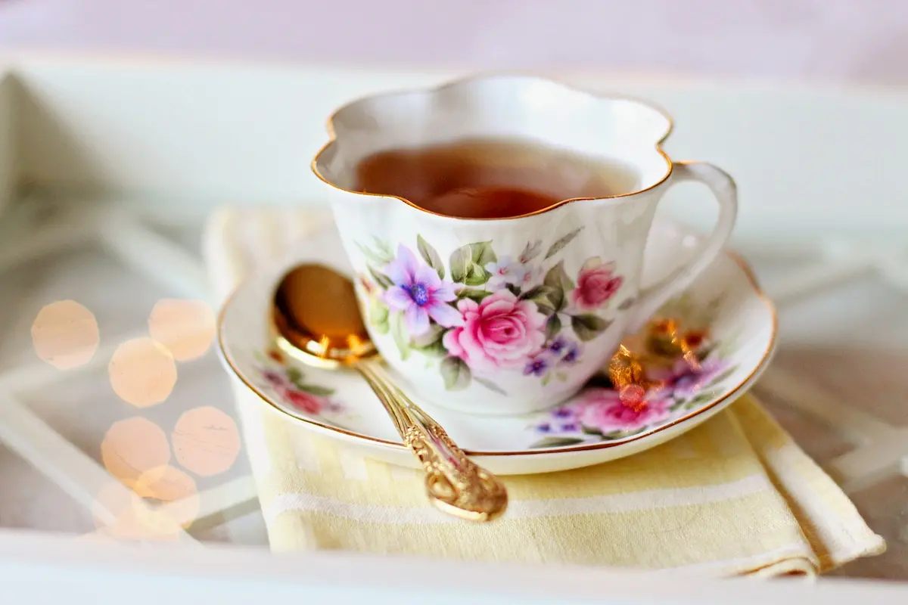

In questi giorni sto riflettendo a fondo su alcuni aspetti che riguardano il mio modo di lavorare. E di come gestisco il mio tempo. Ho letto alcuni articoli interessanti (e altri che interessanti non lo erano per nulla). Uno mi ha colpito in modo particolare perché formalizza un pensiero che mi girava per la testa da un pochetto ma che non riuscivo ad afferrare completamente.

[Jory Mackay su Fast Company](https://www.fastcompany.com/90293936/benefits-of-daily-routines-and-rituals) ricorda una frase di Will Durant nella _The Story of Philosophy_:

> Noi siamo quello che facciamo in continuazione

Al di là del fatto che spesso questa frase è attribuita molto spesso anche ad Aristotele, pare che sia grosso modo corretta. Anche perché circa il 40% delle nostre azioni quotidiane sono basate su abitudini e routine. Non necessariamente abitudini e routine di cui siamo consci.

Se ci pensiamo un attimo, è tanto. Ed è anche un bene: in fin dei conti se riusciamo a imbrigliare le nostre routine, a massimizzarle e a trarne il massimo, avremo delle produttività più alte e più tempo da dedicare alle cose che reputiamo più importanti.

Le routine si susseguono una dopo l'altra durante la giornata ma sono separate da alcuni momenti, quasi dei rituali. Può essere un caffè, una telefonata o anche semplicemente il spedire un messaggio alla persona amata. Routine e rituali sono entrambi importanti. Le routine, i compiti che eseguiamo quasi automaticamente ci aiutano a mettere ordine nel caos delle nostre vite. I rituali, invece, convogliano le abitudini in una dimensione più alta, dando uno scopo o un fine.

### Come creare una routine che funzioni

Entrambi gli aspetti sono importanti, parto con il primo, le routine. Nella sua forma base una routine non è altro che una serie di azioni eseguite in sequenza, e fatte con cadenza regolare.

Una routine, per esempio, è quella del mattino: si maledice la sveglia, ci si alza, ci si lava e ci si veste. Ognuno ha le sue routine, che le si riconoscano come tali o meno. Ma non tutti lavorano in maniera cosciente sulle proprie abitudini per migliorare il proprio tempo e la propria vita.

Ecco, è importante però sottolineare una cosa: le routine, le abitudini sono diverse per ognuno. Possono essere simili ma non uguali. Non basta seguire le abitudini di un uomo di successo per aver successo noi stessi. Anche se è sempre interessante confrontare come altri affrontano problemi simili.

Inoltre non sempre un'abitudine influenza direttamente il risultato. Se un grande imprenditore di successo si sveglia ogni giorno prima delle 4 del mattino non è detto che per noi sia la scelta giusta.

Quindi, prima di cominciare a cercare esempi di routine conviene fermarsi un po', riflettere su di noi e sulle abitudini che già abbiamo. E da lì partire, migliorandole dove possibile, aggiungendone di nuove, magari [provando anche solo per un mese](https://blog.stranianelli.com/non-spezzare-la-catena-dei-30-giorni/).

### La ritualità come mezzo per spostare la nostra attenzione dove serve

Uno dei problemi più grossi delle abitudini, soprattutto di quelle più recenti, è che non hanno un interruttore. Che intendo? Beh, che non basta premere un pulsante per passare da una routine all'altra. Il passaggio è sempre graduale, perché la nostra attenzione non finisce immediatamente ma resta per un pochetto ancorata a quello che stavamo facendo prima. E questa attenzione residua limita e rallenta i nuovi compiti da svolgere nella nuova routine.

Per evitare questo dobbiamo avere un mezzo per dire a noi stessi _Hey, adesso sto lavorando a una cosa nuova, quella di prima posso anche dimenticarmela per il momento_! Ecco, a questo servono i rituali. Grazie alla ritualità segniamo il passaggio da una fase all'altra della nostra giornata. Che poi, se ci si pensa bene, è esattamente quello che fanno i rituali religiosi e civili: segnano il passaggio da una fase all'altra della vita. Qui è lo stesso, ma più in piccolo.

### Come aggiungere ritualità nella nostra giornata

Ci sono dei momenti nella giornata di ognuno in cui i rituali aiutano a ridurre l'attenzione residua e migliorano il passaggio da un compito all'altro.

Per esempio, quando passiamo da, che ne so, scrivere un documento a fare una riunione da soli con il nostro responsabile. Sono due azioni completamente diverse, che richiedono abilità diverse. E di certo per concentrarci sulla riunione dobbiamo prima sgomberare la testa da quello che stavamo scrivendo.

Quindi, cosa possiamo fare? Facile, praticamente qualsiasi cosa.

I rituali sono profondamente personali. Per alcuni è sufficiente fare una camminata veloce verso l'altro ufficio, altri prima devono prendere un caffè prima di cambiare radicalmente compito. Oppure ancora basta chiudere lo schermo del PC o indossare l'orologio. Non è l'azione in sé l'importante ma il suo significato simbolico: è finita una parte della giornata, è ora di passare a una parte nuova.

Lo so che è difficile considerare questa una cosa importante, ma la ritualità aiuta molto nell'alleviare lo stress, aumenta il senso di controllo sui problemi nuovi e aumenta persino la produttività. Questo è possibile anche perché il nostro comportamento ci aiuta a costruire la nostra rappresentazione di noi stessi. E la ritualità associata alle abitudine dicono a noi che noi stessi siamo disciplinati, motivati e in grado di concentrarci su tutto quello che facciamo.

Come una profezia che si auto avvera, con il tempo diventeremo così davvero.

### Routine e rituali di perone famose

Se le routine in fondo non sono altro che abitudini, allora sono tutto sommato facili da spiegare e anche da insegnare. I rituali, invece, sono molto personali e possono anche essere piuttosto bizzarri se visti da altri.

Basti pensare alla relazione tra atleti e superstizioni. Ovviamente nessuno crede che non cambiare i calzini durante un torneo importante sia fondamentale per vincere. [Eppure Serena Williams non la vede così](https://www.businessinsider.com.au/the-strangest-pre-game-rituals-2011-8?r=US&IR=T#29-serena-williams-will-not-change-her-socks-once-during-a-tournament-2). Comunque, ecco una carrellata di rituali più o meno bizzarri:

* **Simone de Beauvoir** prima di cominciare un nuovo giorno di lavoro doveva sempre rileggere tutto quello che aveva scritto il giorno precedente
* **Winston Churchill** separava il lavoro del mattino da quello della sera con una siesta di un'ora e mezza
* **Stephen King** deve lavorare sempre nelle condizioni ogni mattina: deve avere un bicchiere d'acqua e le vitamine davanti a sé, ascoltare la stessa musica, essere seduto nella stessa sedia e i fogli devono sempre essere nella stessa posizione nello stesso posto.
* **Will Self** usa come rituali la pipa e le sigarette accompagnati da tea e caffè.
* **Charles Dickens** dormiva solamente rivolto verso nord altrimenti, secondo lui, la sua creatività ne avrebbe risentito.

Ovviamente non è necessario che i nostri rituali siano bizzarri o strani. L'importante è che accompagnino le nostre routine. In fin dei conti le abitudini ci permettono di avere la sensazione di avere il controllo del nostro tempo. La ritualità ci aiuta a tenere i nostri pensieri concentrati sull'obiettivo e a restare motivati.
