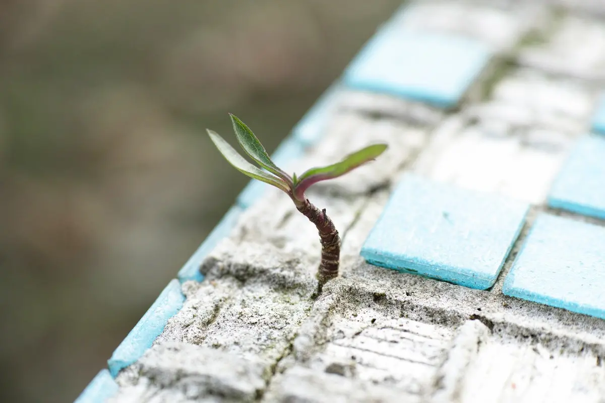

Ho cominciato a sistemare [il sito del matrimonio](https://www.ilmatrimoniodiclaudiaesamuele.com/) e penso di essere andato abbastanza avanti. Quanto? In realtà non so bene perché uno dei miei problemi è la difficoltà di misurare il progredire dei miei progetti personali. Eppure è importante, anzi, è fondamentale misurare il proprio lavoro anche in funzione degli obiettivi prefissati. E non importa che siano obiettivi grandi oppure piccoli.

Anche perché [misurare permette di conoscere](https://blog.stranianelli.com/tecniche-di-time-management/), e conoscere permette di migliorare. Se davvero si vuole crescere, non importa la ragione, allora è di capitale importanza tenere traccia degli obiettivi, dei passi fatti, di quelli da fare, delle cose andate bene e di quelle andate male. E questo prevede un metodo per misurare i propri progressi, al strada fatta in relazione alla meta.

Il fatto stessi di prendersi qualche momento per misurare la strada fatta è un passo avanti: obbliga a riflettere sul lavoro fatto e, in caso, a mettere in discussione il lavoro stesso. O il metodo di lavoro che applichiamo, l'organizzazione dei compiti e delle mansioni. Soprattutto permette di scoprire i punti deboli, quelli che ci fanno inciampare e ci rallentano. Sapere quali sono ci dà un grande potere: la possibilità di incidere sul nostro progetto. Incidere vuol dire togliere dalla nostra strada ostacoli, o rendere più produttivo il nostro tempo.

C'è un altro aspetto da ricordare: tenere traccia dei passi fatti, ovvero delle azioni compiute, aiuta a identificare abitudini (buone o cattive), a individuare tendenze (da assecondare o da bloccare), a capire prima quando qualcosa non funziona.

Volendo, è possibile esprimere lo stesso concetto dicendo che _misurare la produttività aumenta la produttività_.

E più efficacemente misuriamo la nostra produttività più acceleriamo il miglioramento della produttività stessa. Perché? Perché ci concentriamo sulle azioni che ci fanno crescere, migliorare, e soprattutto siamo portati a trovare le soluzioni che ci permettono di raggiungere il risultato migliore.

### Pareto, ancora

Volendo è lo stesso discorso già fatto per il _Principio di Pareto_: il 20% delle nostre azioni influenzano l'80% del nostro risultato. Allora conviene massimizzare il 20 per cento dei nostri sforzi per avere una leva molto forte sulla gran parte dei risultati che otteniamo. E spesso questo 20 percento è composto da compiti piccoli, da operazioni che tutto sommato sono anche piuttosto semplici. Ma per scoprirlo dobbiamo misurare. Misurare e tenere traccia del nostro processo.

Alla fine, se ben ci pensiamo, non esiste una sola grande azione, un'unica grande cosa, che separa l'ordinario dallo straordinario: sono, invece, centinaia, migliaia, forse milioni di piccole cose, all'apparenza separate ma intrinsecamente legate tra di loro. Invece di concentrarsi su una o due grandi azioni, val la pena di mettere la nostra attenzione su questo 20 per cento di cose piccole ma in grado di dare grandi risultati.

### Le riunioni con noi stessi

Va da sé che misurare senza ragionare non serve a nulla. E ragionare significa confrontare, confrontare dove siamo rispetto a dove vogliamo arrivare. Ne nasce, quindi, la necessità di prenderci il nostro tempo per analizzare il lavoro fatto, e le strategie che abbiamo adottato. E serve fare questa verifica con costanza e periodicamente.

Si tratta in fin dei conti di mettere nella propria agenda un momento dedicato a fare "una riunione con noi stessi". Non occorre che sia ogni giorno, magari nemmeno ogni settimana. Ma, con costanza, ogni tot giorni, magari una volta ogni due settimane o una volta al mese, vale la pena prendere noi stessi da parte e interrogarci su cosa abbiamo fatto, su cosa non è andata bene, cosa possiamo migliorare. E su cosa essere fieri, anche. Perché misurare e tenere traccia degli obiettivi raggiunti ci dà anche la spinta per essere fieri di noi stessi per il buon lavoro svolto.
