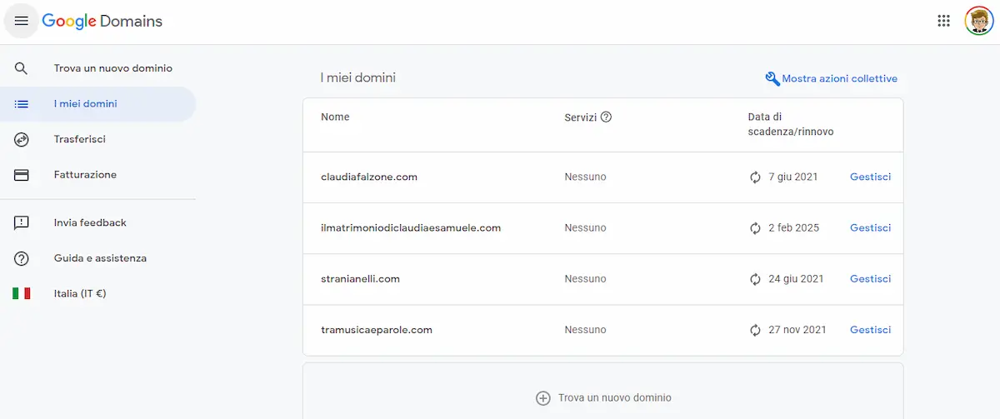

Contestualmente al [trasloco da WordPress a Jekyll](https://blog.stranianelli.com/perche-sono-passato-a-jekyll/) ho spostato anche il dominio dei blog da [GoDaddy](https://it.godaddy.com/) a [Google Domains](https://domains.google/). Come mai? Beh, risposta scontata, perché costa meno. E perché è più semplice. E poi, secondo me, il sito di Google è anche più bellino rispetto a quello di GoDaddy.

### Costa meno

Mettiamola così: con Google il dominio di questo blog mi costa 12 € l'anno. Con GoDaddy 23 €. Direi che la discussione si può chiudere qui.

Però non chiudiamola così velocemente. Perché? Perché in questi 12 euro sono compresi DNSSEC, Cloud DNS e protezione della privacy per impedire lo spam. Con GoDaddy non è così, bisogna pagare ogni singola aggiunta. E pagarla ogni mese. Quanto? Difficile dirlo, perché il sito di GoDaddy è fatto male. Dico davvero, è fatto molto male. Talmente male da essere da solo un buon motivo per cambiare

### Google è più semplice

E GoDaddy è inutilmente complicato. Ogni sezione, ogni pagina, ogni cavolo di operazione ha uno stile diverso. Non si capisce dove trovare la pagina per aggiungere o togliere cose al proprio abbonamento. Non si arriva velocemente alla pagina dei prezzi. Ogni volta è un'impresa capirci qualcosa.

Google invece è... beh, Google.

Richiama immediatamente GMail e tutti gli altri suoi prodotti. Ed è chiara, semplice e soprattutto è facile trovare quello che serve quando si vuole. Anche la Guida è completa e in grado di risolvere molti dei miei dubbi.

### Altro

Poi ci sarebbero anche altre ragioni più tecniche. I DNS di Google, dicono, sono più veloci. E la privacy è maggiormente tutelata. Ed è anche possibile creare, molto facilmente, un redirect per la mail. Cosicché se qualcuno scrive, per dire, a `samuele@nomedominio.com` la posta arriva direttamente alla mia casella Google Mail. Ancora, è semplicissimo configurare [Google Analytics](https://analytics.google.com/) e così via. Ma tutte queste sono cose che ho scoperto dopo. Certo, sono state una bella sorpresa ma le ragioni sul perché passare da GoDaddy a Google Domini sono, per me, le prime due: costa meno ed è più semplice.
