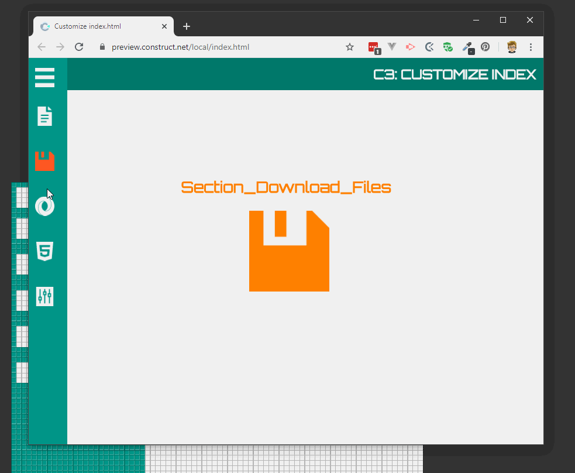
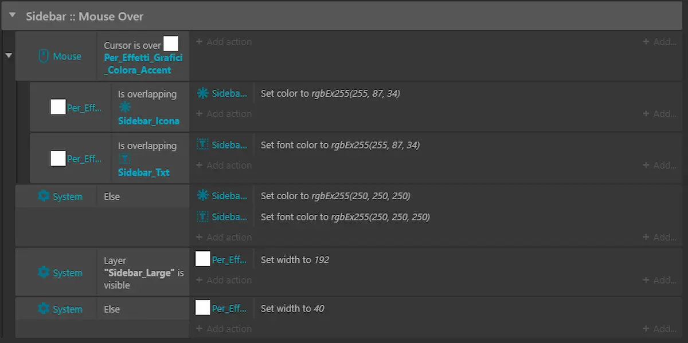

Dopo aver capito come [gestire in maniera dinamica la grafica in Construct 3](https://blog.stranianelli.com/construct-3-media-query-e-grid-system/) è il momento di cominciare lavorare sul menù. Già, perché di fatto sta cominciando a profilarsi un nuovo progetto: la mia idea è di trovare un metodo abbastanza semplice per [personalizzare l'esportazione HTML](https://blog.stranianelli.com/construct-3-come-personalizzare-l-esportazione-in-html/) e, soprattutto, risolvere i limiti legati all'inserimento di elementi durante l'esecuzione di un progetto C3.

Allora, mi piacerebbe avere un menù laterale per gestire le varie sezioni dell'app. È abbastanza semplice crearlo, anche se meno rispetto a lavorare in HTML puro. Però è possibile arrivare a risultati come questo:

Come ieri, ecco qui il [file c3p da scaricare](./custom-menu-with-transition.c3p). Non penso che servano grandi spiegazioni sul funzionamento. Giusto un paio di note.

Ho usato la possibilità di "mappare" le funzioni in modo da poterle chiamare tramite una stringa di testo. In questo modo posso usare la stessa funzione per ogni elemento del menù. Ovviamente per un menù così semplice è possibile usare un metodo più semplice e veloce: passare direttamente il nome del layer da mostrare e nasconde come parametro. Però mi interessava provare sul campo questo metodo, e così ho fatto.

Per gestire il cambio di colore al passaggio del mouse uso uno sprite aggiuntivo in modo da poter coordinare il colore tra la scritta e l'icona. Lo sprite (bianco) cambia la dimensione in base alla visibilità del menù esteso.

### Post Scriptum

Ovviamente, mentre scrivevo questo articolo mi sono accorto che è possibile semplificare ulteriormente il tutto: basta usare un _container_ per icone e testo. Quindi, ecco qui [la versione più semplice di questo esempio](./custom-menu-with-transition-defrag.c3p).
