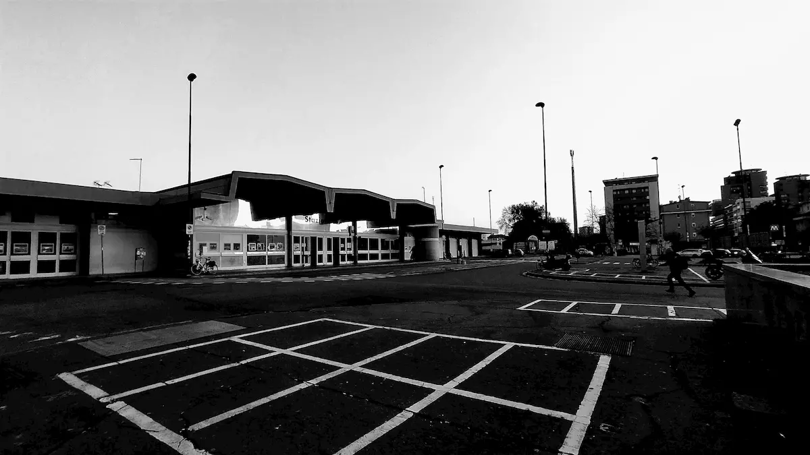
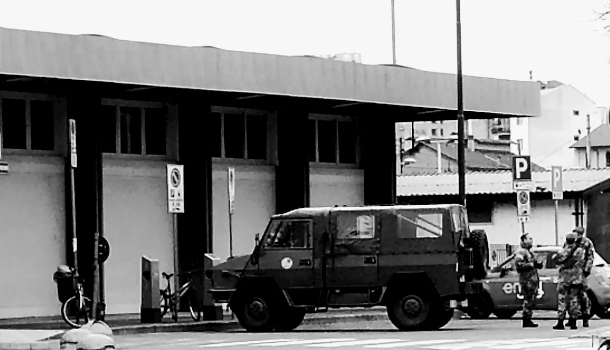
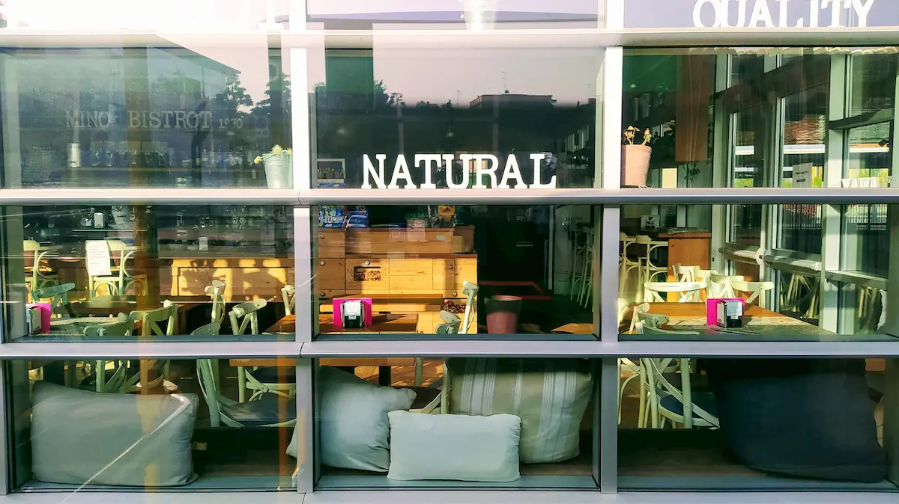
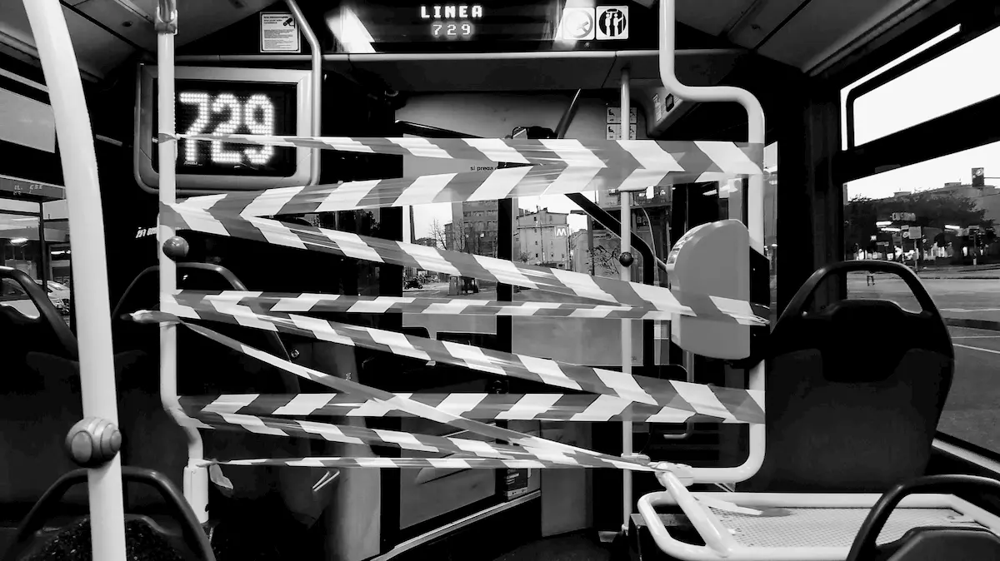

Questo mese di marzo è finito, praticamente. E i miei cento giorni sono rimasti bloccati, schiacciati dalle incombenze e dalla pandemia. Bloccati in un mondo che non c'è più. Dovrei aggiungere un punto ai [vantaggi dell'aphantasia](https://blog.stranianelli.com/welcome-aphantasia/): adattarsi velocemente alla fine del mondo.

Non, il mondo non è finito. Sì, è finito un mondo. Ne nascerà uno nuovo. Migliore, forse, o forse peggiore. Ma sarà nuovo. Le cose sono cambiate, e cambieranno ancora, e non saranno più le stesse. Noi non saremo più noi stessi. Cresceremo, o magari no.

Milano è sempre spettrale, ma gli occhi che incontro non lo sono più. Questa oramai è la nostra realtà, ci dobbiamo fare i conti. L'esercito per le strade. Piazzali vuoti. Mascherine dappertutto. Silenzio. Forse la cosa più spaventosa è il silenzio. Non si sentono gli artisti della metropolitana stonare. Non ci sono clacson. Nessuno che disturba gridando al telefono sul tram. Silenzio ovunque. Nemmeno dai balconi ci sono più suoni.

In giro ci sono ancora molti lenzuoli: _andrà tutto bene_. Ma non ci crede più nessuno, oramai. Sventolano nel deserto, come la bandiera portata dagli astronauti sulla luna. È lì, sono lì, ma nessuno li vede più. Bandiere silenziose, vessilli abbandonati e dimenticati sul campo di battaglia dopo la sconfitta.

E poi la luce. Anzi, le luci delle case. La sera, tutti i palazzi sono illuminati, ogni appartamento con la luce accesa. Pare quasi Natale, quando sono tutti a casa, assieme, a celebrare la gioia del tempo passato assieme. Ma non è Natale. Natale era mille anni fa. Le stesse luci oggi sono fredde. Non scaldano più i cuori, li schiacciano in una morsa di angoscia e paura.
