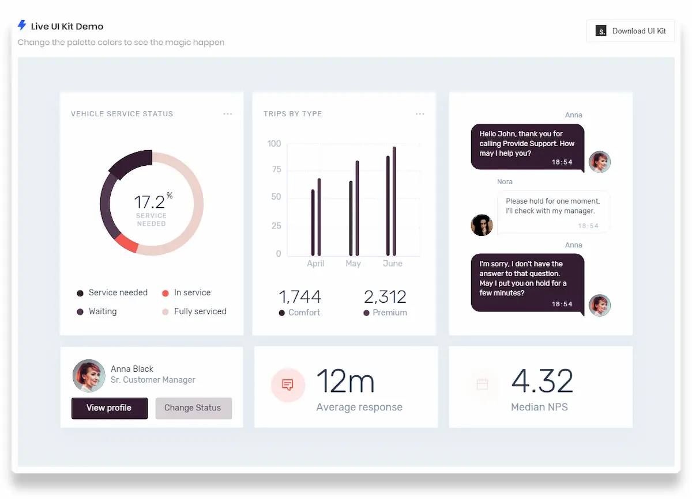
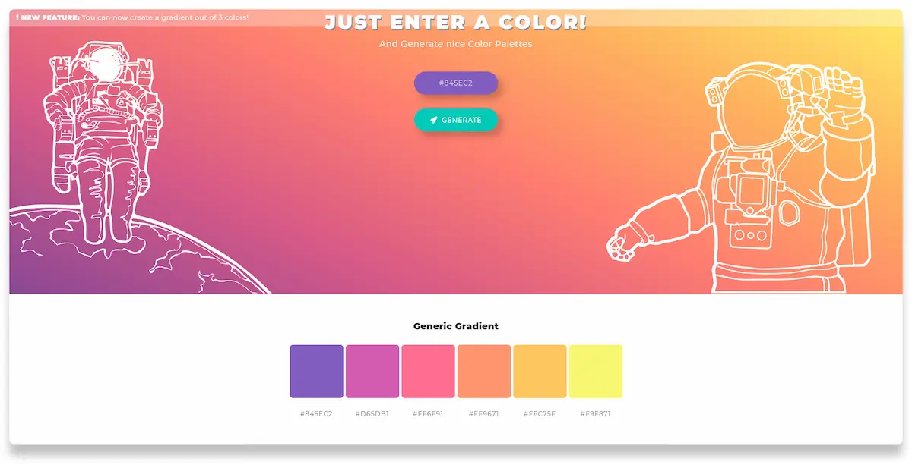
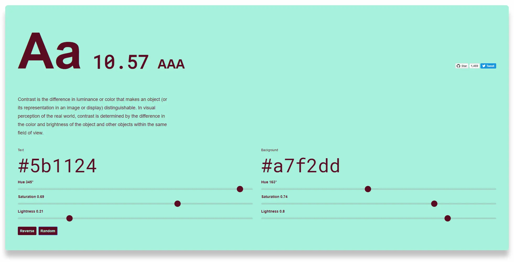
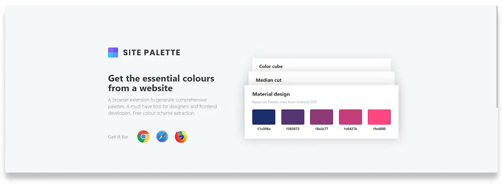
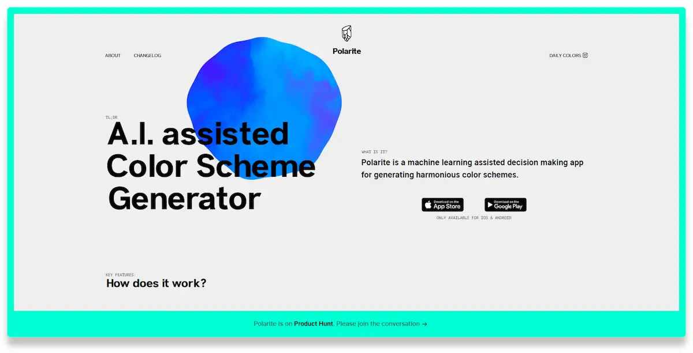
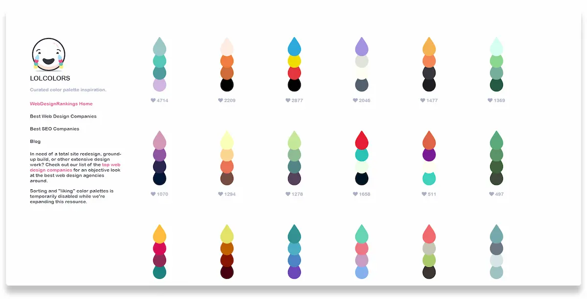
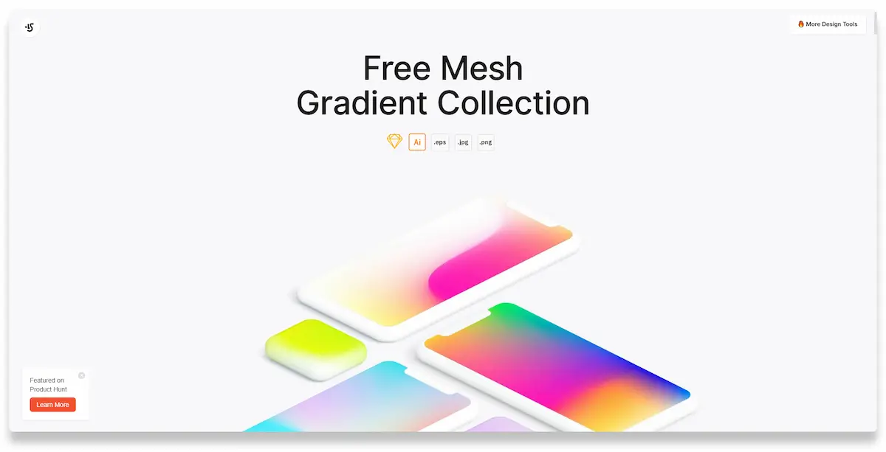
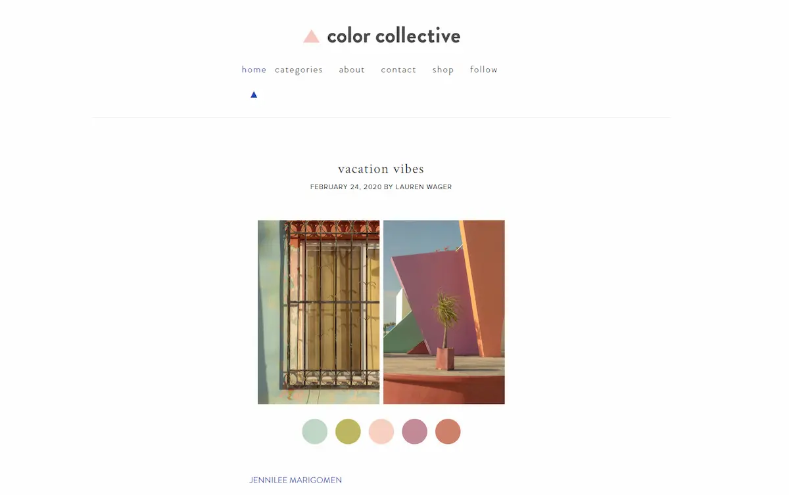

Oggi faccio una cosa diversa dal solito: mi appunto qui alcuni strumenti utili per abbinare colori. Perché anche quando si crea un prototipo vale la pena crearlo bellino. Sì, lo so, sono pur sempre quadrati, ma se i colori dei quadrati, dello sfondo e dei vari elementi sono scelti con un minino di criterio, anche il prototipo più banale ne guadagna in fascino. Premetto che non ho provato tutti questi strumenti: li sto elencando qui così so dove trovarli, nel caso mi servissero.

### [Muzli Colors](https://colors.muz.li/)

La parte migliore di questo sito è che mostra un'anteprima di come può apparire un sito che utilizza la palette generata automaticamente. Molto comodo per avere un'idea del risultato finale.

### [ColorSpace](https://mycolor.space/)

Uno strumento per creare palette di colori a partire da un sono colore.

### [Color Leap](https://colorleap.app/home)

Un progetto interessante che mostra quali combinazioni di colori sono stati utilizzati nel corso della storia.

### [Colorable](https://colorable.jxnblk.com/)

Uno strumento semplice e veloce per verificare la leggibilità e la chiarezza dei testi.

### [Site Palette](http://palette.site/)

Un'estensione per Chrome in grado di identificare le palette usate nei vari siti che visitiamo.

### [Polarite](https://www.polarite.app/)

Non l'ho ancora testata, ma questa app promette di creare degli schemi di colore usando un'Intelligenza Artificiale.

### [LOLCOLORS](https://www.webdesignrankings.com/resources/lolcolors/)

Una piccola collezione di palette, ma molto ben curata. Utilissima.

### [Khroma](http://khroma.co/)

Un'altro tool che non ho provato ma che mi incuriosisce. Si tratta di un'Intelligenza Artificiale che impara durante l'uso e, quindi, genera schemi di colore personalizzati.

### [Free Mesh Gradient Collection](https://www.ls.graphics/meshgradients)

Una collezione di oltre 100 mesh gradient (che non so se tradurre come _gradiente a maglia_ o _trama sfumata_ :smile:).

### [Color Collective](http://www.color-collective.com/)

Un blog con dei palette estratti da foto e immagini. C'è anche il libro, che ho preso e di cui parlerò, prima o poi.

