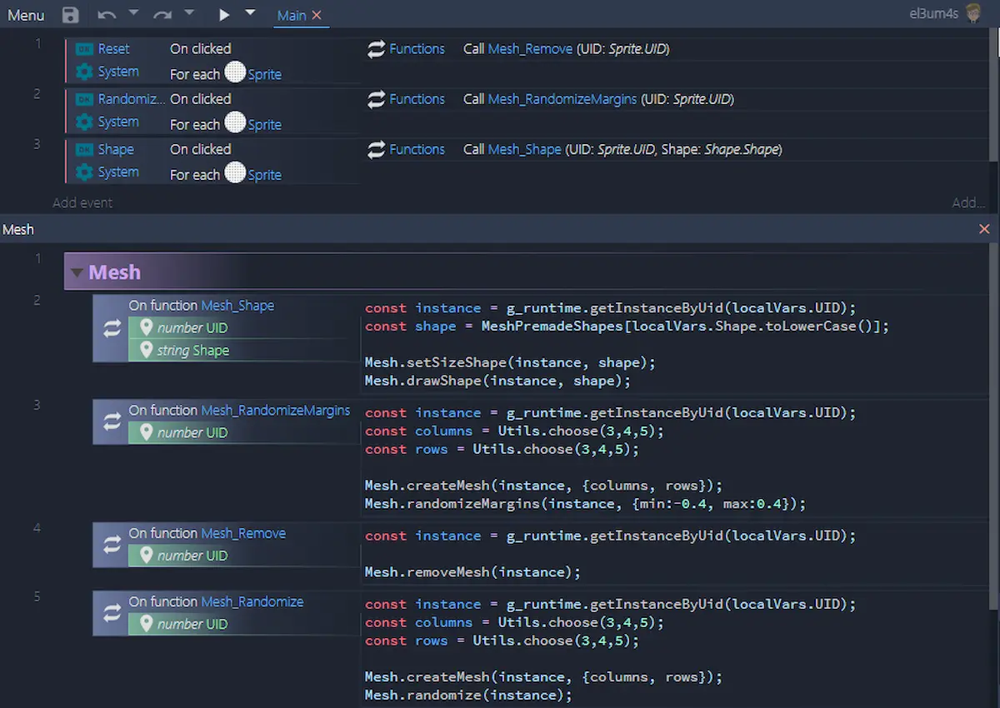
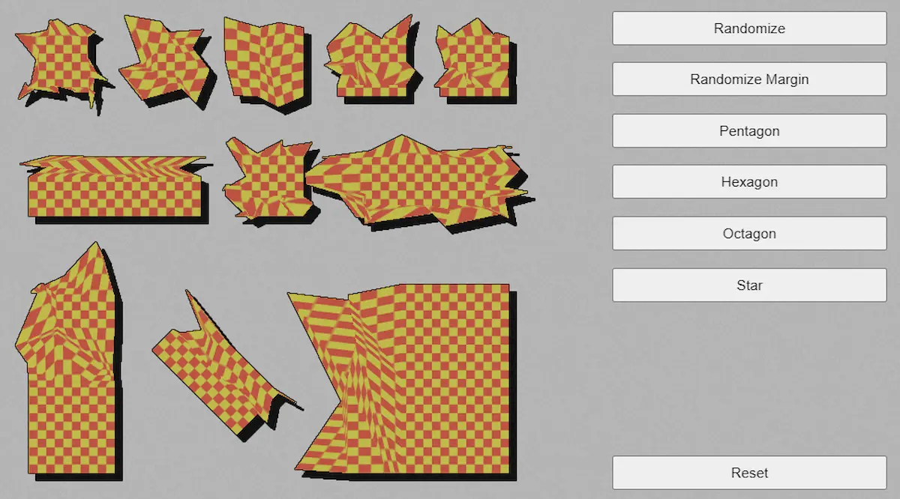

Prima di scrivere questo post ho aspettato l'uscita dell'ultima beta di Construct 3 (la [r235](https://www.construct.net/en/make-games/releases/beta/r235)) e l'aggiunta della funzione `IWorldInstance.getMeshSize()`. Perché? Perché mi serviva per modificare la forma di elementi in maniera geometrica usando _Mesh distortion_.

Come al solito, C3 permette di creare dei bei effetti con tutto sommato poco codice:



Per creare questo template ho usato un solo modulo aggiuntivo, [`mesh.js`](https://github.com/el3um4s/construct-demo/blob/master/javascript/009-mesh-and-shapes/source/files/scripts/mesh.js). Ci sono varie funzioni ma sono 2 quelle principali:

- `setMeshPointAbsolute`
- `drawShape`

La prima funzione

```js
function setMeshPointAbsolute(instance,
    { col = 0, row = 0, x = 0.5, y = 0.5} = {})
{ instance.setMeshPoint(col, row, {mode: "absolute", x, y}); }
```

imposta la posizione di un punto della mesh. La posizione viene impostata in modalità assoluta. Cosa significa? Significa che le coordinate sono in maniera assoluta rispetto all'angolo in alto a sinistra dello sprite. Però non sono in pixel (o punti) bensì in percentuale. Il punto (0;0) è l'angolo in alto a sinistra, quello (0.5;0.5) è il centro, il (1;1) l'angolo in basso a destra.

A partire da questa funzione posso creare questa:

```js
function drawShape(instance, shape) {
	const points = shape.points;
	points.forEach(point => setMeshPointAbsolute(instance, point));
}
```

Questa funzione non fa altro che disegnare ogni spostare ogni punto della sagoma in modo da ottenere la forma desiderata. Aspetta, quale sagoma? Beh, questa è una cosa che non ho detto: per rendere più semplice il disegno ho creato un oggetto [`MeshPremadeShapes`](https://github.com/el3um4s/construct-demo/blob/master/javascript/009-mesh-and-shapes/source/files/scripts/meshpremadeshapes.js)

```js
pentagon: {
	meshSize: {
		columns: 3,
		rows: 2
	},
	points: [
		{col: 0, row: 0, x: 0.00, y: 0.39},
		{col: 1, row: 0, x: 0.50, y: 0.00},
		{col: 2, row: 0, x: 1.00, y: 0.39},
		{col: 0, row: 1, x: 0.20, y: 1.00},
		{col: 1, row: 1, x: 0.50, y: 1.00},
		{col: 2, row: 1, x: 0.80, y: 1.00},
	]
}

```

L'idea alla base è abbastanza semplice: una `shape` è un oggetto con due proprietà: `meshSize` e `points`. Quest'ultima contiene un array di punti definiti: `{col, row, x, y}`

Quindi, `drawShape` non fa altro che scorrere i vari elementi dell'array e richiamare `setMeshPointAbsolute` per spostare i punti corrispondenti dello sprite.

Va da sé che avere inglobato le dimensioni nell'oggetto permette di usare una funzione

```js
function setSizeShape(instance, shape){
	const columns = shape.meshSize.columns;
	const rows = shape.meshSize.rows;
	createMesh(instance, { columns, rows });
}
```

Per generare automaticamente una mesh su un oggetto di Construct 3.

### Creare forme a caso

Volendo vivacizzare un po' il tutto ho creato anche una funzione per modificare in maniera random la forma delle immagini:

```js
function randomize(instance, { min = -0.5, max = 0.5 } = {}) {
	const { rows } = getMeshSize(instance);
	for (let row = 0; row < rows; row++){
		randomizeRow(instance, {row, min, max});
	}
}
```

E qui viene in aiuto `IWorldInstance.getMeshSize()`: mi serve per fare un ciclo su tutte le righe della mesh senza dover salvare le dimensioni della mesh stessa su un altro oggetto. `randomizeRow` modifica i punti della riga in modalità casuale.

```js
function randomizeRow(instance, {row = 0, min = -0.5, max = 0.5 } = {}) {
	const { columns } = getMeshSize(instance);
	for (let col = 0; col < columns; col++) {
  		const value = getRandomArbitraryXY(min, max);
		setMeshPointRelative(instance, {col, row, ...value});
	}
	return instance;
}
```

A differenza di `drawShape` questa volta utilizzo la posizione relativa dei vari punti. In pratica questo mi permette di spostare i punti non troppo distante dalla loro posizione originaria ottenendo un effetto più armonico.

Infine un altro effetto carino si puù ottenere modificando semplicemente i margini degli sprite:

```js
function randomizeMargins(instance, { min = -0.5, max = 0.5 } = {}){
	const { lastRow, lastColumn } = getMeshSize(instance);
	randomizeRow(instance, {row: 0, min, max});
	randomizeRow(instance, {row: lastRow, min, max});
	randomizeColumn(instance, {col: 0, min, max});
	randomizeColumn(instance, {col: lastColumn, min, max});
}
```

In questo modo il centro resta immutato ma i contorni assumono un aspetto più strano, e a mio parere più bello.

Per finire, è possibile usare queste stesse funzioni anche per modificare altri oggetti, come per esempio `TiledBackground`



Bene per il momento è tutto. Come ultima cosa i link al progetto:

- [il progetto su GitHub](https://github.com/el3um4s/construct-demo)
- [la demo online](https://c3demo.stranianelli.com/javascript/009-mesh-and-shapes/demo/)
- [Patreon](https://www.patreon.com/el3um4s)
