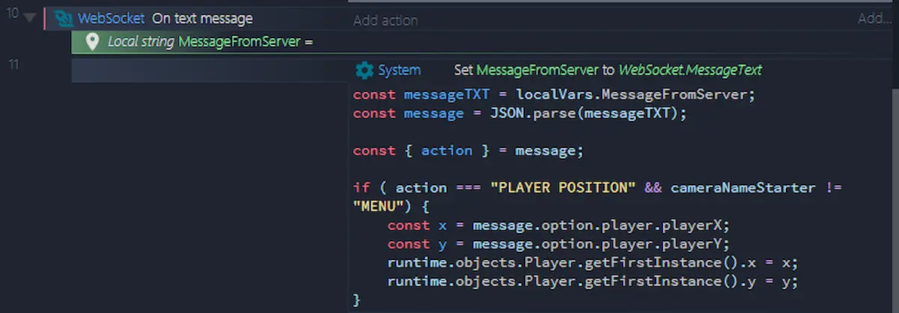

Oggi una cosa semplice e veloce per spiegare il mio ultimo esperimento, un sistema per creare un gioco su più finestre. Il repository su GitHub è ancora abbastanza spoglio, e il codice è davvero molto pasticciato. Ma la prova è riuscita e ci sono un paio di cose da dire.


La mia idea è di creare un gioco in cui il protagonista può muoversi liberamente tra le varie finestre dell'applicazione. Le finestre sono finestre classiche di Windows, create tramite [WebView2](https://blog.stranianelli.com/deno-c3-and-webview/). Questo, credo, potrebbe permette di creare alcune dinamiche di gioco diverse dalle solite. Ovviamente il motore di gioco è basato su Construct 3.

Il problema principale è far comunicare le varie finestre tra di loro. Problema risolvibile grazie all'uso di [**WebSocket**](https://developer.mozilla.org/en-US/docs/Web/API/WebSocket): un metodo supportato da tutti i browser moderni che permette di inviare e ricevere "_messaggi_" in tempo reale da e per un server.

Ed esiste un comodissimo [plugin di C3](https://www.construct.net/en/make-games/manuals/construct-3/plugin-reference/websocket) per fare tutto in maniera semi automatica 




Non mi concentro sul codice in sé, credo che dovrò raffinarlo un pochino. Ma già nel prototipo è chiaro cosa succede:

1. ogni tot C3 spedisce la posizione del giocatore al server
2. il server prende la posizione e la rispedisce indietro alle altre finestre
3. quando C3 riceve il messaggio dal server modifica la posizione del giocatore nelle varie finestre

Ma come creare un server locale su Windows? Ci sono vari metodi, quello che preferisco è usare [Deno](https://deno.land/), e nella fattispecie la [libreria standard ws](https://deno.land/std/ws).

Il codice è abbastanza semplice:

```ts
for await (const req of serve(`:8090`)) {
  const { conn, r: bufReader, w: bufWriter, headers } = req;
  const sock: WebSocket = await acceptWebSocket({ conn, bufReader, bufWriter, headers });
  handleWs(sock);
}

async function handleWs(sock: WebSocket): Promise<void> {
...
    for await (const ev of sock) {
      if (typeof ev === "string") {
        const message:SOCKETMessage = convertMessageToObject(ev);
        await chooseAction(message, sock);
      }
    }
...
}

async function chooseAction(message:SOCKETMessage, sock: WebSocket) {
    const { action, target } = message;
...
  if (action === "PLAYER POSITION") {
    if (message?.option?.player) {
      const sendBack = JSON.stringify(message);
      listConnection.forEach( element => element.sock.send(sendBack));
    }
  }
...
}
```

Ci sono tre fasi in questo codice. La prima mette in ascolto il server sulla porta `8090` e aspetta per una connessione. Quando arriva una connessione registra il webSocket e lo utilizza come argomento per la funzione `handleWs`. All'interno di questa funzione controllo il tipo di socket ricevuto e lo utilizzo per decidere il da farsi. Decisione che prendo usando la funzione `chooseAction`. In questo caso è sufficiente un comando `element.sock.send(message)` per rispedire indietro il messaggio ricevuto, ovvero la posizione del giocatore.

C'è un altro comando attivato da un socket:

```ts
if (action === "PLAY"){
  await Deno.run({ cmd: ["./webview/cameras/A/MultiWindows.exe"] });
  await Deno.run({ cmd: ["./webview/cameras/B/MultiWindows.exe"] });
  await Deno.run({ cmd: ["./webview/cameras/C/MultiWindows.exe"] });
  await Deno.run({ cmd: ["./webview/cameras/D/MultiWindows.exe"] });
}
```

Al momento non ho ancora trovato un metodo migliore, ma questo comando serve per aprire diverse istanze di WebView2, ognuna settata su un diverso scenario del gioco.

Per il momento è tutto. Riporto l'indirizzo del progetto e del mio Patreon, ricordando però che si tratta di un prototipo ancora molto grezzo e non testato in maniera approfondita. Ci lavorerò sopra nei prossimi giorni.

- [il progetto su GitHub](https://github.com/el3um4s/DenoC3MultiWindows)
- [Patreon](https://www.patreon.com/el3um4s)
