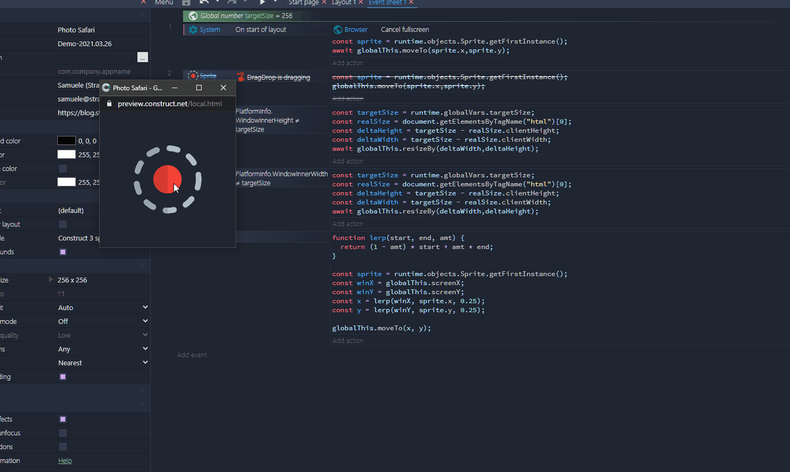

Questa settimana ho ripreso in mano [Electron](https://www.electronjs.org/) ma qualcosa non ha funzionato come previsto. Gli ultimi aggiornamenti di Construct 3, di NodeJS e di Electron hanno generato una combinazione bizzarra: tutto funziona al primo avvio, ma ad ogni successivo lancio del programma qualcosa di diverso si rompe. Adesso mi trovo nella condizione di dover decidere se pubblicare alcune cose che non riguardano più C3. Devo pensarci. Per il momento, però, posso parlare del mio ultimo template: **Floating Window**.


L'idea è di creare una finestra di Chrome in grado di muoversi nello schermo del PC rivelando, in base alla posizione, un qualcosa di diverso. Come se fosse una macchina fotografica in grado di inquadrare una realtà parallela, o qualcosa di simile. Mi piacerebbe poterlo esportare su Windows tramite WebView2, ma c'è ancora qualche problema nell'esportazione. Ma il codice alla base funziona. Funziona ed è molto semplice:

```js
function lerp(start, end, amt) {
  return (1 - amt) * start + amt * end;
}

const camera = runtime.objects.Camera.getFirstInstance();
const winX = globalThis.screenX;
const winY = globalThis.screenY;
const x = lerp(winX, camera.x, 0.25);
const y = lerp(winY, camera.y, 0.25);

globalThis.moveTo(x, y);
```

Allora, la funzione `lerp` serve unicamente a rendere più juicy il movimento della finestra. `globalThis.screenX` e `globalThis.screenY` permettono di ricavare la posizione della finestra del browser sullo schermo. `globalThis.moveTo(x, y);` muove la finestra nella posizione `(x, y)` dello schermo del PC.

Ma cosa è [`globalThis`](https://developer.mozilla.org/docs/Web/JavaScript/Reference/Global_Objects/globalThis)? Diciamo che è il metodo più rapido per accedere a `Window`, ovvero il DOM della pagina web, da C3.

Ovviamente quando si costruisce qualcosa saltano sempre fuori delle difficoltà impreviste. In questo caso è "come ridimensiono la finestra alle dimensioni che mi servono?". La risposta più semplice è utilizzando [`Window.resizeTo()`](https://developer.mozilla.org/docs/Web/API/Window/resizeTo). Ma non è sufficiente. Questo metodo, infatti, imposta le dimensioni della finestra complessiva invece a noi serve che le dimensioni della pagina web sia identica a quella della viewport di Construct. La dimensione della pagina web è ricavabile tramite [`Element.clientHeight`](https://developer.mozilla.org/docs/Web/API/Element/clientHeight). In questo caso l'elemento da prendere come riferimento è l'intero `HTML`.

```js
const realSize = document.getElementsByTagName("html")[0];
const realSizeHeight = realSize.clientHeight
const realSizeWidth = realSize.clientWidth;
```

Dopo aver trovato le dimensioni effettive della finestra possiamo calcolare quanto manca per raggiungere la grandezza esatta:

```js
const targetSize = 256; // runtime.globalVars.TargetSize;
const deltaHeight = targetSize - realSizeHeight;
const deltaWidth = targetSize - realSizeWidth;
```

E quindi usare [`Window.resizeBy()`](https://developer.mozilla.org/docs/Web/API/Window/resizeBy) per ridimensionare la finestra del browser:

```js
globalThis.resizeBy(deltaWidth,deltaHeight);
```




Resta un problema: come aprire la demo online in modo da poter testare il template? Di default Chrome (e credo tutti i browser) aprono i link o nella stessa tab o in una nuova finestra. A noi però serve aprire il template in una finestra popup:

```js
window.open("https://c3demo.stranianelli.com/template/017-floating-window/demo","test", "width=256,height=256,menubar=false,toolbar=false,location=false,resizable=false,status=false")
```
Bene, con questo è tutto, per oggi. Come al solito il codice e la demo sono disponibili su GitHub:

- [il progetto su GitHub](https://github.com/el3um4s/construct-demo)
- [La demo online](https://c3demo.stranianelli.com/template/017-floating-window/demo)
- [Patreon](https://www.patreon.com/el3um4s)
