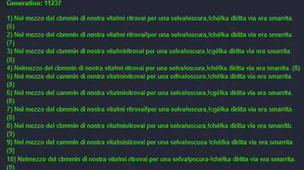

La scorsa settimana è stata abbastanza complicata e non ho avuto molto tempo per sperimentare. Sono però riuscito a trovare il tempo per partecipare a una jam e per replicare un semplice algoritmo genetico per… scrivere "_hello world_".

Della Jam parlerò magari un'altra volta, oggi voglio parlare di questo:



Lo so, lo so, non è molto spettacolare. Da fuori somiglia a una serie di caratteri a caso che tentano di scrivere l'incipit della Divina Commedia. Ed effettivamente è così, un tentativo di "insegnare" a un algoritmo genetico a scrivere. Una specie di "Hello World" per imparare qualcosa di machine learning. Come sempre ho caricato su GitHub [una demo su cui provare](https://c3demo.stranianelli.com/machine-learning/001-hello-world/demo/) e [il codice del progetto](https://github.com/el3um4s/construct-demo).

La mia conoscenza è tendente allo zero quindi mi sono fortemente ispirato a questo articolo del 2012 di Burak Kanber: [Machine Learning: Introduction to Genetic Algorithms](https://burakkanber.com/blog/machine-learning-genetic-algorithms-part-1-javascript/). Articolo a cui rimando per tutta la spiegazione teorica.

Mi limito a riassumere quello che ho capito e quello che ho provato a replicare.

### Cosa è un Algoritmo Genetico (in inglese Genetic Algorithms, GA)?

È un algoritmo che tenta di imitare il funzionamento del DNA per ottenere risposte velocemente a problemi di carattere generale. In pratica, se ho ben capito funziona così:

- si prende un pool genetico (random o meno), ovvero un insieme di soluzioni a caso al nostro problema
- si stima quindi quanto le singole soluzioni sono corrette
- si eliminano alcune delle soluzioni sbagliate
- si prendono le soluzioni rimaste e si usano come base per creare delle nuove soluzioni
- si riesegue nuovamente la stima, la selezione e la generazione di nuove soluzioni
- tutto questo fino a trovare la soluzione ottimale o per lo meno la migliore soluzione in un dato tempo

In questo modo è possibile testare varie soluzioni e gradualmente avvicinarsi alla soluzione cercata.

### Come si creano nuove soluzioni?

Ci sono alcune tecniche:

- si prendono i candidati migliori e li si incrocia generando dei candidati figli che condividono parte del materiale genetico dei genitori
- si generano delle mutazioni casuali al codice genetico delle soluzioni già esistenti in modo da innescare una mutazione casuale
- si scambiano le posizioni di due geni all'interno del cromosoma della soluzione
- si aggiunge o si toglie un gene a caso dal cromosoma

Da quello che ho capito ce ne sono altre ancora. Ma per il momento la cosa importate è il concetto: si imitano le mutazioni casuali che avvengono in natura, sia al momento della riproduzione del DNA che in seguito a mutazioni casuali.

### Come si eliminano le soluzioni sbagliate?

Semplicemente cancellandole dalla popolazione. Il problema semmai è decidere quali e quante soluzioni cancellare. Qui ci sono varie tecniche:

- la roulette: si scelgono a caso le soluzioni da "salvare". Ma è un caso pilotato dal fitness di ogni soluzione. Cos'è "fitness"? È il valore che indica quanto una soluzione è corretta. Più alto è il fitness più sono alte le probabilità per una soluzione di essere "salvata"
- in base al punteggio: in genere verso la fine di una selezione tutte le soluzioni candidate hanno un fitness simile. Questo rende la selezione a "roulette" una seleziona sostanzialmente casuale. Per mantenere la pressione evolutiva allora è possibile decidere di eliminare sostanzialmente le soluzione con il ranking più basso
- stazionaria: l'idea alla base è di conservare più cromosomi possibili. Si scelgono i migliori, li si incrocia tra di loro e si inseriscono i loro figli al posto delle soluzioni più scarse. I cromosomi con un fitness medio, la maggior parte, non vengono eliminati e possono continuare nella generazione successiva

E poi, ovviamente, altre ancora.

### Come si calcola il fitness di una soluzione?

Dipende. Dipende dal problema, dipende da quello che conosciamo, dipende. 

### Come finisce l'evoluzione?

Quando si trova una soluzione. Ma non sempre si sa se esiste una soluzione. Una tecnica, credo abbastanza semplice ed efficace, è decidere di interrompere l'esecuzione dell'algoritmo dopo tot generazioni senza mutazioni in grado di migliorare il fitness della soluzione migliore. Si può decidere, per esempio, che dopo 1000 generazioni in cui la soluzione migliore ha fitness X, allora quella soluzione è la "Soluzione".

Non è detto sia la soluzione migliore in assoluto. Ma a volte non è necessario trovare la soluzione perfetta e una risposta quasi corretta va bene.

### Ok, ma il codice?

Adesso ci arrivo. Comincio però dal problema. Il problema è insegnare a un algoritmo come scrivere "Hello World". Ovviamente è un problema banale, e il metodo migliore non presuppone nessun algoritmo genetico. Ma è un buon esempio per applicare quello di cui ho appena parlato.

Comincio con il creare una classe **Chromosome** 

```js
class Chromosome {
	constructor(code) {
		this.code = code ?? '';
		this.cost = 9999;
	}
}
```

Il nostro _Cromosoma_ ha due proprietà:

- `code` : dove salvare i vari geni
- `cost` : dove conservare il valore di fitness del cromosoma stesso

La prima cosa da fare dopo aver creato un cromosoma è riempirlo di geni a caso:

```js
random(length) {
	while (length--) {
		this.code += String.fromCharCode(Math.floor(Math.random()*255));
	}
}
```

Ma cosa sono i geni adatti per risolvere il problema? Semplicemente i caratteri alfanumerici. In JavaScript possiamo rappresentare ogni carattere come numero, e convertire un numero in carattere. Basta quindi riempire il `code` con una stringa di caratteri random.

```js
calcCost(compareTO) {
  let total = 0;
  for (let i = 0; i < this.code.length; i++) {
    total += Math.pow(this.code.charCodeAt(i) - compareTO.charCodeAt(i), 2);
  }
  this.cost = total;
}
```

Ci serve inoltre una funzione in grado di calcolare il fitness di un cromosoma. La funzione `calcCost` fa esattamente questo. Qui c'è però un problema: il modo più semplice per capire quanto una soluzione è distante da "Hello World" è confrontarla con "Hello World". E se abbiamo già in mano la soluzione allora tutta questa fatica diventa inutile. Ma questo lo sapevamo già, e quindi andiamo avanti con l'esercizio. Confrontiamo quindi ogni carattere con quello corretto e calcoliamo la distanza tra i due codici numerici. Meglio, la distanza al quadrato in modo da togliere dalle scatole i numeri negativi.

```js
crossover(chromosome) {
  const pivot = Math.round(this.code.length / 2) - 1;
  
  const child1 = this.code.substr(0, pivot) + chromosome.code.substr(pivot);
  const child2 = chromosome.code.substr(0, pivot) + this.code.substr(pivot);
  
  return [new Chromosome(child1), new Chromosome(child2)];
}
```

La funzione di `crossover` permette di "sposare" due cromosomi e di generare due figli. La tecnica più banale è di dividere ogni cromosoma in due, e di scambiarle tra i due.

È invece un po' più complicata la funzione per generare una mutazione:

```js
mutate(chance) {
  if (Math.random() < chance) { return; }
  
  const index = Math.floor(Math.random()*this.code.length);
  const upOrDown = Math.random() <= 0.5 ? -1 : 1;
  const newChar = String.fromCharCode(this.code.charCodeAt(index) + upOrDown);
  let newString = '';
  
  for (let i = 0; i < this.code.length; i++) {
    if ( i == index ) {
      newString += newChar;
    } else {
      newString += this.code[i];
    }
  }
  this.code = newString;
}
```

`mutate(chance)` accetta come argomento un numero tra 0 e 1: rappresenta la probabilità di innescare una mutazione. Se la mutazione viene innescata, si sceglie un gene a caso all'interno del cromosoma e lo si sostituisce con un altro carattere.

Bene, la classe `Chromosome` è a posto, per il momento. Passiamo adesso alla classe `Population` da usare come base per fare "vivere" le varie generazioni:

```js
class Population {
	constructor (goal, size){
		this.members = [];
		this.goal = goal;
		this.generationNumber = 0;
		while (size--) {
			const chromo = new Chromosome();
			const lenght = this.goal.length;
			chromo.random(lenght);
			this.members.push(chromo);
		}
	}
}
```

**Population** ha come proprietà:

- `members` : un array dove inserire tutti gli individui (cromosomi) vivi in quel momento
- `goal` : la frase da insegnare all'algoritmo
- `generationNumber` : il numero della generazione in corso

Inoltre il costruttore della classe genera cromosoma casuale per ogni individuo della prima generazione.

```js
sort() {
	this.members.sort( (a,b) => a.cost - b.cost );
}
```

Serve una funzione di ordinamento per semplificare la selezione dei cromosomi più vicini alla soluzione corretta,

```js
display() {
  const textGeneration = g_runtime.objects.Generation.getFirstInstance();
  textGeneration.text = `Generation: ${this.generationNumber}`;
  
  const textPopulation = g_runtime.objects.Population.getFirstInstance();
  textPopulation.text = '';
  for (let i = 0; i < this.members.length; i++){
    textPopulation.text += `${i+1}) ${this.members[i].code} (${this.members[i].cost})\n`
  }
}

signalEndEvolution() {
  g_runtime.callFunction("EnableButton");
}
```

E due funzioni di aiuto (`display` e `signalEndEvolution`) per permettere all'algoritmo di comunicare con Construct 3.

Ma sopratutto serve la funzione `generation`

```js
async generation() {		
  for (let i = 0; i < this.members.length; i++) {
    const goal = this.goal;
    this.members[i].calcCost(goal);
  }
  
  this.sort();
  this.display();
  const children = this.members[0].crossover(this.members[1]);
  this.members.splice(this.members.length-2, 2, children[0], children[1]);
  
  for (let i = 0; i < this.members.length; i++) {
    this.members[i].mutate(0.5);
    this.members[i].calcCost(this.goal);
    if(this.members[i].code == this.goal) {
      this.sort();
      this.display();
      this.signalEndEvolution();
      return true;
    }
  }
  
  this.generationNumber++;
  await new Promise(resolve => setTimeout(resolve, 10));
  this.generation();
}
```

Questo codice è un po' più lungo dei precedenti, meglio dividerlo in pezzetti più piccoli.

Per prima cosa calcolo il fitness di ogni cromosoma:

```js
for (let i = 0; i < this.members.length; i++) {
  const goal = this.goal;
  this.members[i].calcCost(goal);
}
```

Poi ordino i cromosomi e uso i primi due per generare due "figli":

```js
this.sort();
const children = this.members[0].crossover(this.members[1]);
this.members.splice(this.members.length-2, 2, children[0], children[1]);
```

Quindi prendo tutti i cromosomi e applico loro una mutazione:

```js
for (let i = 0; i < this.members.length; i++) {
  this.members[i].mutate(0.5);
  this.members[i].calcCost(this.goal);
}
```

Controllo quindi se qualche soluzione coincide con la stringa cercata. Se sì posso interrompere l'algoritmo.

```js
if(this.members[i].code == this.goal) {
  this.sort();
  return true;
}
```

Altrimenti passo alla generazione successiva e rieseguo i passaggi precedenti:

```js
this.generationNumber++;
this.generation();
```

### Ma praticamente come uso tutto questo?

Infine basta inserire un semplice script nell'event sheet del progetto:

```js
const population  = new Population("Hello World", 20);
population.generation();
```

per avviare l'algoritmo genetico e ottenere come risposta il nostro "Hello World".

Con questo è tutto, ricordo che il codice di questo progetto è disponibile su GitHub:

- [il progetto su GitHub](https://github.com/el3um4s/construct-demo)
- [la demo online](https://c3demo.stranianelli.com/machine-learning/001-hello-world/demo/)
- [Patreon](https://www.patreon.com/el3um4s)
