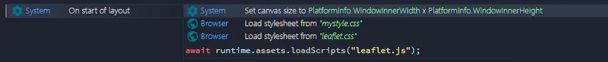
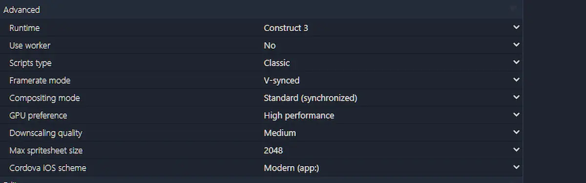
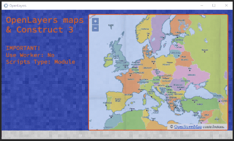

Era da un po' che non giocavo con le mappe. L'ultimo tentativo risale oramai a qualche anno fa. Questa settimana, complice anche alcuni messaggi diretti su Twitter, ho ripreso in mano il mio vecchio codice. E ho creato due template.


Il primo usa [Leaflet](https://leafletjs.com/), una libreria abbastanza famosa per inserire mappe in una pagina html. Ma come possiamo integrare Leaflet in Construct 3? In modo tutto sommato semplice.

Per prima cosa ci servono 2 file:

- [leaflet.css](https://unpkg.com/leaflet@1.7.1/dist/leaflet.css)
- [leaflet.js](https://unpkg.com/leaflet@1.7.1/dist/leaflet.js)

Carichiamo subito questi file:



Contestualmente creiamo anche file CSS per gestire la posizione e lo stile della mappa. Nel mio esempio è semplicemente:

```css
#mapid {
	position: absolute;
	left:304px;
	top:16px;
	right:16px;
	bottom:16px;
	border-style: solid;
	border-color: rgb(91, 31, 31);
	border-radius: 8px;
	opacity: 80%;
}
```

Dopo di ché possiamo creare un DIV (con ID `mapid`) dove inserire la nostra mappa:

```js
const myDiv = document.createElement("div");
myDiv.id = 'mapid';
document.body.appendChild(myDiv);
myDiv.style.position = "absolute";
```

Da qui in avanti è possibile seguire la [Quick Start Guide di Leaflet](https://leafletjs.com/examples/quick-start/).

Impostiamo la posizione e lo zoom della mappa con:

```js
let mymap = L.map('mapid').setView([51.505, -0.09], 13);
```

Poi aggiungiamo un livello alla mappa (in questo caso per mostrare OpenStreetMap)

```js
L.tileLayer('https://{s}.tile.openstreetmap.org/{z}/{x}/{y}.png', {
    attribution: '&copy; <a href="https://www.openstreetmap.org/copyright">OpenStreetMap</a> contributors'
}).addTo(mymap);
```

Infine, se ci serve, disegniamo un cerchio e un triangolo

```js
let circle = L.circle([51.508, -0.11], {
    color: 'red',
    fillColor: '#f03',
    fillOpacity: 0.5,
    radius: 500
}).addTo(mymap);

let polygon = L.polygon([
    [51.509, -0.08],
    [51.503, -0.06],
    [51.51, -0.047]
]).addTo(mymap);
```

E, visto che ci siamo, aggiungiamo anche un popup:

```js
circle.bindPopup("I am a circle.");
polygon.bindPopup("I am a polygon.");
```

Tutto molto bello, molto semplice e molto veloce. Però. Però c'è un problema. Non so per quale motivo ma Leaflet non supporta i moduli ES6 di Javascript. Il che vuol dire che siamo costretti a usare come impostazione `Scripts type: Classic`.



Il che non sarebbe nemmeno un problema adesso. Il problema sorgerà in futuro quando la Classic Mode non verrà più supportata (vedi qui: [Upgrading projects from classic scripts to modules](https://www.construct.net/en/tutorials/upgrading-projects-classic-2652))

> The old classic mode is deprecated and will soon be removed, so you should update your code soon.

Per fortuna l'Internet è venuto in soccorso. Grazie ad alcuni suggerimenti su Twitter (grazie [@laurentgontier](https://twitter.com/laurentgontier) e [@jmviglino](https://twitter.com/jmviglino)) ho provato [OpenLayers](https://openlayers.org/):




Il procedimento per integrare le mappe di OpenLayers in Construct 3 è molto simile a quello con Leaflet. Ci sono però alcune piccole differenze, a partire dai file da importare:

- [ol.css](https://cdn.jsdelivr.net/gh/openlayers/openlayers.github.io@master/en/v6.5.0/css/ol.css)
- [ol.js](https://cdn.jsdelivr.net/gh/openlayers/openlayers.github.io@master/en/v6.5.0/build/ol.js)

Ovviamente carichiamo subito i file


e creiamo il div per la mappa. Da qui in avanti possiamo seguire la guida [OpenLayers - Vector Layer](https://openlayers.org/en/latest/examples/vector-layer.html).

Possiamo creare una mappa OSM in questo modo, centrandola su Milano e impostando uno zoom 12.

```js
const mymap = new ol.Map({
	target: 'mapid',
	layers: [
		new ol.layer.Tile({
			source: new ol.source.OSM()
		})
	],
		view: new ol.View({
		center: ol.proj.fromLonLat([9.1892, 45.4641]),
		zoom: 12
	})
});
```

Ma c'è un altro aspetto interessante, di OpenLayers: la facilità con cui è possibile importare mappe basate su TileJSON e GeoJSON.

Nel primo caso è sufficiente inserire un livello in questo modo:

```js
new ol.layer.Tile({
	source: new ol.source.TileJSON({
		url: 'https://a.tiles.mapbox.com/v3/aj.1x1-degrees.json?secure=1',
		crossOrigin: 'anonymous',
	}),
}),
```

L'utilizzo di GeoJSON è un attimo più lungo perché occorre stabilire anche lo stile da applicare. Ma prima di tutto dobbiamo collegare il file GeoJSON

```js
const sourceGeoJSON = await runtime.assets.getProjectFileUrl("ds964_nil_wm.geojson");
```

In questo esempio uso un file importato nel progetto C3 ma volendo possiamo usare anche un file online.

Dopo aver ottenuto i dati geografici possiamo creare un livello nella mappa:

```js
new ol.layer.Vector({
	source: new ol.source.Vector({
		url: sourceGeoJSON,
		format: new ol.format.GeoJSON(),
	}),
	style: function (feature) {
		style.getText().setText(feature.get('NIL'));
		return style;
	},
})
```

Lo stile viene ricavato dalla funzione:

```js
const style = new ol.style.Style({
  fill: new ol.style.Fill({
    color: 'rgba(255, 255, 255, 0.6)',
  }),
  stroke: new ol.style.Stroke({
    color: '#319FD3',
    width: 1,
  }),
  text: new ol.style.Text({
    font: '10px "SourceCodePro-Regular",Calibri,sans-serif',
    fill: new ol.style.Fill({
      color: '#000',
    }),
    stroke: new ol.style.Stroke({
      color: '#fff',
      width: 1,
    }),
  }),
});
```

Un'altra cosa interessante è la possibilità di poter gestire eventi come il click del mouse su una particolare zona:

```js

const displayFeatureInfo = function (pixel) {
  const feature = mymap.forEachFeatureAtPixel(pixel, function (feature) {
    return feature;
  });

  const info = runtime.objects.NIL_MILAN.getFirstInstance();
  if (feature) {
    info.text = `${feature.get('ID_NIL')} - ${feature.get('NIL')}`;
  } else {
    info.text = '';
  }

  if (feature !== highlight) {
    if (highlight) {
      featureOverlay.getSource().removeFeature(highlight);
    }
    if (feature) {
      featureOverlay.getSource().addFeature(feature);
    }
    highlight = feature;
  }
};

mymap.on('click', function (evt) {
  displayFeatureInfo(evt.pixel);
});
```

Penso ci siano le basi per poter sperimentare un pochetto su questo metodo per integrare mappe in Construct 3. Ma per il momento mi fermo qui. Ricordo solamente che, come sempre, il codice di questo progetto è disponibile su GitHub:

- [il progetto su GitHub](https://github.com/el3um4s/construct-demo)
- [la demo online: Leaflet](https://c3demo.stranianelli.com/mini-template/003-leaflet/demo/)
- [la demo online: OpenLayers](https://c3demo.stranianelli.com/mini-template/004-openlayers/demo/)
- [Patreon](https://www.patreon.com/el3um4s)
- [Leaflet](https://leafletjs.com/)
- [OpenLayers](https://openlayers.org/)
- [NIL Milano](https://dati.comune.milano.it/dataset/ds964-nil-vigenti-pgt-2030/resource/9c4e0776-56fc-4f3d-8a90-f4992a3be426)
