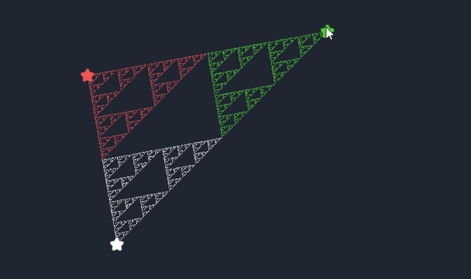
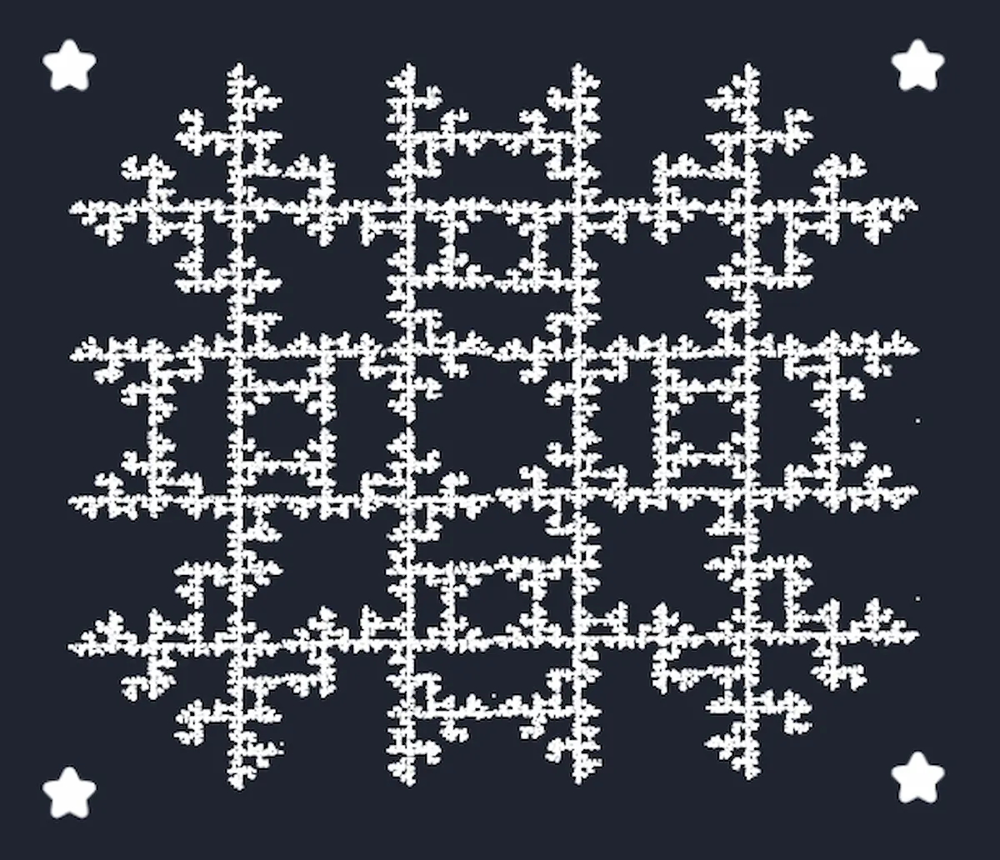
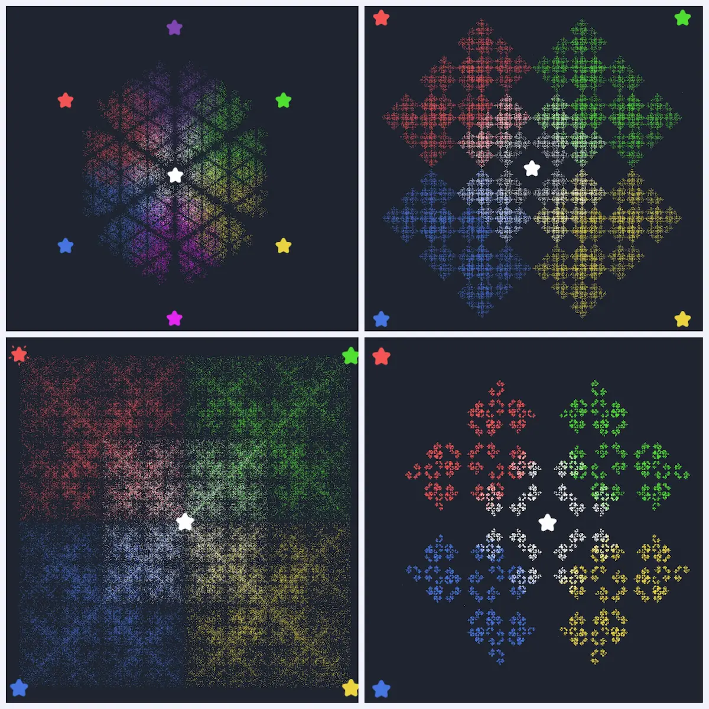
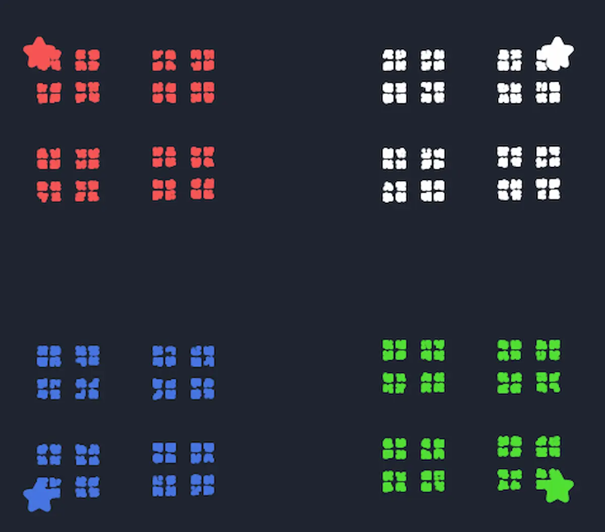

Grazie a [TᴀᴄᴋᴇʀTᴀᴄᴋᴇʀ 🐰](https://twitter.com/2xTacker) ho scoperto l'esistenza dei [chaos games](https://en.wikipedia.org/wiki/Chaos_game): un metodo per generare frattali a partire da un poligono e un punto a caso. Il meccanismo è squisitamente matematico e si presenta a diverse variazioni e personalizzazioni. Ma in sintesi si tratta di scegliere a ogni passaggio un vertice a caso e di disegnare il punto mediano tra il vertice e il punto disegnato nel passaggio precedente. I risultati sono molto interessanti:


Ci sono vari modi per raggiungere questo risultato. Per esempio, TackerTacker ha realizzato [questa implementazione con C2](https://chaosgame.netlify.app/). Io ho scelto di non lavorare con la Canvas ma di usare solamente degli sprite. Oramai la tecnologia è abbastanza matura da permette di gestire decine di migliaia di elementi in una sola pagina web: perché non approfittarne? L'animazione qui sotto mostra come Construct 3 regge 50.000 (cinquantamila) sprite in movimento:



E, ottimizzando un po' il codice, credo sia possibile migliorare ancora di più le prestazioni. A proposito, cominciamo con il codice di questo progetto, ovviamente presente anche su [GitHub](https://github.com/el3um4s/construct-demo). La funzione principale, quella attorno cui ruota tutto il progetto è questa:

```js
// c3Function ChaosGame_GenerateAllPoints(Quantity: number)
const quantity= localVars.Quantity;
const vertex = runtime.objects.Vertex.getAllInstances();
const nameObject = "Points";
const nameLayer = "Points";
const show = true;

const rules = ["normal"];

if (runtime.globalVars.Rule_NotEqualPrevious != "-") {
  rules.push("not equal previous");
}
if (runtime.globalVars.Rule_NotEqualPrePrevious != "-") {
  rules.push("not equal pre-previous");
}

Game.generateAllPoints({quantity, vertex, nameObject, nameLayer, show, rules});
```

Nella prima parte dichiaro alcune variabili e definisco le regolo da usare per disegnare i vari punti. L'ultima riga contiene un rimando alla funzione `generateAllPoints` presente nel modulo [`game.js`](https://github.com/el3um4s/construct-demo/blob/master/template/019-chaos-game/source/files/scripts/game.js). Anche qui penso che conn un altro po' di lavoro si potrebbe semplificare ulteriormente il codice ma per il momento mi interessa mostrare il processo che ho usato:

```js
function generateAllPoints({ 
          quantity,
          vertex, 
          nameObject, 
          nameLayer, 
          show, 
          rules }) {

	let x = choose(vertex).x;
	let y = choose(vertex).y;
	
	let previousVertex = [];
	
	for (let i = 0; i < quantity; i++){
		const point = PointsIntance.Create(nameObject,nameLayer, x, y);
		point.isVisible = show;
		point.setOrder(i);
		rules.forEach(r => point.addRule(r));
		point.setStarterPoint({x, y});
 		point.moveToStarterPoint();
		point.setPreviousVertex(previousVertex);
		const randomDestination = point.setRandomDestination(vertex);
		previousVertex = point.getPreviousVertex();
 		point.moveToDestination();
		x = randomDestination.x;
		y = randomDestination.y;
		point.colorPoint();
	}	
}
```

Per prima cosa, a differenza di altri miei esperimenti non sto lavorando su variabili aggiunte a istanze di oggetti in Construct3. Ho scelto, invece, di estendere una classe ("Sprite") e di lavorare direttamente su questa nuova classe, la **PointsInstance**. In questo modo posso accedere facilmente a tutta una serie di metodi specifici utili al mio scopo:

- `Create(nameObject,nameLayer, x, y)` mi permette di creare e disegnare un nuovo punto direttamente in C3
- `setOrder(i)` assegna un indice progressivo ad ogni punto
- `addRule(r)` aggiunge le regole che il punto deve rispettare
- `setRandomDestination(vertex)` sceglie casualmente uno tra i vertici consentiti verso cui disegnare il nuovo punto

Già solo con queste è possibile creare qualcosa simile a questo:



Se invece aggiungo la possibilità di gestire i colori, e magari aumento il numero di punti fino a 50 mila, 100 mila o più, posso avere una galleria di immagini come queste:



È il momento di dare un'occhiata a [`point.js`](https://github.com/el3um4s/construct-demo/blob/master/template/019-chaos-game/source/files/scripts/point.js), ovvero alla classe `PointsIntance`. Per crearla è sufficiente una riga di codice:

```js
class PointsIntance extends globalThis.ISpriteInstance {
  constructor(){
    super();
  }
}
```

E poi nel file `main.js`

```js
import PointsIntance from "./point.js";

runOnStartup(async  runtime =>  { 
	runtime.objects.Point.setInstanceClass(PointsIntance);
})
```

Per una spiegazione più approfondita rimando alla [guida online di Construct 3](https://www.construct.net/en/make-games/manuals/construct-3/scripting/guides/subclassing-instances).

Ovviamente non basta dichiarare la classe, occorre anche riempirla di metodi utili allo scopo. `Create()`, come dice il nome, crea un nuovo punto

```js
static Create(nameObject, nameLayer, x, y) {
	return g_runtime.objects[nameObject].createInstance(nameLayer,x, y);
}
```

`_randomVertex(vertex)` invece sceglie un vertice a caso tra quelli disponibili.

```js
_randomVertex(vertex) {

	const uniqueSet = new Set(vertex);
	const previousVertex = this.previousVertex.length;

  if (this.rules.has("not equal previous") && previousVertex >= 1) {

    const toDelete = this.previousVertex[previousVertex-1];
    uniqueSet.delete(toDelete);
  }
      
  if (this.rules.has("not equal pre-previous") && previousVertex >= 2) {
    const toDelete = this.previousVertex[previousVertex-2];
    uniqueSet.delete(toDelete);
  }
  
  const vertexCleaned = [...uniqueSet];
  const index = Math.floor(Math.random() * vertexCleaned.length);
  const randomVertex = vertexCleaned[index];
  return randomVertex;
}
```

Per semplificare le cose ho deciso di usare [`Set`](https://developer.mozilla.org/en-US/docs/Web/JavaScript/Reference/Global_Objects/Set) invece di un array: in questo modo sono sicuro di non duplicare le regole e posso verificare facilmente quali regole sono abbinate al punto. Ammetto però che l'idea mi è venuta a partire da un articolo pubblicato su Medium ([How to Remove Array Duplicates in ES6](https://medium.com/dailyjs/how-to-remove-array-duplicates-in-es6-5daa8789641c)) un paio d'anni fa.

Gli altri metodi della classe servono sostanzialmente a registrare la posizione di partenza del punto e quella di arrivo. Vale però la pena notare una cosa:

```js
setRandomDestination(vertex) {
  const randomVertex = this._randomVertex(vertex);

  this.previousVertex.push(randomVertex);

  this.pointDestinationVertex = randomVertex;
  
  const startX = this.pointStarter.x;
  const startY = this.pointStarter.y;
  
  const distanceX = (startX - randomVertex.x)/2;
  const distanceY = (startY - randomVertex.y)/2;

  const x = startX - distanceX;
  const y = startY - distanceY;

  this.pointDestination = {x, y};
  return {x, y};
}
```

In `setRandomDestination(vertex)` calcolo la posizione di destinazione del punto con un rapporto 1/2. Ma si possono ottenere degli effetti interessanti variando questo parametro. Per esempio con

```js
const distanceX = (startX - randomVertex.x)*2/3;
const distanceY = (startY - randomVertex.y)*2/3;
```

si può ottenere un disegno come questo



Come dicevo all'inizio, ci sono ancora alcune migliorie possibili e si potrebbero aggiungere ancora alcuni parametri all'interfaccia utente. Ma per il momento mi fermo qui. Ricordo che, come al solito, il codice di questo progetto è disponibile su GitHub:

- [il progetto su GitHub](https://github.com/el3um4s/construct-demo)
- [la demo online](https://c3demo.stranianelli.com/template/019-chaos-game/demo/)
- [Patreon](https://www.patreon.com/el3um4s)
