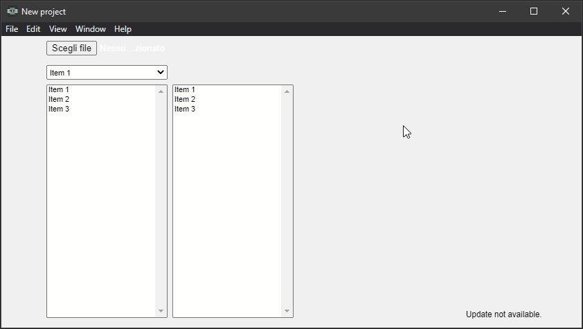

Il template di questa settimana è un po' meno curato dal punto di vista grafico. Non ho avuto il tempo, è stata una settimana molto intensa dal punto di vista lavorativo. Ma ci tenevo comunque a pubblicare qualcosa. Perché è un prototipo interessante, perché mostra alcune potenzialità di Construct 3 e perché è il mio primo test funzionante di qualcosa che voglio sviluppare nei prossimi mesi.

Ma di cosa si tratta? Di un semplice programma per accedere a database Microsoft Access, vedere le tabelle contenute nel database e analizzare la struttura delle stesse. Non fa nulla di più ma mi serviva per testare alcune cose assieme prima di cominciare a lavorare sul serio:

1. la possibilità di leggere file su disco locale in maniera semplice e intuitiva
2. la possibilità di leggere file MDB tramite JavaScript
3. la possibilità di creare un unico file EXE per installare il programma
4. la possibilità di aggiornare automaticamente un'applicazione a ogni nuova release pubblicata su GitHub

Ovviamente sapevo che é possibile farlo. Non sapevo come, e quali sarebbero stati i limiti che avrei incontrato. Ma prima vediamo il risultato:



### Le impostazioni iniziali

Ho scelto di usare [ElectronJS](https://www.electronjs.org/) e [TypeScript](https://www.typescriptlang.org) per semplificare la creazione di un'app offline. Ho scelto di appoggiarmi a [node-adodb](https://www.npmjs.com/package/node-adodb) per gestire l'interrogazione dei file MDB. Infine ho deciso di usare [Construct 3](https://www.construct.net) per l'interfaccia grafica.

Stabilito questo ho creato la struttura base del progetto. Quindi, da riga di comando ho cominciato a inizializzare e scaricare i vari pacchetti:

```shell
npm init
npm i -D electron@latest
npm install typescript --save-dev
npm install electron-builder --save-dev
npm i electron-updater
npm i node-adodb
```

Riguardo a `node-adodb` c'è una nota importante da riportare:

> The library need system support `Microsoft.Jet.OLEDB.4.0` or `Microsoft.ACE.OLEDB.12.0`, `Windows XP SP2` above support `Microsoft.Jet.OLEDB.4.0` by default, Others need to install support!
>
> Recommended use `Microsoft.ACE.OLEDB.12.0`, download: [Microsoft.ACE.OLEDB.12.0](https://www.microsoft.com/en-us/download/details.aspx?id=13255)

### La struttura delle cartelle

Dopo aver scaricato i pacchetti necessari ho stabilito come organizzare le varie cartelle del progetto:

- src: i file typescript del programma
- src_c3: i file di Construct 3
- dist: i file JavaScript e i file esportati di C3
- out: la cartella di destinazione dove salvare il file di installazione

### package.json

Il passo successivo è stato configurare il `package.json` in modo da rendere possibile compilare i file TypeScript, testare il progetto e pubblicarlo su GitHub.

```json
{
  "name": "access-c3",
  "productName": "Access C3",
  "version": "0.0.1",
  "main": "dist/index.js",
}
```

Comincio con le informazioni base. Nome del repository e punto d'ingresso del programma. Poiché tutti i file TS compilati finiranno nella cartella `dist` il punto di ingresso è nella cartella.

Il numero di versione e il `productName` sono particolarmente importanti e non vanno sottovalutati. Il primo perché permetterà ad Electron di capire il numero di versione del programma installato ed eventualmente installare un aggiornamento del programma. Il nome del prodotto perché é il nome che avrà il programma quando sarà installato su un computer.

```json
{
  "scripts": {
    "start": "npm run compile && electron .",
    "compile": "tsc",
    "build-installer": "electron-builder build --win --publish never",
    "publish": "electron-builder build --win --publish always",
  }
}
```

Il contenuto di `scripts` serve per semplificare il lancio dell'applicazione (quando la devo testare) e la pubblicazione su GitHub del file finale.

Il comando `npm run start` permette di compilare i file TypeScript e di lanciare il programma.

`npm run build-installer` serve per creare il file di installazione (ma non di pubblicarlo automaticamente su GitHub)

`npm run publish` crea il file di installazione del programma e lo carica direttamente sul repository di GitHub.

```json
{
  "build": {
    "appId": "access-c3",
    "directories": {
      "output": "out"
    },
    "win": {
      "target": [
        "nsis"
      ],
      "icon": "icon.ico",
      "requestedExecutionLevel": "requireAdministrator"
    },
    "nsis": {
      "installerIcon": "icon.ico",
      "uninstallerIcon": "icon.ico",
      "uninstallDisplayName": "Access C3",
      "license": "license.txt",
      "oneClick": false,
      "allowToChangeInstallationDirectory": true
    }
  }
}
```

Su [electron.build](https://www.electron.build/configuration/configuration#configuration) si possono trovare le spiegazioni dettagliate sulle varie opzioni di configurazione. Ho scelto di usare come target `nsis` perché é l'unico che permette una installazione completa senza dover aver un computer connesso a internet.

```json
{
  "build": {
    "publish": [
      {
        "provider": "github",
        "owner": "el3um4s",
        "repo": "access-c3"
      }
    ]
  }
}
```

Questo pezzetto del file di configurazione serve per gestire la pubblicazione su GitHub e configurare gli aggiornamenti automatici

```json
{

  "build": {
    "extraResources": [
      {
        "from": "./node_modules/node-adodb/lib/adodb.js",
        "to": "adodb.js"
      }
    ]
  }
}
```

Infine quest'ultima opzione serve per utilizzare `node-adodb` da Electron.

### tsconfig.json

Il secondo file importante per configurare il progetto è stato `tsconfig.json`. Qui sono inserite le istruzioni per compilare i file TypeScript in file JavaScript:

```json
"compilerOptions": {
      "target": "ES2020",
      "module": "commonjs",
      "outDir": "./dist",
      "rootDir": "./src",
      "strict": true,
      "moduleResolution": "node",
      "esModuleInterop": true,
      "skipLibCheck": true,
      "forceConsistentCasingInFileNames": true
    },
    "exclude": [
      "node_modules",
      "public",
      "out/**",
      "typings/browser/**"
  ]
}
```

Rimando a [aka.ms/tsconfig.json](https://www.staging-typescript.org/tsconfig) per i dettagli delle varie opzioni.

### I file TypeScript

Ho usato 3 file TypeScript:

- index.ts
- connection.ts
- listTypeFieldEnum.ts

Sugli ultimi due, se a qualcuno interessa, parlerò in un altro post. Servono per gestire la connessione ai database e per spedire il risultato a Construct 3. Per il momento mi concentro su `index.ts`.

Per prima cosa importo i moduli che serviranno nel progetto:

```ts
import { app, BrowserWindow, ipcMain } from 'electron';
import { autoUpdater } from "electron-updater"
import * as path from 'path';
import * as Connection from './connection';
import ADODB from 'node-adodb';
```

Poi imposto l'auto updater per eseguire un controllo ogni 4 ore:

```ts
(async () => {
		const FOUR_HOURS = 1000 * 60 * 60 * 4;
		setInterval(async () => {
			await autoUpdater.checkForUpdates();
		}, FOUR_HOURS);

		await autoUpdater.checkForUpdates();
})();
```

Se viene trovato un aggiornamento Electron lo scarica e lo installa automaticamente. Dopo di ciò creo la finestra per il programma:

```ts
const createWindow = () => {
  mainWindow = new BrowserWindow({
      width: 854,
      height: 480,
      webPreferences: {
          nodeIntegration: true,
          contextIsolation: false,
          enableRemoteModule: true
      }
  });
  mainWindow.loadURL(path.join(__dirname, 'www', 'index.html'));
  mainWindow.webContents.openDevTools();
};

app.on('ready', () => {
    app.name = 'Access C3';
    createWindow();
});

app.on('window-all-closed', () => {
    if (process.platform !== 'darwin') {
      app.quit();
    }
});
```

Bene, ora si tratta di gestire l'invio dei dati da e verso Construct 3. Per farlo è molto semplice usare:

```js
ipcMain.on('list-tables', async (event, message) => {
    const positionDB = message.path;
    const connection = Connection.open(positionDB);
    const schema = await Connection.getListTables(connection);
    event.reply('list-tables', schema);
});

ipcMain.on('schema-table', async (event, message) => {
    const positionDB = message.path;
    const tableName = message.tableName;
    const connection = Connection.open(positionDB);
    const schema = await Connection.getSchemaTable(connection,tableName);
    event.reply('schema-table', schema);
});
```

Invece per rendere evidente la ricerca e il download dei file di aggiornamento del programma conviene usare:

```js
function sendStatusToWindow(text: string) {
    console.log(text);
    mainWindow.webContents.send('message', text);
}

autoUpdater.on('checking-for-update', () => {
    sendStatusToWindow('Checking for update...');
})
autoUpdater.on('update-available', (info) => {
    sendStatusToWindow('Update available.');
})
autoUpdater.on('update-not-available', (info) => {
    sendStatusToWindow('Update not available.');
})
autoUpdater.on('error', (err) => {
    sendStatusToWindow('Error in auto-updater. ' + err);
})
autoUpdater.on('download-progress', (progressObj) => {
    let log_message = "Download speed: " + progressObj.bytesPerSecond;
    log_message = log_message + ' - Downloaded ' + progressObj.percent + '%';
    log_message = log_message + ' (' + progressObj.transferred + "/" + progressObj.total + ')';
    sendStatusToWindow(log_message);
})
autoUpdater.on('update-downloaded', (info) => {
    sendStatusToWindow('Update downloaded');
});
```

### Construct 3

Dal punto di vista di Construct 3 invito a consultare il progetto ([access-c3.c3p](https://github.com/el3um4s/access-c3/raw/main/src_c3/c3p/access-c3.c3p)). Concettualmente, ho aggiunto un listener al plugin `FileChooser` in modo da poter ottenere la posizione su disco fisso del database e usare `ipcRenderer.send("list-tables", { name, path });` per ottenere la lista delle tabelle.

```js
function buttonChooseDatabase_EventListener() {
	const chooseDatabase = document.getElementById("choose-database");
	chooseDatabase.addEventListener("change", handleFiles, false);
}

function handleFiles() {
    const fileList = this.files;
    if (fileList) {
        const file = fileList[0];
        console.log(file);
        const name = file.name;
        const path = file.path;
		ElectronStorage.pathDatabase = path;
		ipcRenderer.send("list-tables", { name, path });
    }
}
```

Quando Electron risponde con la lista delle tabelle uso

```js
ipcRenderer.on('list-tables', async (event, arg) => {
	ElectronStorage.listTables = arg;
	ElectronStorage.listTablesType = new Set();
	
	g_runtime.callFunction("ListTables_Clear");
	g_runtime.callFunction("ListTables_Filter_Clear");	
	
	ElectronStorage.listTables.forEach(table => {
		g_runtime.callFunction("ListTables_Add", table.TABLE_NAME);
		ElectronStorage.listTablesType.add(table.TABLE_TYPE);
	});
	
	g_runtime.callFunction("ListTables_Filter_Add", "ALL");
	ElectronStorage.listTablesType.forEach(tableType => {
		g_runtime.callFunction("ListTables_Filter_Add", tableType);
	});
});
```

Questo mi permette di mostrare a schermo i nomi delle tabelle.

Per il momento è tutto. Se ci fossero domande o richieste particolari scriverò una seconda parte di questo articolo. Ma il mio scopo, testare la fattibilità di un programma del genere, è stato raggiunto. Penso di sperimentare ancora su questo progetto ma non so ancora se continuare a usare C3 come interfaccia grafica. Dovrò fare ancora alcuni test.

Ricordo comunque che il codice di questo progetto è disponibile su GitHub:

- [Access C3 su GitHub](https://github.com/el3um4s/access-c3)
- [access-c3.c3p](https://github.com/el3um4s/access-c3/raw/main/src_c3/c3p/access-c3.c3p)
- [il progetto su GitHub](https://github.com/el3um4s/construct-demo)
- [Patreon](https://www.patreon.com/el3um4s)
