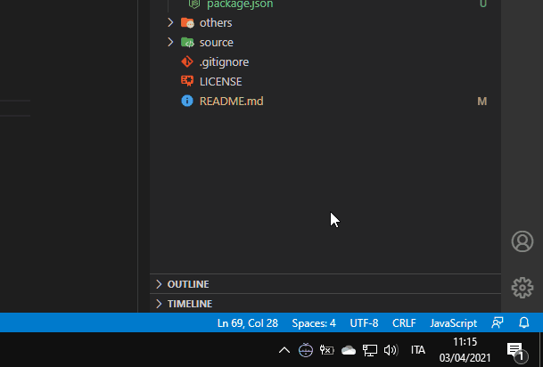

Il progetto di questa settimana è doppio. È un **Pomodoro Clock** che "vive" nella taskbar di Windows. Allo scadere del tempo appare una notifica nella barra delle notifiche di Windows. Per ottenere questo risultato ho combinato [**Electron**](https://www.electronjs.org/) e la WebApi [**Notifications**](https://developer.mozilla.org/en-US/docs/Web/API/Notifications_API).

### Notifications API



Comincio dall'interfaccia _Notification_: permette di mostrare delle notifiche di sistema all'utente. Le notifiche non sono legate al browser, quindi è possibile vederle anche mentre si sta usando un'applicazione diversa, o mentre si sta visualizzando un tab diverso. Il codice necessario è molto semplice:

```js
new Notification("Title");
```

Volendo possiamo anche personalizzare l'aspetto e il contenuto aggiungendo alcune _options_:

```js
const title = "Pomodoro c3";
const icon = await g_runtime.assets.getProjectFileUrl("icon-notification.png");

const options = {
	body: "Pomodoro Finished",
	icon: icon
}

const notification = new Notification(title, options);
```

Ovviamente non possiamo mostrare notifiche di sistema su computer altrui senza prima chiedere il permesso:

```js
const permission = await Notification.requestPermission();
```

La risposta dell'utente alla nostra richiesta può essere positiva, e allora possiamo mostrare la notifica:

```js
if (permission === "granted") {
  new Notification(title, options);
}
```

Oppure negativa, e quindi niente notifica di sistema.

Non occorre chiedere il permesso ogni volta, basta una volta sola e controllare prima di mostrare la notifica:

```js
if (Notification.permission === "granted") {
	new Notification(title, options);
}
```

Se invece `(Notification.permission === "denied")` è meglio non richiedere nuovamente il permesso e semplicemente non mostrare la notifica.

Unendo tutti i pezzettini otteniamo un codice simile a questo:

```js
async function webApiNotification() {

	const icon = await g_runtime.assets.getProjectFileUrl("icon-notification.png");
	const title = "Pomodoro c3";

	const options = {
		body: "Pomodoro Finished",
		icon: icon
	}

	if (!("Notification" in globalThis)) {
    	alert("This browser does not support desktop notification");
  	} else if (Notification.permission === "granted") {
		new Notification(title, options);
	} else if (Notification.permission !== "denied") {
		const permission = await Notification.requestPermission();
		if (permission === "granted") {
     	new Notification(title, options);
    }
	}
}
```

### ipcRenderer

Per una web app è sufficiente questa funzione. Ma la mia idea è di mostrare le notifiche partendo dalla taskbar del sistema operativo. E mi piacerebbe mostrare l'app cliccando sulla notifica. Per fare questo usiamo il _listener_ [**Notification.onclick**](https://developer.mozilla.org/en-US/docs/Web/API/Notification/onclick). Questo evento di default mette in evidenza la finestra che ha generato la notifica. Ma lavorando con Electron ci serve un passaggio in più:

```js
const notification = new Notification(title, options);
const { ipcRenderer } = require('electron');

notification.onclick = (event) => {
  event.preventDefault();
  ipcRenderer.send("show-pomodoro-clock");
}
```

L'API [**ipcRenderer**](https://www.electronjs.org/docs/api/ipc-renderer) fa parte del mondo di Electron e permette di spedire e ricevere messaggi dalla pagina web al processo principale dell'applicazione. In questo caso è sufficiente spedire il comando _show-pomodoro-clock_ e impostare l'API [**ipcMain**](https://www.electronjs.org/docs/api/ipc-main) per intercettarlo:

```js
ipcMain.on('show-pomodoro-clock', (event) =>{
    mainWindow.show();
});
```

Ma qui siamo già un passo oltre la semplice visualizzazione delle notifiche. È il momento di passare ad Electron e di far "vivere" l'app nella taskbar.


### Taskbar App in ElectronJs


Per prima cosa importiamo `electron` nel progetto tramite il comando

> npm i -D electron@latest

Poi impostiamo il file principale dell'app (nel mio progetto è il file `indes.jx`) importando i moduli che useremo:

```js
const path = require('path');

const electron = require('electron');
const { app, BrowserWindow, Tray, Menu, ipcMain } = electron;
```

Creiamo due variabili esterne all'app:

```js
let mainWindow = null;
let tray = null;
```

Useremo **mainWindow** per creare la finestra dell'applicazione. **tray**, invece, servirà per gestire il comportamento della taskbar. Aspettiamo che l'app sia pronta per essere eseguita e quindi creiamo la finestra principale:

```js
app.on('ready', () => {
  mainWindow = new BrowserWindow({
        height: 180,
        width: 320,
        frame: false,
        resizable: false,
        show: false,
        alwaysOnTop: true,
        webPreferences: {
            pageVisibility: true, 
            backgroundThrottling: false,
            nodeIntegration: true,
            contextIsolation: false,
            enableRemoteModule: true
        }
    });
})
```

Le proprietà **pageVisibility: true** e **backgroundThrottling: false** sono importanti perché permettono all'app di restare attiva in background. Invece **frame:false** e **resizable: false** servono per non mostrare i margini e il titolo della finestra.

Dopo aver creato la finestra principale possiamo caricare la parte web dell'applicazione usando:

```js
mainWindow.loadURL(`file://${__dirname}/www/index.html`);
```

Fin qui tutto nella norma. È però giunto il momento di far apparire una icona nella taskbar:

```js
const iconPath = path.join(__dirname, 'www' , 'icons', '/icon-32.png');
tray = new Tray(iconPath);
```

**tray** ci permette di gestire il comportamento dell'icona. Possiamo aggiungere un listener per l'evento _click_ da usare per mostrare la finestra principale:

```js
tray.on('click', (event) => {
  mainWindow.show();
});
```

Questo è già sufficiente, ma non è esattamente quello che voglio. Mi piacerebbe mostrare la finestra principale esattamente sopra l'icona della taskbar. Per ottenere  questo risultato dobbiamo usare una funzione leggermente diversa:

```js
tray.on('click', (event,bounds) => {
  mainWindow.show();
});
```

In questo modo possiamo accedere alla posizione dell'icona nella taskbar e usarla come punto di riferimento per posizionare la finestra dell'applicazione:

```js
const { x, y } = bounds;
const { height, width } =  mainWindow.getBounds();
mainWindow.setBounds({
    x: x - width/2,
    y: y - height,
    height,
    width
});
```
Unendo tutto questo otteniamo:

```js
tray.on('click', (event, bounds) => {
    const { x, y } = bounds;
    const { height, width } =  mainWindow.getBounds();

    if (mainWindow.isVisible()) {
        mainWindow.hide();
    } else {
        mainWindow.setBounds({
            x: x - width/2,
            y: y - height,
            height,
            width
        });
        mainWindow.show();
    }
});
```

### Context Menu

Manca ancora una cosa per rendere utilizzabile l'applicazione: la possibilità di chiuderla. Aggiungiamo quindi un menù richiamabile con il tasto destro del mouse sull'icona nella taskbar:

```js
const menu = Menu.buildFromTemplate([
  {
    label: 'Quit',
    click: () => app.quit()
  }
]);

tray.setContextMenu(menu);
```

Infine aggiungiamo un tooltip quando passiamo con il mouse sopra l'icona:

```js
tray.setToolTip('Pomodoro');
```

E nascondiamo la finestra quando clicchiamo da qualche altra parte:

```js
mainWindow.on('blur', () => {
  mainWindow.hide();
})
```

Bene, direi che per il momento è tutto. Ricordo che i codice dei miei progetti è disponibile su GitHub.

- [il progetto su GitHub](https://github.com/el3um4s/pomodoro-c3)
- [Patreon](https://www.patreon.com/el3um4s)
