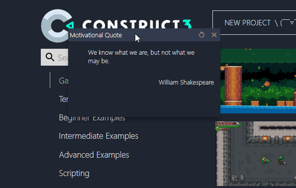
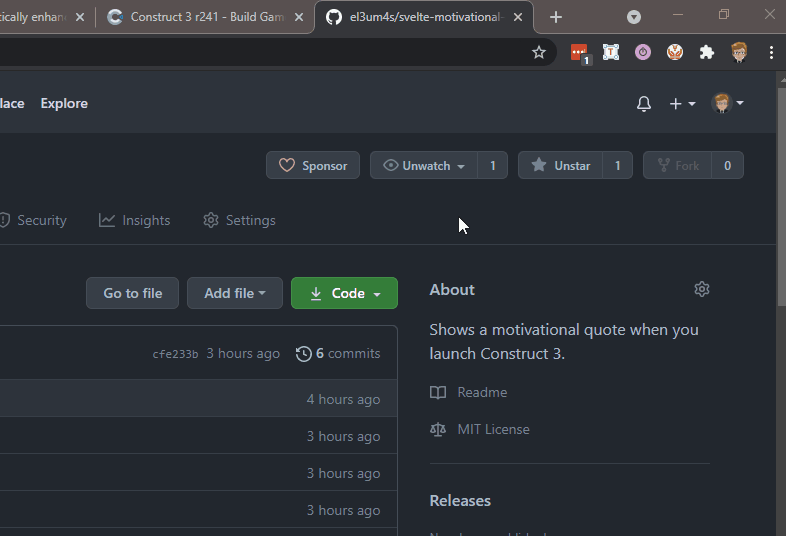
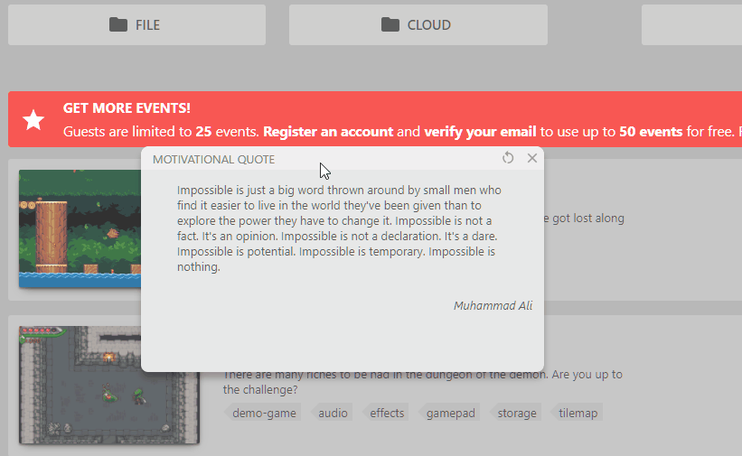

Questa settimana sono andato avanti con il corso su [Svelte](https://svelte.dev/). Le cose stanno diventando interessanti e ho deciso di mettere alla prova le mie conoscenze creando un'estensione per Google Chrome. Ho scelto come cavia un mio vecchio plugin [**Motivational Quotes**](https://www.construct.net/en/make-games/addons/175/motivational-quotes) e ho provato a rifarlo da capo.



Lo scopo dell'estensione è banale: far apparire una frase motivazionale ogni volta che apriamo l'[editor di Construct 3](https://editor.construct.net/). Voglio inoltre che appaia in un elemento html integrato nell'editor e che sia possibile cambiare la frase scegliendone un'altra, sempre a caso.

Non avendo mai creato un'estensione per Chrome sono partito dallo studio degli [esempi ufficiali](https://developer.chrome.com/docs/extensions/mv3/getstarted/) e da un articolo di [dev.to](https://dev.to/khangnd/build-a-browser-extension-with-svelte-3135). Ho però dovuto mettere insieme i vari pezzi.

Per prima cosa ho scaricato un template di Svelte:

```shell
npx degit sveltejs/template chrome-extension
cd chrome-extension
npm install
```

Il progetto prevede 2 cartelle principali: `src` e `public`. La prima, _src_ è dove scriverò effettivamente il codice. Il codice verrà poi compilato e salvato dentro `public/build`. Poi, alla fine di tutto, prenderò il contenuto di _public_, lo comprimerò e lo caricherò come estensione per Chrome.

La prima cosa da fare è creare il file `manifest.json` dentro la cartella `public`:

```json
{
  "name": "Motivational Quotes",
  "description": "Get and create motivational quotes",
  "version": "0.1.0",
  "manifest_version": 3
}
```

Ho deciso di dividere l'estensione in due parti

1. una parte chiamata `popup` dove inserire una pagina html da visualizzare quando clicco sull'icona dell'estensione
2. una parte chiamata `motivational` per "_hackerare_" l'editor di Construct 3 e inserire una finestra con la citazione motivazionale

Comincio con aggiungere una voce al `manifest.json`:

```json
{
  "action": {
    "default_popup": "popup.html",
  }
} 
```

e rinomino il file `public/index.html` in `public/popup.html`.

Creo poi il file `src/popup/Popup.svelte` con il template da mostrare nella finestra popup dell'estensione:

```html
<div class="popup">
  <div class="item title center">
    <h3>Motivational Quotes</h3>
  </div>
  <div class="item info center">
    <p><em>Shows a motivational quote when you launch Construct 3.</em></p>
  </div>
  <hr>
  <div class="item info">
    <p>...info...</p>
  </div>
</div>
```

Aggiungo anche un po' di stili per rendere il tutto più bellino, ma non riporto qui il codice. È comunque possibile vederlo sul repository del progetto ([el3um4s/svelte-motivational-quotes-for-c3](https://github.com/el3um4s/svelte-motivational-quotes-for-c3)).

Per completare il popup non resta che aggiornare il file `src/App.svelte` importando l'elemento:

```html
<script>
	import Popup from "./popup/Popup.svelte";
</script>

<Popup></Popup>

<style>
:global(html,body){
  width: 256px;
  height: auto;
  font-size: medium;
  padding: 0px;
  margin: 0px;
  background-color: #F4ECE1;
  color: #1F1B0F;
}
:global(body){
  position: absolute;
  height: auto;
}
</style>
```

In questo caso ho riportato anche lo stile perché mi interessa far notare la necessità di utilizzare `:global()` per modificare tutta la finestra. Dopo aver importato l'estensione possiamo vedere qualcosa di simile a questo:



Fin qui la parte semplice. Ma per ottenere qualcosa simile al mio obiettivo ho dovuto modificare il file `manifest.json` aggiungendo:

```json
{ 
  "permissions": [
    "activeTab",
    "scripting"
  ],
  "content_scripts": [
    {
      "matches": ["*://editor.construct.net/*"],
      "css": ["/build/motivational.css"],
      "js": ["/build/motivational.js"]
    }
  ]
}
```
Con ordine. `permissions` mi serve per chiedere a Chrome di darmi i permessi per modificare la tab attiva del browser e per eseguire dei comandi javascript. `content_scripts` indica quali file _js_ e _css_ serviranno all'estensione. Infine `matches` indica su quali pagine web voglio poter intervenire.

In linea teorica non resta che scrivere il codice in `motivational.js` e siamo a posto. Ma non è così semplice. Perché *svelte* compila tutto in `bundle.js` e `bundle.css`. A meno che non andiamo a configurare [Rollup](https://rollupjs.org/guide/en/) tramite il file `rollup.config.js`:

```js
export default [
  {
    // input: 'src/main.js',
    // ...
  },
  {
		input: "src/motivational.js",
		output: {
			sourcemap: true,
			format: "iife",
			name: "motivational",
			file: "public/build/motivational.js"
		},
		plugins: [
			svelte({
				compilerOptions: {
					dev: !production
				}
			}),
			css({
				output: 'motivational.css'
			}),
			resolve({
				browser: true,
				dedupe: ['svelte']
			}),
			commonjs(),
			!production && serve(),
			!production && livereload('public'),
			production && terser()
		],
		watch: {
			clearScreen: false
		}
	  }
  ];
```

In questo modo posso forzare `motivational.js` ad essere compilato come file separato. Ma cosa devo inserire in `motivational.js`?

```js
import Motivational from './motivational/Motivational.svelte';

const motivational = new Motivational({
	target: document.body
});

export default motivational;
```

In pratica succede questo. Quando l'estensione si accorge di essere nel tab con l'editor di Construct 3 esegue il contenuto del file `/build/motivational.js`. E questo file non è altro che il risultato del compilatore di Svelte: inserisce in `document.body` il componente `Motivational`. Anche se detto in maniera arzigogolata non si tratta niente di più e niente di meno del normale funzionamento di Svelte.

Passo quindi a `src/motivational/Motivational.svelte`:

```html
<script>
    import { onMount } from "svelte";
    import importQuotes from "./importQuotes.js";

    import Pane from "./Pane.svelte";
    //...
</script>

<Pane {id} {isVisible} on:newQuote={onNewQuote}>
  <span slot="title">{title}</span>
  <span slot="quote">{quote}</span>
  <span slot="author">{author}</span>
</Pane>
```

Anche questo è un normale file Svelte. C'è un'unica cosa da notare: il componente `Pane` è composto da alcuni tag ricavati dalla pagina dell'editor:

```html
<ui-pane>
  <ui-caption>
    <ui-close-button></ui-close-button>
  </ui-caption>
  <ui-body></ui-body> 
</ui-pane>
```

Perché ho scelto questa strada? Per sfruttare la gestione dei fogli di stile integrata in C3. In questo modo non devo ricreare lo stile CSS di ogni elemento. E sopratutto posso ottenere facilmente un componente che si integra con i vari temi dell'editor.



Per generare le frasi random ho usato una funzione molto semplice:

```js
import words from "./words.js";

export default async function importQuotes(url) {
  try {
    const quotes =  await fetch(url);
    const response = await quotes.json();
    const listQuotes = response.quotes;
    return listQuotes; 
  } catch (error) {
    const listQuotes = words.motivationalQuotes;
    return listQuotes; 
  }
};
```

Rispetto al plugin originale ho scelto di importare la lista delle frasi direttamente dal repository di GitHub ([../motivational-quotes/default.json](https://raw.githubusercontent.com/el3um4s/svelte-motivational-quotes-for-c3/main/motivational-quotes/default.json)). In teoria questo dovrebbe permettermi di aggiungere nuove frasi senza dover ricompilare e caricare nuovamente l'estensione.

Creare, o meglio, ricreare questo plugin è stato molto interessante. Sia perché ho potuto notare come nel tempo la mia abilità è cresciuta sia perché sto davvero apprezzando molto Svelte. Ma non sono completamente soddisfatto del risultato. C'è un limite, credo insormontabile: un'estensione Chrome non può accedere direttamente al contenuto di un progetto C3. Sarebbe interessante, per esempio, poter usare questa tecnica per potenziare l'editor. Su GitHub c'è un repository interessante di [Quentin Goinaud (aka Armaldio)](https://github.com/Armaldio) e di [Ossama Jouini (aka Skymen)](https://github.com/skymen): [Refined C3](https://github.com/Armaldio/refined-construct-3). Sono curioso di vedere cosa ne uscirà fuori.

Dal mio lato, credo che il prossimo tentativo sarà di testare la possibilità di ricreare questo plugin (o un altro) direttamente con l'[SDK ufficiale](https://www.construct.net/en/make-games/manuals/addon-sdk) di Construct 3 e Svelte.


Questo è tutto, per il momento. Ho ovviamente caricato il progetto completo su GitHub.

- [il progetto su GitHub](https://github.com/el3um4s/svelte-motivational-quotes-for-c3)
- [Patreon](https://www.patreon.com/el3um4s)