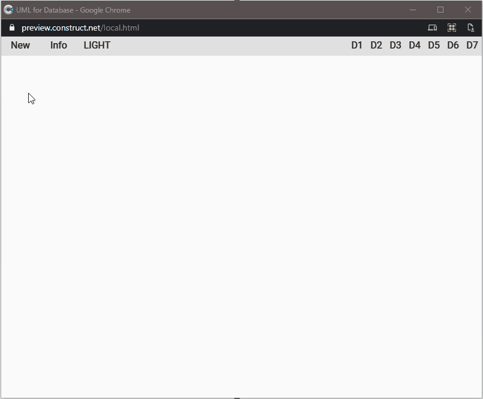

Le ultime due settimane sono state abbastanza dure. Un lutto improvviso ha colpito duramente la mia famiglia, annichilendoci. In genere la programmazione è sempre stato un rifugio sicuro in cui rifugiarmi, la possibilità di portare un po' di ordine nel mio mondo altrimenti caotico. In parte è stato così anche questa volta, anche se non ho avuto voglia di pubblicare, di condividere, di entrare in contatto con il mondo esterno. Comunque, il progetto di questa settimana è un estratto di una idea per un progetto di lavoro.


Allora, è un esperimento su come rappresentare graficamente le relazioni tra le tabelle di un database. Non si tratta di una cosa completa, solo dell'interfaccia grafica, ma ci sono 4 aspetti a mio parere interessanti:

1. la possibilità di avere un tema chiaro e un tema scuro
2. la creazione di una finestra modal sopra l'applicazione (in questo caso per mostrare le informazioni sull'app)
3. la gestione di finestre separate con possibilità di ridurle a icona, ingrandirle e chiuderle
4. la rappresentazione grafica di schemi scritti con un linguaggio testuale



La gestione dei temi è fatta tramite una variabile globale:

```js
const Globals = {
	theme: {
		light: {
			statusBar: "#E0E0E0",
			appBar: "#F5F5F5",
			background: "#FAFAFA",
			card: "#FFFFFF",
			textPrimary: "#222222",
			secondaryText: "#455A64",
			textDisabled: "#CFD8DC",
			textInteractive: "#0071BC",
			textError: "#BF0000"			
		},
		dark: {
			statusBar: "#000000",
			appBar: "#212121",
			background: "#303030",
			card: "#424242",
			textPrimary: "#FFFFFF",
			secondaryText: "#B0BEC5",
			textDisabled: "#B0BEC5",
			textInteractive: "#FFFFFF",
			textError: "#FFFFFF"	
		}
	}
};

export default Globals;
```

In cui sono conservati i valori dei colori. Per cambiare il colore dei diversi elementi è sufficiente un funzione simile a questa:

```js
function themeColorize(name) {
  const theme = Globals.theme.selected;

  const instances = runtime.objects[name].getAllInstances();

  for (const inst of instances){
    const color = inst.instVars.Color;
    const colorHEX = Globals.theme[theme][color];
    inst.colorRgb = hexToRGBA(colorHEX);
  }
}
```

Per la gestione delle finestre (compresa quella modal) ho usato [WinBox.js](https://github.com/nextapps-de/winbox), una libreria particolarmente adatta allo scopo. Per esempio, per aprire la finestra con le informazioni sull'applicazione basta una funzione simile a questa

```js
function toggleWinInfo() {
  const info = document.getElementById("winbox-info");

  if (!info) {
    const theme = Globals.theme.selected;

    const projectName = runtime.projectName;
    const projectVersion = runtime.projectVersion;

    const html = `
    <div style="text-align:center;" id="winbox-info">
    <h3 style="color=${Globals.theme[theme].textPrimary}">${projectName}</h3>
    <p style="color=${Globals.theme[theme].secondaryText}">v: ${projectVersion}</p>
    </div>
    `;

    new WinBox({
      title: "Info",
      class: theme,
      modal: true,
      background: Globals.theme[theme].statusBar,
      top: 32,
      x: "center",
      y: "center",
      width: 200,
      height: 150,
      html
    });
  }
}
```


Infine i grafici. Ho scelto di usare [Mermaid ](https://mermaid-js.github.io/mermaid/#/), una libreria che permette di rappresentare dei grafici e degli schemi a partire da una rappresentazione testuale. Un po' come fa Markdown, che converte un file md in un file html.

Questa parte ha richiesto un po' più di lavoro perché richiede di integrare la creazione di due nuove finestre e il loro collegamento reciproco. Per prima cosa creo la finestra da usare come input:

```js
const theme = Globals.theme.selected;

const htmlInput = `
<div class="editor" id="input-1" contenteditable="true"></div>
`;

new WinBox({
  title: "INPUT",
  class: theme,
  background: Globals.theme[theme].statusBar,
  top: 32,
  html: htmlInput
});
```

Poi quella per mostrare il grafico:

```js
const theme = Globals.theme.selected;

const htmlOutput = `
<div id="output-1"></div>
`;

new WinBox({
  title: "PREVIEW",
  class: theme,
  background: Globals.theme[theme].statusBar,
  top: 32,
  x: 32,
  y: 32,
  html: htmlOutput
});
```

Infine collego le due finestre in modo da aggiornare automaticamente il disegno del grafico a ogni modifica del testo contenuto nella prima finestra.

```js
document.getElementById("input-1").addEventListener("input", (e) => {
  const output = document.getElementById("output-1");
  if (output.firstChild !== null) {
    output.innerHTML = "";
  };

  const code = e.target.innerText;
  const insert = function (code) {
    output.innerHTML = code;
  };
  mermaid.render("preparedScheme", code, insert);
});
```

Come ultimo tocco ho aggiunto la possibilità di mostrare del codice di esempio importandolo direttamente nella finestra di input e aggiornando la finestra di output

```js
function showDemo(code) {
  const input = document.getElementById("input-1");
  if (input) {
    const number = localVars.number;
    input.innerHTML = code
        
    const output = document.getElementById("output-1");
    if (output) {
      if (output.firstChild !== null) {
        output.innerHTML = "";
      };
      const insert = function (code) {
        output.innerHTML = code.trim();
      };
      mermaid.render("preparedScheme", code, insert);
    }
  }
}
```

Questo progetto è al momento un prototipo ma a suo modo già utilizzabile per testare le potenzialità di un'applicazione di questo genere. 

Il codice, come al solito, è disponibile su GitHub.

- [il progetto su GitHub](https://github.com/el3um4s/construct-demo)
- [la demo online](https://c3demo.stranianelli.com/javascript/010-mermaid/demo/)
- [Patreon](https://www.patreon.com/el3um4s)