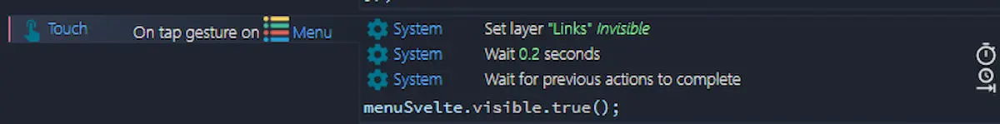
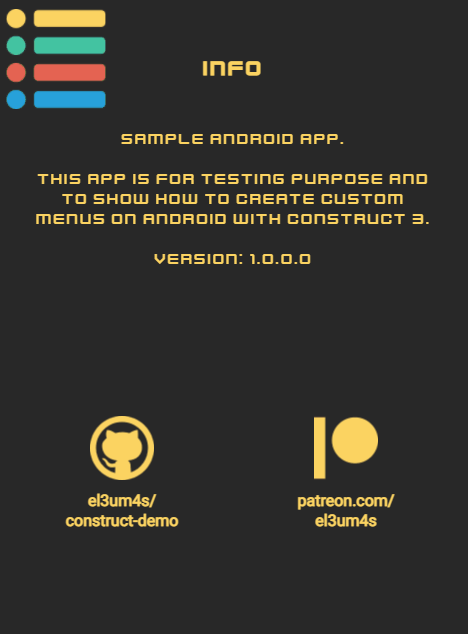
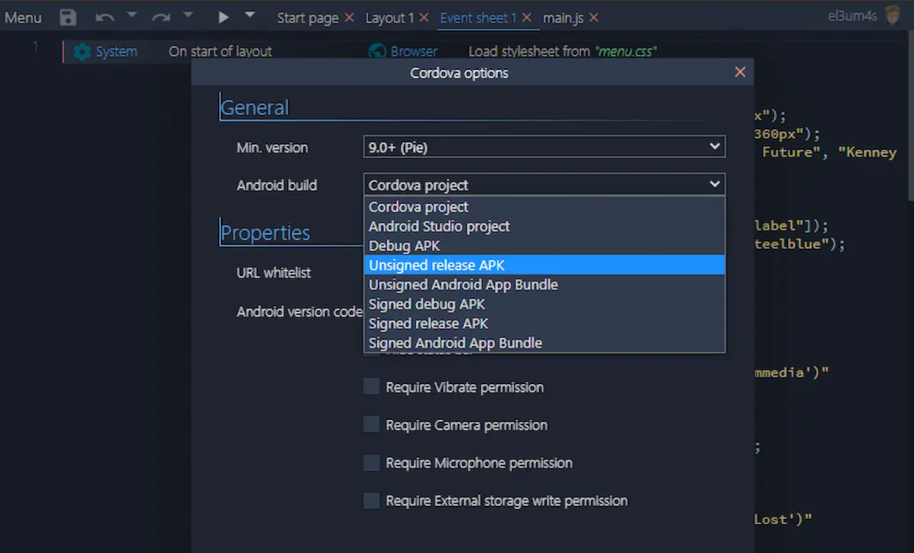

Avevo oramai deciso di saltare il mio articolo settimanale su Construct 3 ma poi mi è arrivata una notifica: la mia app android è stata pubblicata sul Google Play. Che poi chiamarla app è un po' pretenzioso, ma tant'è. Ho creato una demo del mio menù per Construct 3 e l'ho data in pasto al mondo.

Pensavo di poter mutuare la versione per browser senza dover far modifiche ma in realtà ho dovuto apportare una modifiche al codice per poterlo funzionare su Android: devo caricare il file `menu.js` nella cartella `file` e non in quella `scripts`. Di conseguenza il file va importato manualmente all'avvio dell'app compilata.

```js
runOnStartup(async runtime => {
	globalThis.g_runtime = runtime;
	await runtime.assets.loadScripts("menu.js");
});
```

Il secondo aspetto a cui ho dovuto fare attenzione è legato al funzionamento dell'evento `touch`, leggermente diverso da `click`.



Se non metto un attimo di attesa l'evento tocco che avvia la procedura per mostrare il menù attiva anche il tocco sullo sfondo del menù stesso. E per come è costruito il menù toccare lo sfondo della pagina implica il voler chiudere il menù. Aggiungendo un'attesa di qualche istante posso evitare questo problema.




Un'ultima cosa prima di chiudere questo post. Avevo già provato a pubblicare alcune app android qualche anno fa. Al di là del risultato non proprio entusiasmante, e della mia scarsa fiducia nel risultato, ricordo un procedimento abbastanza macchinoso e farraginoso. Construct 3, invece, si è rivelato una piacevole sorpresa.

L'unica cosa un po' confusa è che tipo di scelta fare al momento di esportare per Android.



Per me ha funzionato così:

- **Debug APK** per testare l'app sul mio smartphone
- **Signed Android App Bundle** per caricare l'app su Google Play

L'altra cosa che mi ha creato un po' di grattacapi è come controllare i messaggi di errore generati dall'app. Ma più che un problema di C3 è stata la mia scarsa conoscenza dello sviluppo per dispositivi mobili il problema. Alla fine è stato sufficiente collegare il telefono al pc tramite un cavo USB, abilitare la modalità "Debug USB" dalle "Opzioni Sviluppatore" e andare alla pagina [chrome://inspect/#devices](chrome://inspect/#devices).

Detto questo non resta che dare il link per scaricare l'app da Google Play:

- [Poemia su Google Play](https://play.google.com/store/apps/details?id=com.stranianelli.menu)
- [la demo online](https://c3demo.stranianelli.com/javascript/013-menu-for-android/demo/)  
- [il progetto su GitHub](https://github.com/el3um4s/construct-demo)
- [il file c3p](https://c3demo.stranianelli.com/javascript/013-menu-for-android/source/c3p/menu-for-android.c3p)
- [menu.js](https://c3demo.stranianelli.com/javascript/012-menu/source/lib-menu/menu.js)
- [menu.css](https://c3demo.stranianelli.com/javascript/012-menu/source/lib-menu/menu.css)
- [Patreon](https://www.patreon.com/el3um4s)
