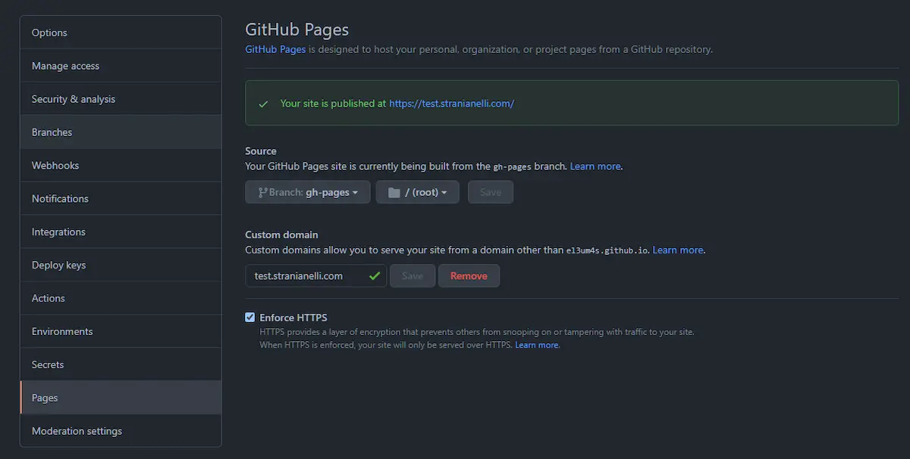

Ho aspettato qualche settimana prima di scrivere un nuovo articolo su come usare Svelte con GitHub Pages. Oggi mi interessa testare SvelteKit. Questo post avrà la forma di un diario di viaggio: riporto i vari passaggi man mano che li faccio. Sono degli appunti, più che una guida.

### SvelteKit

Per prima cosa creo un nuovo progetto basato su [SvelteKit](https://kit.svelte.dev/) digitando:

```shell
npm init svelte@next my-app
```

Installo quindi le varie dipendenze

```shell
npm i
```

Per semplificare la pubblicazione su GitHub Pages uso ancora una volta [gh-pages](https://www.npmjs.com/package/gh-pages):

```shell
npm install gh-pages --save-dev
```

Aggiungo lo script su `package.json`:

```json
"scripts": {
 "deploy": "node ./gh-pages.js"
}
```

E quindi creo il file gh-pages.js:

```js
var ghpages = require('gh-pages');

ghpages.publish(
  'public', // path to public directory
  {
    branch: 'gh-pages',
    repo: 'https://github.com/el3um4s/petits-chevaux.git', // Update to point to your repository
    user: {
      name: 'Samuele', // update to use your name
      email: 'samuele@stranianelli.com' // Update to use your email
    },
    dotfiles: true
  },
  () => {
    console.log('Deploy Complete!');
  }
);
```

Per pubblicare su GitHub mi serve l'[adapter-static](https://www.npmjs.com/package/@sveltejs/adapter-static):

```shell
npm i -D @sveltejs/adapter-static@next
```

Aggiorno quindi il file `svelte.config.js`

```js
import preprocess from 'svelte-preprocess';
import adapter from '@sveltejs/adapter-static';

/** @type {import('@sveltejs/kit').Config} */
const config = {
  preprocess: preprocess(),
	kit: {
		target: '#svelte',
		adapter: adapter({
			pages: 'build',  // path to public directory
			assets: 'build',  // path to public directory
			fallback: null
		})
	}
};

export default config;
```

Se eseguo il comando

```shell
npm run build
```

Otterrò una cartella `build` nella root del progetto. Bene, questa sarà la cartella da caricare su GitHub Pages. Ma prima devo configurare il repository in maniera corretta.



Imposto come origine del sito la branch `gh-pages` e, in caso, imposto un dominio personalizzato.

Mi servono poi altri 2 file, entrambi da inserire nella cartella `static`:

- `.nojekyll`, per evitare che sia Jekyll a gestire le pagine create (vedi [Bypassing Jekyll on GitHub Pages](https://github.blog/2009-12-29-bypassing-jekyll-on-github-pages/))
- `CNAME`, per permette a GitHub Pages di usare il dominio personalizzato che ho impostato.

Il primo file, `.nojekyll` è un file vuoto. Basta crearlo e non scriverci dentro nulla.

`CNAME`, invece, contiene una sola riga: il nome del dominio, in questo formato:

```text
test.stranianelli.com
```

Fatto questo posso ricompilare il sito con `npm run build` e poi usare

```shell
npm run deploy
```

per caricarlo online.

In fase di sviluppo è comodo anche il comando

```shell
npm run dev -- --open
```

Per vedere in tempo reale le modifiche fatte al codice.

Provo ad aggiungere una nuova pagina, `about.svelte`. Basta creare un nuovo componente nella cartella `src\routes`.

### Come creare un blog con SvelteKit

Questo può andare bene per un sito statico. E se invece volessi creare qualcosa di simile ad un blog?

Qui la questione è un po' più complicata. Ho trovato alcuni post e video in rete:

- [SvelteKit Blog](https://svelteland.github.io/svelte-kit-blog-demo) - grazie John per il link!
- [Sveltekit Markdown Blog](https://www.youtube.com/playlist?list=PLm_Qt4aKpfKgonq1zwaCS6kOD-nbOKx7V)
- [How to Create a Blog with SvelteKit and Strapi](https://strapi.io/blog/how-to-create-a-blog-with-svelte-kit-strapi)
- [How to create a blog with SvelteKit and dev.to API](https://dev.to/ladvace/how-to-create-a-blog-with-sveltekit-and-dev-to-api-5h7e)

E altri ancora. Non sono davvero soddisfatto di nessuna delle soluzioni proposte. Ma non ho ancora una mia proposta. Mi limito per il momento a unire alcuni passaggi dei diversi. Devo però fare un ringraziamento particolare a [WebJeda](https://blog.webjeda.com/) per i suoi video e i suoi post.

Detto questo, mi serve qualche altro strumento. Per cominciare mi serve [trash-cli](https://github.com/sindresorhus/trash-cli) per ripulire la cartella `build` prima di ogni comando `npm run build`

```shell
npm i -D trash-cli
```

Aggiungo un nuovo script a `package.json` e aggiorno `build`:

```json
"scripts": {
 "build": "npm run clean && svelte-kit build",
 "clean": "trash build"
},
```

Passo quindi a importare [mdsvex](https://mdsvex.pngwn.io/)

```shell
npm i -D mdsvex
```

e in successione uso [svelte-add/mdsvex](https://github.com/svelte-add/mdsvex):

```shell
npx svelte-add@latest mdsvex
```

`mdsvex` mi permette di usare le pagine `markdown` come se fossero dei componenti svelte. Anche come pagine di un router di SvelteKit. C'è un file di configurazione, `mdsvex.config.js`:

```js
const config = {
  extensions: [".svelte.md", ".md", ".svx"],

  smartypants: {
    dashes: "oldschool",
  },

  remarkPlugins: [],
  rehypePlugins: [],
};

export default config;
```

Modifico `svelte.config.js` in modo da gestire il markdown:

```js
import { mdsvex } from "mdsvex";
import mdsvexConfig from "./mdsvex.config.js";
import preprocess from "svelte-preprocess";
import adapter from "@sveltejs/adapter-static";

/** @type {import('@sveltejs/kit').Config} */
const config = {
  extensions: [".svelte", ...mdsvexConfig.extensions],
  preprocess: [preprocess(), mdsvex(mdsvexConfig)],

  kit: {
    target: "#svelte",
    adapter: adapter({
      pages: "build",
      assets: "build",
      fallback: null,
    }),
  },
};

export default config;
```

Come prova posso creare alcuni post di un blog fittizio. Creo la cartella `src/routes/blog` e dentro inserisco alcuni file `.md`.

```text
---
file: hello-world.md
title: Hello World
---

Hi!
```

Dopo aver rieseguito `npm run dev` posso vedere il risultato alla pagina `http://localhost:3000/blog/hello-world`

La cosa bella è che è possibile usare Svelte dentro il file. Posso per esempio impostare il titolo della pagina con:

```text
# {title}
```

e usare dei componenti definiti altrove:

```text
<script>
 import Box from "$lib/Box.svelte";
</script>

<Box />
```

È invece un po' più complessa la gestione delle immagini. Non so ancora quale sia il metodo migliore. Uno prevede di inserire tutte le immagini nella cartella `static` e poi richiamarle da lì:

```html
<script>
  ;
</script>
```

In alternativa si possono inserire in una cartella dentro `lib` e poi importarle come componenti:

```html
<script>
  import ImageSrc from "$lib/assets/drums.png";
</script>


```

### Creare un indice dei post

Un altro aspetto da tenere presente quando si crea un blog è la necessità di gestire l'home page in maniera dinamica. Posso ottenere qualcosa di carino creando un componente `src/routes/blog/index.svelte` e usando la funzione [load()](https://kit.svelte.dev/docs#loading).

Comincio con l'importare nel componente un array con un riferimento a tutti file con estensione `md` nella cartella:

```html
<script context="module">
  const allPosts = import.meta.glob("./**/*.md");
</script>
```

Estraggo da quell'array le informazioni che mi servono: `path`, ovvero la posizione del file, e `metadata`, che non è altro che il contenuto YAML del file stesso

```html
<script context="module">
  const allPosts = import.meta.glob("./**/*.md");
  let body = [];
  for (let path in allPosts) {
   body.push(
    allPosts[path]().then( ({metadata}) => {
     return { path, metadata}
    })
   );
  }
</script>
```

Infine passo al componente quello che mi serve per creare l'indice:

```html
<script context="module">
  // ...
  export async function load() {
    const posts = await Promise.all(body);
    return {
      props: { posts },
    };
  }
</script>
```

Il resto del componente è abbastanza semplice:

```html
<script>
 export let posts;
</script>

<ul>
 {#each  posts as {path, metadata: {title}} }
  <li>
   <a href={`/blog/${path.replace(".md","")}`}>{title}</a>
  </li>
 {/each}
</ul>
```

### SvelteKit e Layouts

Un'altra funzione interessante sono i [layouts](https://kit.svelte.dev/docs#layouts), ovvero delle specie di template. Per esempio, posso creare un componente `src/routes/blog/__layout.svelte`:

```html
<nav>
  <a sveltekit:prefetch href="./">Blog</a>
  <a sveltekit:prefetch href="../about">About</a>
  <a sveltekit:prefetch href="../">Home</a>
</nav>

<slot></slot>
```

Per inserire un menù di sopra ogni pagina del blog.

### Highlighting

Un altro aspetto da sistemare riguarda il codice. O, meglio, come appare il codice. `mdsvx` ha la possibilità di applicare degli stili in maniera quasi automatica. Su questo punto non ho trovato molte indicazioni chiare. Per me ha funzionato scaricare uno stile da [prismjs](https://prismjs.com/). Poi ho copiato il file css (che ho chiamato `prism.css`) nella cartella `static`. Infine ho aggiunto un riferimento al foglio di stile al file `src\app.html`:

```html
<link href="prism.css" rel="stylesheet" />
```

In alternativa posso inserire nel layout:

```html
<svelte:head>
  <link href="prism.css" rel="stylesheet" />
</svelte:head>
```

### Configurare path.base

Un altro problema che può sorgere è legato a dove viene caricato il blog. Se lo carico su un dominio unico, per esempio su `test.stranianelli.com` allora posso accedere alle varie pagine andando su indirizzi simili a `test.stranianelli/blog/first-post`.

Però le cose sono diverse se carico il tutto in una cartella non root. Per poter far funzionare il tutto devo modificare il file `svelte.config.js`, per esempio così:

```js
kit: {
		paths: {
			base: '/memento-sveltekit-and-github-pages'
		},
	}
```

Questo mi permette di configurare meglio i link usando qualcosa di simile a:

```html
<script>
    import { base } from '$app/paths';

    export let posts;
</script>

<ul>
    {#each  posts as {path, metadata: {title}} }
        <li>
            <a href={`${base}/blog/${path.replace(".md","")}`}>{title}</a>
        </li>
    {/each}
</ul>
```

### Aggiungere transitions tra le pagine

Una cosa carina è aggiungere una transition quando si passa da un post all'altro. Per farlo basta seguire il consiglio dato da [Evan Winter](https://dev.to/evanwinter/page-transitions-with-svelte-kit-35o6).

Creo un componente `PageTransition.svelte`:

```html
<script>
  import { fly } from "svelte/transition"
  export let refresh = ""
</script>

{#key refresh}
  <div in:fly={{  x:-5, duration: 500, delay: 500 }}
       out:fly={{ x: 5, duration: 500             }}>
    <slot />
  </div>
{/key}
```

e poi lo uso nel layout:

```html
<script>
  import PageTransition from "$lib/PageTransition.svelte";
  export let key;
</script>

<script context="module">
  export const load = async ({ page }) => ({
    props: {
      key: page.path,
    },
  });
</script>

<div>
  <nav>
    <a href="/">Home</a>
    <a href="/about">About</a>
  </nav>

  <PageTransition refresh="{key}">
    <slot />
  </PageTransition>
</div>
```

Per oggi è tutto. Il codice è disponibile su GitHub:

- [MEMENTO - SvelteKit & GitHub Pages](https://github.com/el3um4s/memento-sveltekit-and-github-pages)

Il blog invece è visibile all'indirizzo [el3um4s.github.io/memento-sveltekit-and-github-pages](https://el3um4s.github.io/memento-sveltekit-and-github-pages/).

Ricordo inoltre l'indirizzo del mio Patreon:

- [Patreon](https://www.patreon.com/el3um4s)

### Update Gennaio 2022

Uno degli ultimi aggiornamenti di SvelteKit ha modificato i parametri passati alla funzione [load()](https://kit.svelte.dev/docs#loading). WebJeda ha caricato un bel video che spiega la questione:

<iframe width="560" height="315" src="https://www.youtube.com/embed/F2UTRJzo_E4" title="YouTube video player" frameborder="0" allow="accelerometer; autoplay; clipboard-write; encrypted-media; gyroscope; picture-in-picture" allowfullscreen></iframe>

In sintesi si tratta di correggere tutte le funzioni `load` sostituendo a `page` uno tra `url` e `params`.

```js
export const load = async ({ url }) => ({
  props: {
    key: url.pathname,
  },
});
```

Oppure

```js
export const load = ({ params }) => {
  const posts = body;
  const { slug } = params;

  const filteredPosts = posts.filter((p) => {
    const slugPost = p.metadata.slug;
    const slugToCompare = !slugPost ? p.slugPage : slugPost;
    return slugToCompare.toLowerCase() === slug.toLowerCase();
  });

  return {
    props: {
      page: filteredPosts[0].post.default,
      metadata: filteredPosts[0].metadata,
    },
  };
};
```

SvelteKit è ancora in beta, quindi è previsto che qualche modifica produca alcuni effetti non voluti. Sul GitHub è possibile trovare l'elenco delle cose che mancano per arrivare al rilascio della prima versione stabile (qui: [milestone:1.0](https://github.com/sveltejs/kit/issues?q=is%3Aopen+is%3Aissue+milestone%3A1.0))

### Update Giugno 2022

Negli ultimi mesi SvelteKit è cambiato molto. Non ho il tempo di seguire tutti gli aggiornamenti, di conseguenza sto aspettando il rilascio della versione stabile. Ciò nonostante alcuni mi hanno chiesto consiglio su come correggere i vari messaggi di errore che appaiono nel mio template. Ho aggiornato il codice per allinearlo all'ultima versione disponibile di SvelteKit.

Per prima cosa modifico il file **src/app.html**:

- sostituisco `%svelte.head%` con %`sveltekit.head%`
- sostituisco `<div id="svelte">%svelte.body%</div>` con `<div>%sveltekit.body%</div>`

In questo modo il file diventa:

```html
<!DOCTYPE html>
<html lang="en">
  <head>
    <meta charset="utf-8" />
    <link rel="icon" href="favicon.png" />
    <meta name="viewport" content="width=device-width, initial-scale=1" />
    %sveltekit.head%
  </head>
  <body>
    <div>%sveltekit.body%</div>
  </body>
</html>
```

Poi modifico il file **tsconfig.json** aggiungendo:

```json
"extends": "./.svelte-kit/tsconfig.json",
```

In **svelte.config.js** elimino `kit.target ='#svelte'` e aggiungo un `prerender`:

```js
kit: {
	prerender: {
		crawl: true,
		enabled: true,
		onError: 'continue',
		default: true
	},
}
```

Elimino `export const ssr = false;` da **`src\routes[slug].svelte`**.

Creo quindi il file **src/hooks.js**:

```js
/** @type {import('@sveltejs/kit').Handle} */

export async function handle({ event, resolve }) {
  const response = await resolve(event, {
    ssr: false,
  });
  return response;
}
```

Infine aggiorno tutte le dipendenze del progetto con il comando `npx npm-check-updates -u`.
