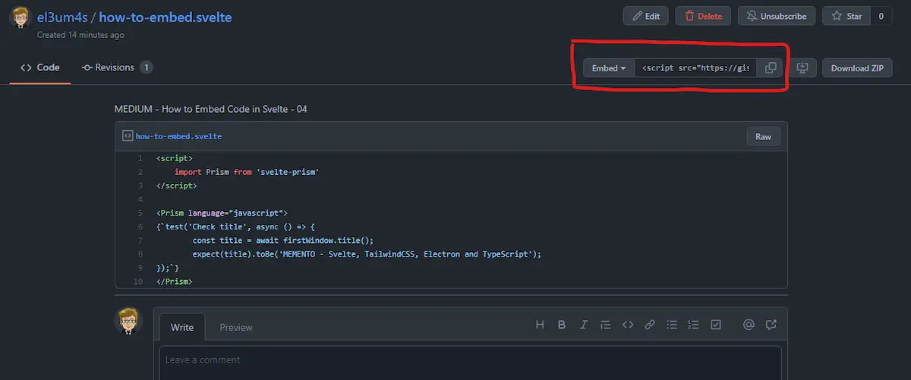
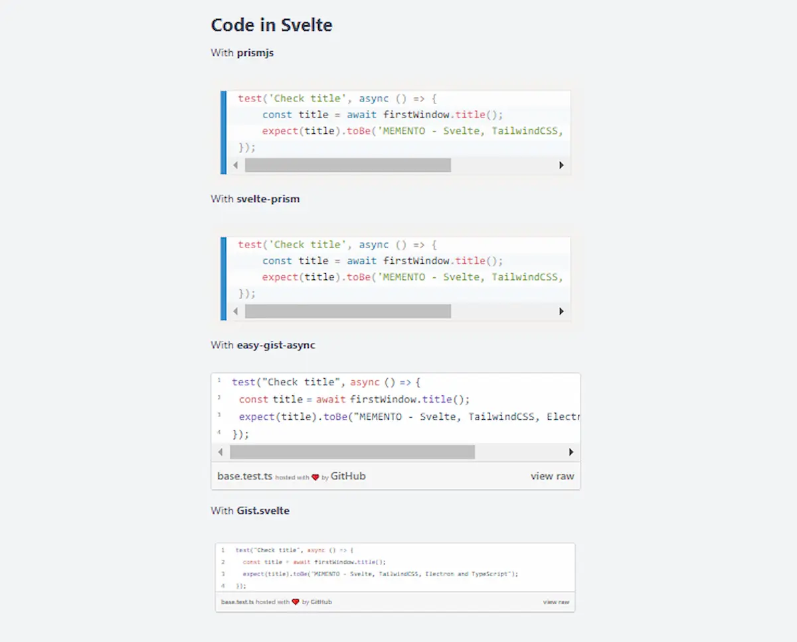

Prima o poi dovrò decidermi a riscrivere completamente il codice del mio blog. Due anni fa sono passato da WordPress a Jekyll: è stata una buona scelta. Ma più approfondisco [Svelte](https://svelte.dev/) più sono curioso di vedere cosa posso tirare fuori. L'ultima cosa su cui mi sono appassionato è sul come mostrare snippet di codice in Svelte. Con mio stupore non pare un argomento molto approfondito, ma penso di aver trovato 4 modi che possono fare al mio caso.

### PrismJS e Svelte

Il primo metodo prevede di usare [Prismjs](https://prismjs.com/) direttamente in una pagina in formato Markdown. Come esempio uso il mio template [MEMENTO - SvelteKit & GitHub Pages](https://github.com/el3um4s/memento-sveltekit-and-github-pages). In questo progetto le pagine del blog sono dei file `md` (markdown). Ogni pagina nella cartella `blog` è per l'appunto un post di un ipotetico blog. E la scrittura del codice avviene usando quello che viene chiamato `code fencing`:

```text
~~~javascript
function hello() {
  console.log("Hello World");
};
~~~
```

Quello che voglio ottenere è far si che il codice venga visualizzato in maniera simile a questa:

```js
function hello() {
  console.log("Hello World");
};
```

Come fare? Per prima cosa importo Prism nel mio template usando:

```bash
npm i -D prismjs
```

Posso usarlo direttamente in un file Svelte ma conviene inserirlo una sola volta, nel file `__layout__`: in questo modo ogni pezzo di codice apparirà alla stessa maniera in ogni pagina del blog.

```html
<script context="module">
  import 'prismjs';
  import 'prismjs/themes/prism.css';
  import 'prismjs/themes/prism-coy.css';
</script>
```


In base al tema del blog posso decidere se cambiare il tema utilizzato per mostrare i codici. Posso anche usare un tema personalizzato, magari il `Dracula`. Per usarlo importo [prism-themes](https://www.npmjs.com/package/prism-themes) con il comando:

```bash
npm i -D prism-themes
```

e quindi importo il tema nel file con:

```js
import "prism-themes/themes/prism-dracula.css";
```


### Svelte-Prism

Il secondo metodo è utilizzare un componente Svelte: [svelte-prism](https://github.com/jakobrosenberg/svelte-prism). Questo componente di [Jakob Rosenberg](https://github.com/jakobrosenberg) è molto comodo se si lavora all'interno di un file con estensione `.svelte`. Perché? Perché in questo caso non posso usare la sequenza di 3 backtick.

Per prima cosa installo il componente con:

```bash
npm i -D svelte-prism
```

Poi importo il componente dove mi serve:

```html
<script>
    import Prism from 'svelte-prism'
</script>

<Prism language="javascript">
{`test('Check title', async () => {
	const title = await firstWindow.title();
	expect(title).toBe('MEMENTO - Svelte, TailwindCSS, Electron and TypeScript');
});`}
</Prism>
```

Il risultato finale è pressoché identico al primo esempio:


### Mostrare GitHub Gist in Svelte con easy-gist-async

Il terzo metodo è di usare i [GitHub Gist](https://gist.github.com/) per mostrare i vari snippet di codice. Il vantaggio è la possibilità di mostrare qualcosa di molto più bellino e ben curato. Lo svantaggio principale è che il codice da mostrare vive al di fuori del post: rende un po' più complicato modificarlo e consultarlo offline.

Normalmente sarebbe sufficiente creare un Gist e poi copiare il codice di importazione con il pulsante in alto a destra



Il problema qual è? Che il codice da usare è in questo formato:

```html
<script src="https://gist.github.com/el3um4s/b2ce146321ba67d7420f2a14f1a38544.js"></script>
```

Si tratta di aggiungere un altro script js in una pagina (o componente) Svelte. Ma Svelte accetta solamente un elemento di tipo Script per componente. Occorre di conseguenza creare un nuovo componente.

Ho trovato due modi per farlo. Il primo prevede di usare il pacchetto npm [easy-gist-async](https://www.npmjs.com/package/easy-gist-async). Ovviamente lo installo con

```bash
npm i -D easy-gist-async
```

Poi creo un componente `AsyncGist.svelte`:

```html
<script>
	// https://www.npmjs.com/package/easy-gist-async
	import gistLoader from 'easy-gist-async';
	import { beforeUpdate, tick } from 'svelte';
	beforeUpdate(async () => {
		await tick();
		gistLoader();
	});
	export let dataGist = '';
</script>

<div data-gist={dataGist} />
```

E quindi uso il mio nuovo componente nella mia pagina:

```html
<script>
	import AsyncGist from '$lib/components/gist/AsyncGist.svelte';
</script>

<AsyncGist dataGist="https://gist.github.com/el3um4s/164a153b7097ca53ecd4904e12721bbd" />
```


Il risultato dipende molto dallo stile della pagina in cui viene importato il componente. Può essere una cosa buona per personalizzare l'aspetto ma per quello che serve a me è più un fastidio.

### Usare Gist.svelte

L'ultimo modo è una mia rielaborazione di questo [svelte.dev/repl](https://svelte.dev/repl/2d4d41df9f404b2d896bb81c55cb75c0?version=3.44.0). L'idea alla base è di creare un frame HTML attorno allo script importato: in questo modo vengono mantenuti gli stili originali. Rispetto al codice originale ho aggiunto un meccanismo per variare la grandezza del frame in base al contenuto. Penso sia più comodo e più utile.

Creo quindi il componente `Gist.svelte`:

```html
<script>
  export let src = '';
  export let title = '';
  src = src.slice(src.length - 3) === '.js' ? src : src + '.js';
  title = title === '' ? src : title;
  import { onMount } from 'svelte';
  let frame;
  let height = '30px';
  const barGistHeight = 30;
  onMount(() => {
    frame.srcdoc = `<script src='${src}'><${''}/script>`;
  });
  function getInnerHeight() {
    height = frame?.contentWindow?.document?.body?.scrollHeight + barGistHeight + 'px';
  }
</script>
<iframe src="about:blank" bind:this={frame} {title} {height} on:load={getInnerHeight} />
<style>
  iframe {
    border: 0;
    width: 100%;
  }
</style>
```

e lo uso nella mia pagina:

```html
<script>
  import Gist from '$lib/components/gist/Gist.svelte';
</script>

<Gist src="https://gist.github.com/el3um4s/164a153b7097ca53ecd4904e12721bbd.js"/>

<Gist src="https://gist.github.com/el3um4s/164a153b7097ca53ecd4904e12721bbd"/>
```

Il risulto che ottengo è


### Per finire

Per finire posso mettere tutte queste tecniche una dopo l'altra e ottengo

```html
<script>
  import Prism from '$lib/components/svelte-prism/Prism.svelte';
  import Gist from '$lib/components/gist/Gist.svelte';
  import AsyncGist from '$lib/components/gist/AsyncGist.svelte';
</script>

With **prismjs**

~~~ts
test('Check title', async () => {
  const title = await firstWindow.title();
  expect(title).toBe('MEMENTO - Svelte, TailwindCSS, Electron and TypeScript');
});
~~~

With **svelte-prism**

<Prism language="javascript">
{`test('Check title', async () => {
  const title = await firstWindow.title();
  expect(title).toBe('MEMENTO - Svelte, TailwindCSS, Electron and TypeScript');
  });`}
</Prism>

With **easy-gist-async**

<AsyncGist dataGist="https://gist.github.com/el3um4s/164a153b7097ca53ecd4904e12721bbd" />

With **Gist.svelte**

<Gist src="https://gist.github.com/el3um4s/164a153b7097ca53ecd4904e12721bbd.js"/>
```


