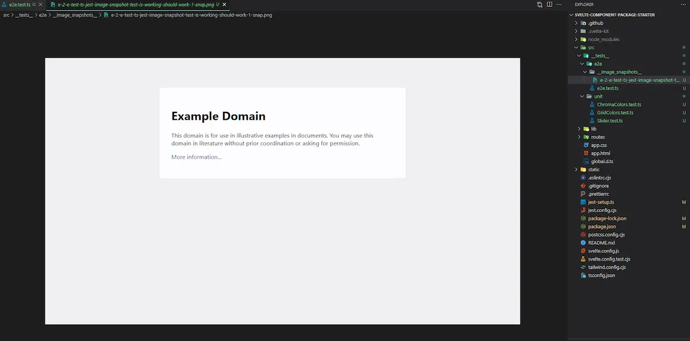
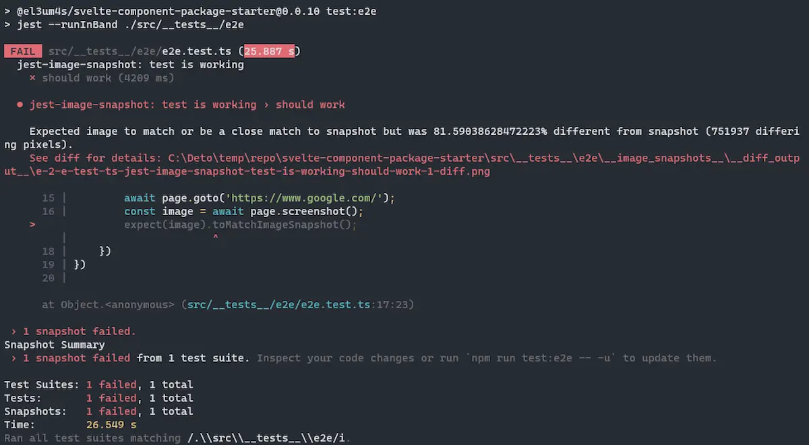
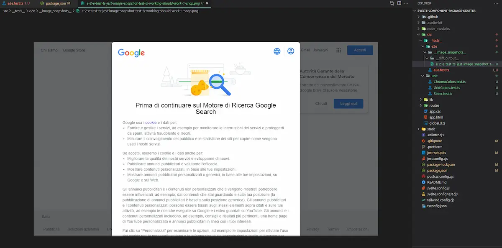
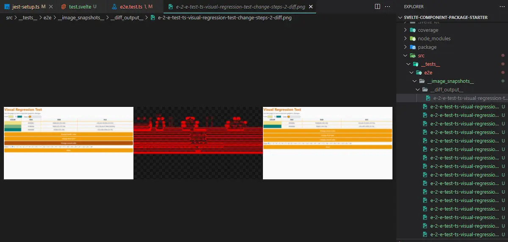
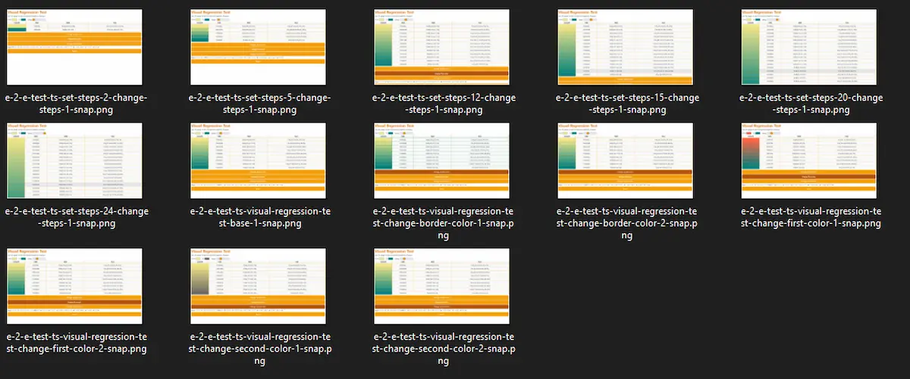

Ammetto di trovarmi sempre più a mio agio con lo sviluppo guidato dai test (TDD - [Test-driven development](https://en.wikipedia.org/wiki/Test-driven_development)). Anche perché man mano che sorgono i problemi so dove andare a cercarli. Ovviamente sconto ancora una certa inesperienza. E penso di pagare anche una certa ingenuità. Un problema che mi ha fatto sbattere la testa è legato alle modifiche non volute dell'aspetto grafico di una pagina web. Per risolvere questo problema ho dovuto imparare come eseguire dei Visual Regression Test.

### Scelgo che strumenti usare

Per una panoramica generale consiglio di leggere questo articolo di [Leonardo Giroto](https://medium.com/loftbr/visual-regression-testing-eb74050f3366), è di qualche tempo fa ma è scritto bene. Per quello che riguarda il mio problema, invece, ho valutato 3 opzioni. In sintesi, ho preso in considerazione [cypress](https://www.cypress.io/), [Puppeteer](https://pptr.dev/) e [Playwright](https://playwright.dev/). Sono tutti strumenti validi ma solo Playwright permette di interfacciarsi facilmente con [Electron](https://www.electronjs.org/). Lo so, lo so, questa è un'esigenza mia: il progetto che ho in testa prevede una parte costruita con Electron quindi questa caratteristica è fondamentale per me.

Capito questo è il momento di cominciare con il codice. Riprendo quindi in mano il mio template [Svelte Component Package Starter](https://github.com/el3um4s/svelte-component-package-starter) e comincio con aggiungere Playwright:

```shell
npm i -D playwright @playwright/test
```

E poi installo i browser da usare come base per i test

```shell
npx playwright install
```

Per un uso base non mi serve altro ma preferisco continuare a usare [Jest](https://jestjs.io/) anche per questo genere di test. Mi serve però un pacchetto aggiuntivo: [Jest Image Snapshot](https://github.com/americanexpress/jest-image-snapshot):

```shell
npm i --save-dev jest-image-snapshot @types/jest-image-snapshot
```

### Metto in ordine i test vecchi

È buona pratica tenere separati i test e2e (End to End). Quindi modifico leggermente la struttura del mio template e creo le due cartelle `src/__tests__/unit` e `src/__tests__/e2e`:

```text
src
├── __tests__
│   ├── unit
│   │   ├── ChromaColors.test.ts
│   │   ├── GridColors.test.ts
│   │   └── Slider.test.ts
│   └── e2e
├── lib
├── routes
├── app.css
├── app.html
└── global.d.ts
```

Copio dentro `unit` i test precedenti e lascio vuota, per il momento, `e2e`.

Il primo problema che mi si pone è che eseguendo `npm run test` eseguo sia i test di unità che quelli e2e. Modifico quindi `package.json` in modo da tenere separati i due binari:

```json
{
  // ...
  "scripts": {
    // ...
    "test": "cross-env TAILWIND_MODE=build jest --runInBand ./src/__tests__/unit",
    "test:e2e": "jest --runInBand ./src/__tests__/e2e",
  }
  //...
}
```

### Configuro Jest per fare screenshot

Per utilizzare `Jest-Image-Snapshot` devo prima estendere `expect` per supportare `toMatchImageSnapshot`. Modifico quindi `jest-setup.ts`:

```ts
import '@testing-library/jest-dom';
import { toMatchImageSnapshot } from 'jest-image-snapshot';

expect.extend({ toMatchImageSnapshot });
```

### Creo un test di esempio

Come primo test mi serve qualcosa di semplice e banale, giusto per verificare che tutto funzioni a dovere. Creo il file `e2e.test.ts`:

```ts
import { Browser, chromium } from 'playwright';

describe('jest-image-snapshot: test is working', () => {
    let browser: Browser;

    beforeAll(async () => {
      browser = await chromium.launch();
    });
    afterAll(async () => {
      await browser.close();
    });

    test("should work", async () => {
        const page = await browser.newPage();
        await page.goto('https://www.example.com/');
        const image = await page.screenshot();
        expect(image).toMatchImageSnapshot();
    })
})
```

Cosa fa questo test? Usa Playwright per lanciare un browser nascosto, va alla pagina `https://www.example.com`, cattura un'immagine della pagina e la confronta con quella salvata in memoria. Se non esiste un'immagine di riferimento ne crea una nuova nella cartella `__image_snapshots__`. Eseguo 

```shell
npm run test:e2e
```
e ottengo l'immagine:



Ovviamente questo test è puramente didattico: serve a me per capire come utilizzare questo strumento. Cambio l'indirizzo della pagina da aprire (uso `www.google.com`). Rieseguo il test e ottengo



È inoltre apparsa una nuova cartella `__diff_output__` al cui interno c'è un'immagine:


Sono evidenziate in rosso le differenze tra un'immagine e l'altra. Essendo due pagine completamente diverse è quasi tutto rosso. Ma spiega bene il senso di questo tipo di test.

Faccio finta per un momento che la nuova pagina sia corretta e che le differenze siano volute. Per superare il test devo aggiornare lo screenshot. Creo uno script che mi semplifichi il lavoro:

```json
"test:e2e-update": "jest --runInBand --updateSnapshot ./src/__tests__/e2e",
```

e lo eseguo:

```shell
npm run test:e2e-update
```

Adesso la mia pagina di riferimento è diventata:



Questa volta ripetendo il test `npm run test:e2e` non ottengo errori.

### Creo un test personalizzato

Ovviamente questo test è inutile: serve solo a me per capire come creare qualcosa di utile. Creo una pagina `src/routes/test.svelte` dedicata ai test:

```html
<script lang="ts">
	import GridColors from '$lib/components/GridColors.svelte';
	import { stringToColorStyle } from '../lib/functions/ChromaColors';

	const settings = {
		firstColor: 'khaki',
		secondColor: 'teal',
		steps: 9
	};

	settings.firstColor = stringToColorStyle(settings.firstColor).hex;
	settings.secondColor = stringToColorStyle(settings.secondColor).hex;

	let borderColor = 'orange';

	$: settings.firstColor = stringToColorStyle(settings.firstColor).hex;
	$: settings.secondColor = stringToColorStyle(settings.secondColor).hex;

	const changeBorderColor = () => (borderColor = borderColor === 'orange' ? 'green' : 'orange');
	const changeFirstColor = () =>
		(settings.firstColor =
			settings.firstColor === stringToColorStyle('khaki').hex ? 'tomato' : 'khaki');
	const changeSecondColor = () =>
		(settings.secondColor =
			settings.secondColor === stringToColorStyle('teal').hex ? 'dimgray' : 'teal');
	const reset = () => {
		settings.firstColor = 'khaki';
		settings.secondColor = 'teal';
		settings.steps = 9;
	};
</script>

<main>
	<h1>Visual Regression Test</h1>
	<p>Use this page to test component graphics changes</p>
	<div id="grid-colors">
		<GridColors {...settings} --border-color={borderColor} />
	</div>

	<section>
		<button id="change-border-color" on:click={changeBorderColor}>Change border color</button>
		<button id="change-first-color" on:click={changeFirstColor}>Change first color</button>
		<button id="change-second-color" on:click={changeSecondColor}>Change second color</button>

		<div>
			<span>Steps:</span>
			{#each Array(23) as array, i}
				<label>
					<input type="radio" bind:group={settings.steps} value={i + 2} />
					{i + 2}
				</label>
			{/each}
		</div>

		<button id="reset" on:click={reset}>Reset</button>
	</section>
</main>

<style lang="postcss">
	#grid-colors { @apply mb-2 mt-2; }

	main { @apply overflow-y-auto; }

	section { @apply flex flex-col space-y-1; }
</style>
```

Ho inserivo vari pulsanti e controlli per testare il mio componente in varie situazioni. Modifico il file `e2e.test.ts` in modo da fare riferimento alla pagina con i test:

```ts
import { Browser, chromium } from 'playwright';

describe('visual regression test', () => {
    let browser: Browser;

    beforeAll(async () => {
      browser = await chromium.launch();
    });
    afterAll(async () => {
      await browser.close();
    });

    test("test page", async () => {
        const page = await browser.newPage();
        await page.goto('http://localhost:3000/test');
        const image = await page.screenshot();
        expect(image).toMatchImageSnapshot();
    })
})
```

Ed eseguo il test con il comando `npm run test:e2e`.

Non mi interessa uno screenshot statico, mi interessa vedere cosa succede quando modifico i vari parametri. Aggiungo quindi un'azione per cliccare automaticamente su vari pulsanti, registrare lo schermo e poi confrontare il risultato:

```ts
test("test page", async () => {
	const page = await browser.newPage();
	await page.goto('http://localhost:3000/test');

	const image = await page.screenshot();
	expect(image).toMatchImageSnapshot();

	await page.click('text=Change border color');
	let changeBorder = await page.screenshot();
	expect(changeBorder).toMatchImageSnapshot();
	await page.click('text=Change border color');

	changeBorder = await page.screenshot();
	expect(changeBorder).toMatchImageSnapshot();
})
```

Creo in maniera simile i test per tutti i pulsanti e i controlli.

Dopo aver sistemato i test posso tornare a modificare il codice. La cosa bella è che sbaglio qualcosa, o se succede qualcosa di non previsto, posso avere un warning e accorgermi rapidamente che qualcosa non funziona:



Un'altra cosa interessante è che gli screenshot danno una buona idea delle caratteristiche del componente e valgono quasi come documentazione:



Questo è tutto, per il momento. Come al solito è possibile vedere il codice del repository all'indirizzo [el3um4s/svelte-component-package-starter](https://github.com/el3um4s/svelte-component-package-starter).
