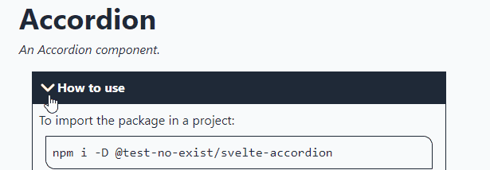
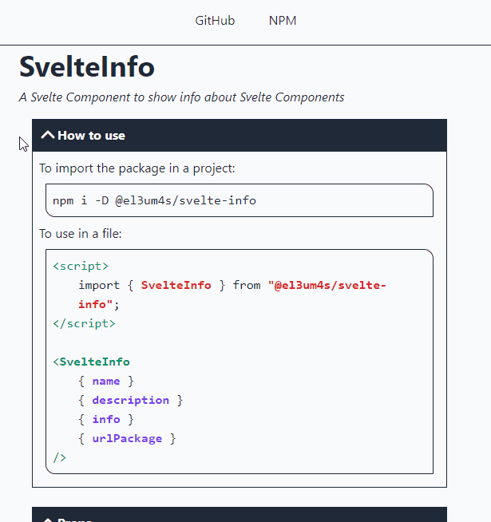

Prima o poi dovrò trovare il tempo per riportare le mie impressioni sul metodo Agile e su quello che sto imparando in questi mesi. So però una cosa: la mia idea di creare un sistema automatico per documentare componenti Svelte mi sta portando via più tempo del previsto. La tecnica non è molto complicata, ma continuano a saltare fuori dettagli che non avevo previsto. E, sopratutto, la mia tendenza a voler capire come funzionano le cose mi sta portando a impiegare molto tempo per ricreare alcuni elementi base. L'ultimo in ordine di tempo è l'**accordion**: un elemento che si può ingrandire e diminuire con un click.

### Cosa voglio costruire


Cosa mi serve? Mi serve un elemento in grado di raggruppare le varie sezioni del componente principale in modo da non mostrare troppe informazioni. Un qualcosa di semplice, che non dipenda da altre librerie e che sia abbastanza leggero e personalizzabile. Per fortuna con [Svelte](https://svelte.dev/) è molto facile crearlo. E per quanto riguarda la parte CSS mi sono oramai abituato alla comodità di [TailwindCSS](https://tailwindcss.com/).

### Partiamo dalla struttura

```html
<script lang="ts">
  export let title:string = "Title";
</script>

<section>
  <header> {title} </header>
  <slot />
</section>
```

La struttura base è molto semplice, bastano solamente 2 parti:

- una da usare come _header_ del componente per inserire il titolo sezione;
- l'altra è un semplice _slot_ in cui verrò inserito il contenuto da mostrare.

Ovviamente senza aggiungere né stili CSS né azioni il risultato è abbastanza deludente:


### Aggiungiamo un po' di stili

Passo quindi ad aggiungere un po' di stili per evidenziare il titolo dell'elemento e i suoi margini. Per questo componente voglio usare uno stile monocromatico. E, sinceramente, sono sempre più attirato da questo genere di utilizzo dei colori, ma questo è un'altra storia.

Comincio quindi con il definire il titolo:

```html
<script lang="ts">
  export let title: string = 'Title';
</script>

<section>
  <header>{title}</header>
  <slot />
</section>

<style lang="postcss">
  section {
    @apply flex flex-col p-2 m-2;
  }
  
  header {
    @apply flex flex-row items-center justify-start p-2 font-bold;
    background-color: var(--text-color, theme('colors.gray.800'));
    color: var(--background-color, theme('colors.gray.50'));
  }
</style>
```


Per quello che riguarda il contenuto non posso aggiungere uno stile css direttamente allo _slot_. Posso però inserirlo in un _div_ e stilizzare quello:

```html
<div>
  <slot />
</div>

<style lang="postcss"> 
  div {
    @apply flex flex-col p-2 border border-solid w-full;
    background-color: var(--background-color, theme('colors.gray.50'));
    color: var(--text-color, theme('colors.gray.800'));
    border-color: var(--text-color, theme('colors.gray.800'));
  }
</style>
```


### Apriamo e chiudiamo l'elemento

Svelte permette di nascondere e visualizzare un elemento della pagina in maniera molto semplice. Usando una semplice condizione `if...then...else` legata a un _prop_ posso controllarne lo stato:

```html
<script lang="ts">
  export let title: string = 'Title';
  export let open: boolean = true;
</script>

<section>
  <header>{title}</header>
  {#if open}
    <div>
      <slot />
    </div>
  {/if}
</section>
```


### Aggiungiamo un'icona ruotante

Ma quello che serve a me è un modo per aprire con un click l'elemento. Per farlo mi serve un pulsante e, possibilmente, un'animazione per evidenziare il click. Il modo più elegante che ho trovato mi è stato suggerito da un video di [Johnny Magrippis](https://magrippis.com/) ([How to: Svelte Hamburger Menu Animation 🍔](https://www.youtube.com/watch?v=fWzKPUUQdQY)). 

<iframe width="560" height="315" src="https://www.youtube.com/embed/fWzKPUUQdQY" title="YouTube video player" frameborder="0" allow="accelerometer; autoplay; clipboard-write; encrypted-media; gyroscope; picture-in-picture" allowfullscreen></iframe>

Consiglio di guardare il video, anche perché é abbastanza veloce. In ogni caso, per cominciare mi serve un altro componente, `Chevron.svelte`, in cui inserisco un'immagine `svg`:

```html
<svg
  xmlns="http://www.w3.org/2000/svg"
  viewBox="0 0 24 24"
  fill="none"
  stroke-linecap="round"
  stroke-linejoin="round"
  stroke-width="3"
>
  <path d="M19 9l-7 7-7-7" />
</svg>
```

Ovviamente mi conviene aggiungere un po' di stili per integrarla nel titolo del componente principale:

```html
<svg
  xmlns="http://www.w3.org/2000/svg"
  viewBox="0 0 24 24"
  fill="none"
  stroke-linecap="round"
  stroke-linejoin="round"
  stroke-width="3"
>
  <path d="M19 9l-7 7-7-7" />
</svg>

<style lang="postcss">
  svg {
    @apply h-6 w-6;
    stroke: var(--background-color, theme('colors.gray.50'));
    background-color: var(--text-color, theme('colors.gray.800'));
  }
</style>
```


Lo scopo di questa icona è servire come pulsante: quando viene cliccata apre oppure chiude la parte sottostante dell'accordion. Quindi la inserisco in un elemento `button` e ci aggiungo due `props`:

```html
<script lang="ts">
  export let open = false;
  export let onClick = () => {
    open = !open;
  };
</script>

<button on:click="{onClick}">
  <svg
    class:open
    xmlns="http://www.w3.org/2000/svg"
    viewBox="0 0 24 24"
    fill="none"
    stroke-linecap="round"
    stroke-linejoin="round"
    stroke-width="3"
  >
    <path d="M19 9l-7 7-7-7" />
  </svg>
</button>
```

Uso il prop `open` anche come classe CSS. In questo modo quando l'elemento è aperto posso cambiare l'icona a piacere. In particolare voglio farla ruotare di 180 gradi. Aggiungo quindi un po' di stili CSS utili a questo scopo:

```html
<style>
  :root {
    --transition-duration: 500ms;
  }
  button {
    cursor: pointer;
    display: flex;
    align-items: center;
    overflow: hidden;
  }
  svg {
    transition: transform var(--transition-duration);
  }
  .open {
    transform: rotate(180deg);
  }
</style>
```



### Aggiungiamo un'azione al componente

Adesso che l'icona fa il suo dovere posso tornare al componente principale e inserire un'azione per controllarne lo stato:

```html
<script lang="ts">
  import Chevron from "../icons/Chevron.svelte";
  export let title: string = "Title";
  export let open: boolean = true;
  let onClick = () => {
    open = !open;
  };
</script>

<section>
  <header>
    <Chevron {open} {onClick} />
    {title}
  </header>
  {#if open}
  <div>
    <slot />
  </div>
  {/if}
</section>
```

Cliccando sull'icona ottengo finalmente di poter aprire e chiudere l'accordion:


### Aggiungiamo una transition

Il componente funziona ma, come dire, non è molto bello vedere apparire e sparire all'improvviso una parte della pagina. Per risolvere la cosa posso usare una delle caratteristiche di Svelte, le [transition](https://svelte.dev/docs#svelte_transition):

```html
<script lang="ts">
	import Chevron from '../icons/Chevron.svelte';
	import { slide } from 'svelte/transition';
	
	export let title: string = 'Title';
	export let open: boolean = true;
	
	let onClick = () => {
		open = !open;
	};
</script>

<section>
	<header>
		<Chevron {open} {onClick} />
		{title}
	</header>
	{#if open}
		<div transition:slide={{ duration: 500 }}>
			<slot />
		</div>
	{/if}
</section>
```

Ed ecco il risultato finale:



Come sempre il codice è liberamente consultabile e scaricabile da GitHub:

- [el3um4s/svelte-component-info](https://github.com/el3um4s/svelte-component-info)
