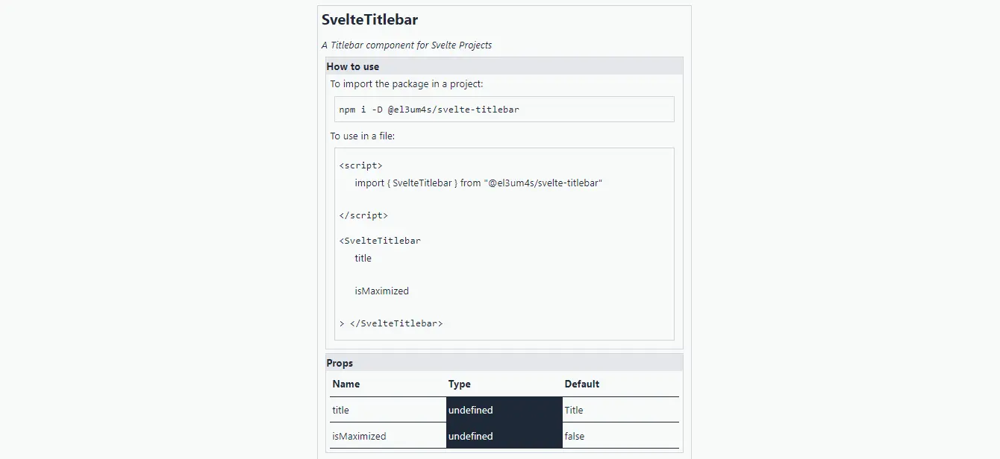

Sono un paio di settimane che non scrivo nulla: è un errore. Mi sono concentrato su come creare in maniera rapida la documentazione per i miei componenti [Svelte](https://svelte.dev/). Non voglio ripetere un mio errore classico: creare delle cosine anche interessanti ma poi non riuscire a mantenere la documentazione aggiornata. Mi serve un metodo per scrivere e sopra tutto mantenere coordinata la documentazione con il codice. Mi sono quindi messo in testa di capire come far sì che sia Svelte stesso ad occuparsene. Non ci sono riuscito del tutto, ma credo di avere impostato il procedimento generale.

### I passi da fare

Ho indagato alcune strade, e sono risultati per lo più dei vicoli ciechi. Il primo tentativo è stato di usare [svelte.parse](https://svelte.dev/docs#svelte_parse): non mi ha condotto da nessuna parte. Il secondo mi ha portato a provare alcuni parser JavaScript, a partire da [acorn](https://github.com/acornjs/acorn). Un altro buco nell'acqua. Mi sono dovuto quindi concentrare su partire da un livello ancora più basso. Riassumendo per poter far sì che Svelte si autodocumenti devo:

1. leggere i componenti Svelte non ancora compilati, ovvero i file raw **.svelte**
2. estrarre le informazioni che mi servono:
   - i **props**, con i rispettivi _nome_, _tipo_ e _valore predefinito_
   - le **azioni** che si possono eseguire; in questo caso è sufficiente il nome, se è abbastanza autoesplicativo
   - i nomi degli **slot** che si possono usare
   - e, ma non ne sono ancora del tutto sicuro, le **variabili css** utilizzate dal componente
3. salvare queste informazioni in un file **json**
   - farlo in maniera automatica, in modo da non doverselo ricordare
4. importare queste informazioni in Svelte
5. usare un componente specifico per leggere le informazioni e mostrarle in maniera automatica

Poiché le informazioni su un componente cambiano solo in fase di sviluppo non è un problema se la configurazione risulta un po' macchinosa. Se poi è tutto automatizzato posso concentrarmi sullo sviluppo in sé senza stare a curarmi dei dettagli.

### La struttura generale

Non ho capito se posso integrare tutte queste operazioni in un unico pacchetto NPM. Ho comunque deciso di dividere il progetto in due diversi repository:

1. [el3um4s/svelte-get-component-info](https://github.com/el3um4s/svelte-get-component-info) per gestire la parte relativa all'estrazione dei dati
2. [el3um4s/svelte-component-info](https://github.com/el3um4s/svelte-component-info) per semplificare la visualizzazione delle varie proprietà

Giusto per essere chiaro: i due repository non sono ancora completi, qui mi interessa tenere traccia dei passi che ho fatto e di quelli ancora da compiere. Appena il progetto sarà abbastanza maturo lo integrerò nel mio template [svelte-component-package-starter](https://github.com/el3um4s/svelte-component-package-starter)

### Come ottenere l'elenco dei props di un componente Svelte

Andiamo in ordine. Il problema di ricavare l'elenco delle proprietà di un componente Svelte è grosso modo assimilabile a un problema di ricerca in un file di testo. Si tratta di leggere un file, estrarne il contenuto e poi scorrerlo estraendone i pezzi che mi servono.

Comincio quindi con il creare una funzione per leggere un file e restituire il suo contenuto come stringa di testo:

```ts
import { existsSync, readFileSync  } from 'fs';
import { toTry } from "@el3um4s/to-try";
import { Content } from "./interfaces";

function readFileSvelte(nameFile:string) {
    const content:Content = {
        error: {
            status: true,
            content: "file not read" },
        content: {
            status: false,
            content: "" }
    };

    if (checkFileExist(nameFile)) {
        const [result, error] = toTry(() => readFileSync(nameFile));
        if (!error && result) {
            const contentString = result.toString();
            content.error = {
                status: false,
                content: "" };
            content.content = {
                status: true,
                content: contentString };
        }
    } else { content.error.content = `File "${nameFile}" not exist`;  }  
    return content;
}

function checkFileExist(nameFile:string):boolean { return existsSync(nameFile); }

export {readFileSvelte, checkFileExist};
```

Uso l'API [readFileSync](https://nodejs.org/api/fs.html#fsreadfilesyncpath-options) di [NodeJS](https://nodejs.org/en/) per fare il grosso del lavoro.

Dopo aver ottenuto il contenuto del file comincio a cercare quello che mi interessa. Per estrarre i props di un componente posso limitare la mia ricerca al blocco [script](https://svelte.dev/docs#script):

```ts
import type { Reading } from "./interfaces";

const regex = {
        script: /<script[\s\S]*?>[\s\S]*?<\/script>/gi,
};

function hasScript (component:string): Reading {
    const script = component.match(regex.script);
    const content = script == null ? "": script[0].replace(/<script[\s\S]*?>/gi, "").replace(/<\/script>/gi, "");
    const result: Reading = {
        status: script == null ? false : true,
        content
    };
    return result;
}

export { hasScript };
```

Uso un'espressione regex `/<script[\s\S]*?>[\s\S]*?<\/script>/gi` in [string.match(regex)](https://developer.mozilla.org/en-US/docs/Web/JavaScript/Reference/Global_Objects/String/match) per ottenere solo una parte del codice e ottenere una stringa di testo.

Uso questo risultato per cercare tutte le variabili `let` esportate dal componente e salvarle in un array. L'espressione regex che uso è `/export let [\s\S]*?;/gi`:

```ts
const regex = /export let [\s\S]*?;/gi

function getProps_asInFile (component:string): Array<string> {
    const content = component.match(regex);
    return content != null ? content : [];
}

export { getProps_asInFile };
```

### Ricavo le proprietà dei props

Adesso posso iniziare a cercare i nomi dei props, sempre usando una regex (`/(?<=let )(.*?)(?=\s|;|=|:)/`):

```ts
onst regex = {
        name: /(?<=let )(.*?)(?=\s|;|=|:)/
};
                         
function getPropName(s:string):string {
    const nameRegex = s.match(regex.name);
    const nameWithDelimiters = nameRegex ? nameRegex[0] : "";
    const name = nameWithDelimiters.replace("let","").replace(/[:|;|=]/gi,"").trim();
    return name;
}
```

Il passo successivo è estrarre i tipi delle variabili. In questo caso la regex che uso è `/(?<=let [:]|[:])(.*?)(?=;|=)/`:

```ts
const regex = {
  type: /(?<=let [:]|[:])(.*?)(?=;|=)/
};
                      
function getPropType(s:string):string|undefined {
  const typeRegex = s.match(regex.type);
  const positionEquals = s.indexOf("=");
  const positionSemicolon = s.indexOf(";");
  const firstDelimiters:number = positionEquals > -1 ? positionEquals : positionSemicolon;
  const positionRegex:number = typeRegex?.index ? typeRegex.index : -1;
  const type:string|undefined = positionRegex < firstDelimiters && typeRegex ? typeRegex[0].trim() : undefined;
  return type;
}
```

Ricavare il valore predefinito delle variabili è un po' più complesso. Non posso usare una espressione regex, ci sono troppi casi ambigui possibili. Posso però cavarmela con un trucco grazie a una scelta fatta all'inizio, quando ho salvato ogni variabile let come elemento di un array. In questo modo posso considerare come valore di default tutto quello che appare tra il simbolo uguale (`=`) e l'ultimo carattere della stringa (che dovrebbe essere il punto e virgola `;`).

```ts
function getPropDefaultValue(s:string):string|undefined {
  const positionEquals = s.indexOf("=");
  const positionSemicolon = s.lastIndexOf(";");
  const defaultValue:string|undefined = positionEquals < 0 ? undefined : s.substring(positionEquals+1, positionSemicolon).trim();
  const result: string|undefined= defaultValue && isStringType(defaultValue) ? getStringWithoutQuote(defaultValue) : defaultValue;
  return result;
}
```

L'unico caso ambiguo possibile è quando il valore predefinito è una stringa: gli apici non appartengono al valore e vanno quindi eliminati. Per farlo ho usato le funzioni `isStringType` e `getStringWithoutQuote`:

```ts
function isStringType(s:string):boolean {
  const startString: string = s.trim();
  const firstChar: string = startString.charAt(0);
  const lastChar: string = startString.charAt(startString.length-1);
  const charIsQuote = firstChar === `"` || firstChar ===`'` || firstChar === "`";
  const result = charIsQuote && firstChar === lastChar;
  return result;
}

function getStringWithoutQuote(s:string):string {
  const startString: string = s.trim();
  const result: string = startString.substring(1,startString.length-1);
  return result;
}
```

### Creo un oggetto

Adesso che ho tutti i vari pezzetti posso cominciare a mettere insieme il tutto. Mi conviene creare una funzione che ricavi `name`, `type` e `defaultValue` in un solo colpo:

```ts
function getPropInfo(s:string):Prop {
  const name:string = getPropName(s);
  const type:string|undefined = getPropType(s);
  const defaultValue:string|undefined = getPropDefaultValue(s);
  return {name, type, defaultValue};
}
```

Quindi creo una funzione che legga il file, estragga i valori e li restituisca come oggetto:

```ts
import { readFileSvelte } from "./readFileSvelte";
import { getProps_asInFile } from "./parseFileSvelte";
import { getPropInfo } from "./parseProps";
import { Content, Prop, SvelteInformations } from "./interfaces";

function getInfo(source: string):SvelteInformations {
  const file:Content = readFileSvelte(source);
  const propsAsInFile = getProps_asInFile(file.content.content);
  const props:Array<Prop> = [];
  propsAsInFile.forEach(p => props.push(getPropInfo(p)));
  return { props };
}

export {getInfo};
```

### Il componente Svelte

Bene, dopo aver estratto tutti i valori devo capire come visualizzarli. Per semplificare le cose sto creando un componente Svelte [el3um4s/svelte-component-info](https://github.com/el3um4s/svelte-component-info). Voglio ottenere qualcosa di simile a questo:



La prima cosa da fare è creare un componente `SvelteInfo.svelte` e decidere quali props mi servono:

```html
<script lang="ts">
  import type { SvelteInformations } from '@el3um4s/svelte-get-component-info';
  
  export let name: string;
  export let description: string = '';
  export let info: SvelteInformations;
  export let urlPackage: string = '-';
  
  const brackesOpen: string = '<';
  const brackesClose: string = '>';
  const bracesOpen: string = '{';
  const bracesClose: string = '}';
</script>
```

Mi serve il nome del componente, il nome del pacchetto (per inserire automaticamente il codice per scaricarlo da npm) e ovviamente tutte le informazioni che posso ricavare usando il codice che ho creato poco fa.

Usando queste informazioni posso creare automaticamente una sezione che spiega come importare il componente dentro un progetto:

```html
{#if urlPackage !== '-'}
  <div>To import the package in a project:</div>
  <div class="code details">npm i -D {urlPackage}</div>
{/if}
```

E come usare il componente stesso:

```html
<div class="code details">
  {#if urlPackage !== '-'}
    <div>
      {brackesOpen}script{brackesClose}
      <p>import {bracesOpen} {name} {bracesClose} from "{urlPackage}"</p>
      {brackesOpen}/script{brackesClose}
    </div>
  {/if}
  <div>
    {brackesOpen}{name}
    {#each info.props as prop}
      <ul>
        <li>{prop.name}</li>
      </ul>
    {/each}{brackesClose}
    {brackesOpen}/{name}{brackesClose}
  </div>
</div>
```

Posso anche creare automaticamente una tabella con tutte le informazioni necessarie sui props:

```html
{#if info.props.length > 0}
  <section class="details">
    <div class="title">Props</div>
    <div class="table">
      <span class="table-header">Name</span>
      <span class="table-header">Type</span>
      <span class="table-header">Default</span>

      {#each info.props as prop}
        <span>{prop.name}</span>
        <span class={prop.type ? '' : 'undefined'}>{prop.type}</span>
        <span class={prop.defaultValue ? '' : 'undefined'}>{prop.defaultValue}</span>
      {/each}
    </div>
  </section>
{/if}
```

### Usare il tutto

Adesso che ho tutti i vari pezzi posso metterli assieme per semplificare la creazione della documentazione di un componente. Parto da componente che ho già creato e inizio con installare quello che mi serve:

```bash
npm i @el3um4s/svelte-get-component-info @el3um4s/svelte-component-info
```

Creo quindi un file per gestire la creazione del file `infoSvelteComponents.json` con le informazioni:

```js
import {
  writeFileSync
} from 'fs';
import glob from 'glob';
import {
  getInfo
} from "@el3um4s/svelte-get-component-info";

const basePath = "src/lib/components/"

const listFile = glob.sync(`${basePath}**/*.svelte`);

let infoFiles = {}
listFile.forEach(file => {
  const prop = getInfo(file);
  const fileName = file.substring(basePath.length);
  infoFiles[fileName] = prop;
});

let data = JSON.stringify(infoFiles);
writeFileSync('./src/routes/infoSvelteComponents.json', data);
```

Aggiorno quindi il file `package.json` aggiungendo alcuni script:

```json
{
  "scripts": {
    "dev": "npm run get-info-svelte-components && svelte-kit dev",
    "build": "npm run get-info-svelte-components && npm run clean && svelte-kit build",
    "get-info-svelte-components": "node getInfoSvelteComponents.js",
  }
}
```

Modifico la pagina con la documentazione componente importando `InfoSvelte.svelte` e il file json. Aggiungo poi il componente:

```html
<script lang="ts">
	import { SvelteInfo } from '@el3um4s/svelte-component-info';
	import infoSvelteComponents from './infoSvelteComponents.json';
</script>

<SvelteInfo
  name="SvelteTitlebar"
  urlPackage="@el3um4s/svelte-titlebar"
  info={infoSvelteComponents['TitleBar.svelte']}
  description="A Titlebar component for Svelte Projects"
/>
```

E poi... niente, è tutto qui. Basta importare il componente e il file JSON e nient'altro. Da adesso in avanti ogni volta che creo la documentazione del componente usando `npm run build` importerò automaticamente tutte le informazioni aggiornate.

Con questo è tutto, per il momento. I due repository sono ancora un work in progress. Conto di aggiornarli ancora nei prossimi giorni ma per il momento ci tenevo a mettere in ordine i vari passaggi fatti fino a qui.
